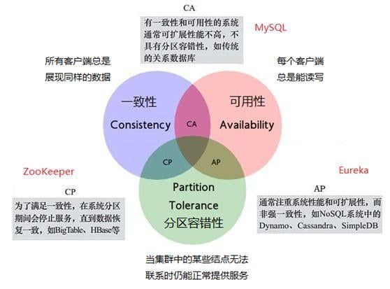
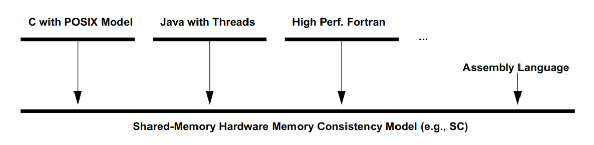
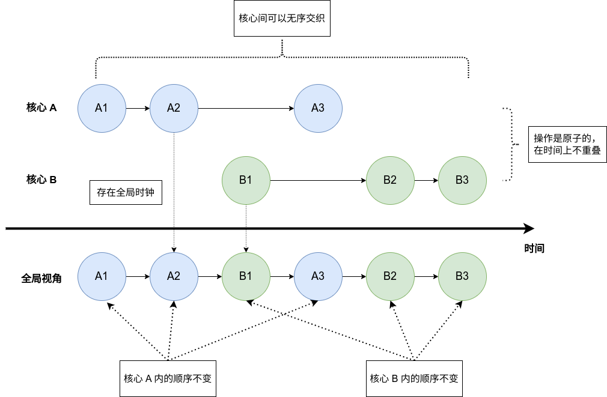
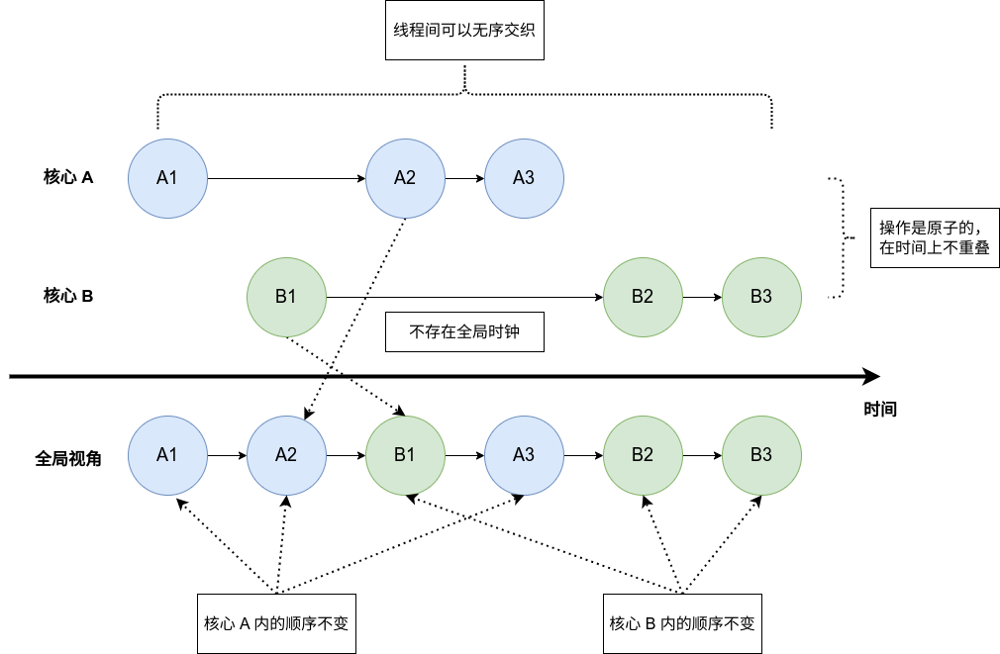
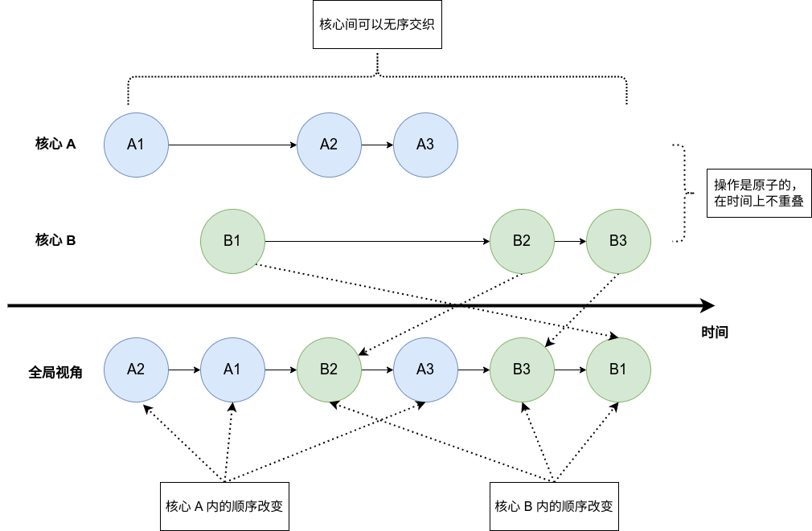
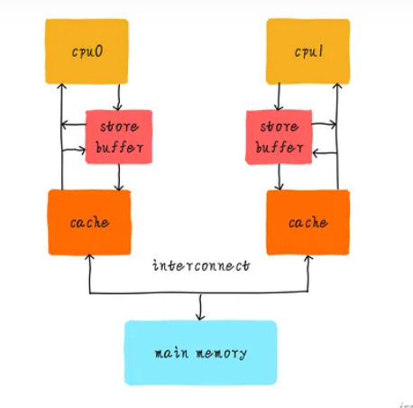
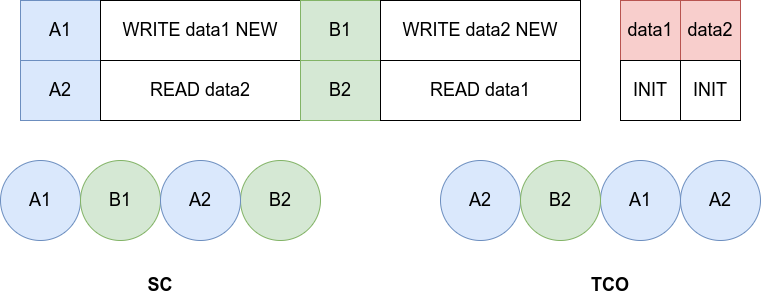
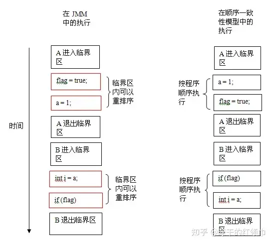
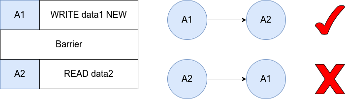

## 一、一致性

一致性（consistency）这个概念应该是来自于分布式理论的 CAP 理论



我觉得用人话来说就是对于**多个观察者观察同一个事物**，每个观察者观察到的现象是“相同的”，那么我们就认为这个设计具有“一致性”。“盲人摸象”就是一个非一致性的例子，对于同一个事物，盲人们分别给出了“柱子、山、石头”等描述，就是不具有一致性的案例。

一致性和并行编程联系紧密，因为一致性保证了多个并行的实体，他们看到的共享资源是相同的。只有这样才能保证并行实体间的协作，如果实体看到的资源都是不一样的，比如说线程 A 给资源加了个锁，但是 B 没有看到这个锁，那么就会导致数据竞争的发生。盲人摸象的结局不正是因为盲人们对于大象的看法各执己见，最终大打出手吗？

不过一致性中要求的“相同”，也并不意味着“完全一样”，因为“完全一样”并不好达到，比如说正常人去看大象，其实看到的同一个大象也是不同的，比如有人会看见大象的正脸，而有人看见了大象的屁股，白天去看的人和晚上去看的人看到的也不同，追求大家看到的都一样，其实是很困难的。但是大家却能根据看到的不同的大象确定那是同一个大象，这就足够了。

在并行编程也是一样，“一致性”并非一个定性的概念，而是一个“定量”概念，有些设计是“严格一致性”的，那么大家看到的现象就是非常一致的，而“宽松一致性”会使得大家看到的现象不那么一致。不过并非在“宽松一致性”下就完全没法编程了，而只是说编程时要考虑的问题更多了，更容易出现 bug 了。

“宽松一致性”的优点在于其他方面会更加有优势，也就是 CAP 中如果牺牲掉 C 这个特性，那么 AP 特性就都会得到增强。在并行编程方面，如果一致性弱的话，那么并行程度就会高，性能就会提升。

---


## 二、内存一致性模型

内存一致性指的是当内存成为共享资源时，也就是存在多个实体读取同一个内存时，每个实体所看到的内存具有一定的相似特征，使得这些实体之间可以进行协作，不至于产生数据竞争。

上文提到的实体，其实有两种，一种是软件实体，他们由函数库提供，也就是“软件线程”；另一种是硬件实体，也就是共享内存的多个处理器核。软件线程可以看作是对应硬件多核的封装（当然即使是单核硬件也可以有软件多线程），它相比硬件多核的概念要更加简单和好理解，二者的关系如图：



我们这次的讨论主要集中于硬件多核处理器所面对的内存一致性模型。

所以到底什么是“一致性模型”？我觉得它是一组规范或者说协议，它规定了多核处理器面对共享内存时可能出现的现象，软件开发者需要根据规范中的所有“一致”的情况，编写出正常运行的软件。需要强调的是，这里说的“一致”是在一致性模型中定义的“一致”，而不是完全符合直觉的“一致”。一致性模型中定义的“一致”，往往是比直觉中的“一致”要更加弱一些。

为什么会存在这种差异呢？因为直觉中的“一致”过于理想了，这种理想就类似于让每个人看见的大象都是一模一样的，一致性越是符合直觉，硬件的开销就会越大，性能就会降低；但是如果一致性稍微弱一些，那么硬件的开销就会减少，性能就会提高，但是也会因为不符合人的直觉，导致软件的开销增大。

我们将内存一致性模型问题定义得更形式化一点，也就是每一个处理器核都在向共享内存进行读写操作，我们需要给这些所有的读写操作线性排序，这个排好的序列对于每个处理器核应该是具有一致性的，也就是应该“差不多”。

需要强调的是，内存一致性的一些概念和 CAP 一致性中的概念并不兼容，可能是由于他们分别是从不同的场景中演化出来的，所以有一些差异，但是核心是为了理解一致性本身。

----


## 三、严格模型
### 3.1 严格一致性
严格一致性（strict memory）是最为严格的一致性模型，它具有如下特点（也可能还有别的）：

- 每个操作都是原子的
- 操作在时间上满足全序关系，而且全序关系对每个核心都相同
- 每个写操作都立刻对所有核心可见
- 线程内操作保持原本的顺序，多个核心的操作可以相互交叉

这个模型是超级理想的，其实实现起来非常困难。原子性实际实际上在说不允许有两个操作同时发生，全序关系完全相同就是对于“一致性”的描述。而每个写操作都需要同步到其他核心，这要求有一个强大的全局时钟和一个强大的通知机制，这也会导致开销超级大。

它的示意图如下：



这个模型由于过于理想，所以在硬件层面并没有对应的实现。不过这个模型我个人觉得非常接近软件编程的中的内存一致性模型，只要有了这个模型，我们就可以基于此构造软件所，保证软件线程的协同工作。

另外需要强调的是，这个模型虽然很理想了，但是看上去也很无序，比如所有核心可以随机交替运行，这一次的运行结果是 $A1 \rightarrow A2 \rightarrow B1 \rightarrow A3 \rightarrow B2 \rightarrow B3$ ，下一次的结果也可能是 $A1 \rightarrow B1 \rightarrow A2 \rightarrow B2 \rightarrow A3 \rightarrow B3$ 。并不能能说这种无序性是一种“不一致性”的体验

### 3.2 序列一致性

序列一致性（sequence memory，SC）相比于严格一致性较为宽松，相比于严格一致性，它不再要求“所有操作立刻可见”的特性，这就不需要全局时钟和通知机制了。其他要求和严格一致性相同，示意图如下：



“不再要求所有操作立刻全局可见”意味着不存在全局时钟，那么就会发生上图所描述的行为。明明实际上 $B1$ 先于 $A2$ ，但是在全局视角下，$A2$ 是先于 $B1$ 的。

这种模型在现实中有一个很好的对照，那就是 Git，最终云端的提交记录历史中，并不是在本地的提交时间靠前，在云端的提交历史中就靠前，可能有的本地提交在时间上较晚，但是和云端同步较早，这样再最终的提交历史中就是比较靠前的。

虽然放松了限制，但是这种模型依然是“过于理想”了，所以在现实的硬件中并没有这样的实现。这两种模型都被成为严格模型，基本上只出现在理论分析中。

我们在分析中一般只讨论序列一致性，严格一致性都比较少提及，这是因为序列一致性相比于严格一致性，基本上只有优点而没有缺点，缺少全局时钟导致的核心间无序交织现象，在严格一致性中同样存在，严格一致性在内存模型中变得没有讨论的必要，但是这并不意味着在其他背景下二者没有分别。

---


## 四、宽松模型

### 4.1 宽松

模型的宽松指的是有序性再度减少，这样的好处在于当有序性减少时，并行程度就会提高，性能就会提升，但是就需要软件编程人员更加耗费心力的编程。

其实在严格模型中核心间已经是无序的了，如果更加无序，那么就是核心内的顺序发生更改，如图所示：



但是这其实有些反直觉了，因为我们都知道一个核心即使是乱序的，但是在提交的时候也要顺序提交，为什么这里却可以乱序呢？这是因为这里并不是提交而是访存，即使是顺序提交的，但是在访存的时候却可以是乱序的。

而事实上，访存的时候真的是乱序的。因为在处理器内部，为了提高并行度，在 cache 之上增设了一层 store buffer 的结构，用于缓存 store 指令（也就是内存 write 指令），store buffer 作为一个 buffer，会在合适的时机将其中的指令应用到内存系统中，对于对同一地址的多次写操作可以合并，对于 load 指令可以先让它在 store buffer 中查找，如果没找到再去 cache 中查找，而且还不阻塞处理器流水线，是非常有用的结构。CPU 只需要保证，当 store 指令 commit 的时候，它已经被写入到 cache 中就可以了。如下所示：



Store buffer 结构的存在就真的会导致从观察者视角去看，访存出现了乱序。因为观察者只能看到 cache 和内存。我们举个例子，按照时间顺序：

1. CPU 先执行一条 `store X` 被放在了 store buffer 中
2. CPU 执行了一条 `load Y` 指令，因为在 store buffer 中没有找到，所以它在 cache 中查找
3. 放在 store buffer 中的 `store X` 指令写入了 cache
4. `store X` 指令被 commit
5. `load Y` 指令被 commit

那么在这个 CPU 的视角下，是先 store 后 load，因为这是以 CPU 判断顺序时，是以 commit 顺序去看的。而如果是一个观察者去看，那么就会发现是先 load 后 store，因为观察者只能查看 cache 或者 memory，然后它就会发现这个 CPU 是先读了 cache，后写了 cache，所以是先 load 后 store。这里就会出现一个 $Write \rightarrow Read$ 的乱序，这都是因为 store buffer 会导致 store 并不能及时“落盘”到 cache 中。

我突然意识到，其实“全局”或者“观察者”这个说法不是很好，应该说是其他 CPU，这样更具备实践意义。上面这个乱序的例子，就是 CPU A 告诉 CPU B，我执行的代码是：

```assembly
store X
load Y
```

但是在其他 CPU 眼中看到的，却是：

```assembly
load Y
store X
```

这就很恐怖，因为编程人员习惯的是，如果代码是一行行写的，那么就应该一行行执行。

总之，引入 store buffer 会出现了 4 种乱序形式（为了表达的方便，我们用 $X \rightarrow Y$ 来表示应该先 $X$ 后 $Y$）：

- 乱序 $Write \rightarrow Read$：也就是原本应该先写后读，现在读指令提前了。这就是上文讲的例子，write 指令被 buffer 了。
- 乱序 $Write \rightarrow Write$：写写乱序，这是因为 buffer 中可以有多个 write 指令，而落盘顺序和 commit 顺序不一致导致的。
- 乱序 $Read \rightarrow Write$
- 乱序 $Read \rightarrow Read$

还需要强调的是，这里的乱序指令都是不存在数据依赖关系的，而且即使乱序，在单个核心上也不会出现乱序执行的效果（因为依然是顺序 commit）。程序员只会在多核编程的时候，感觉到其他核上跑的代码，是乱序执行的。

### 4.2 TSO 模型

完全存储定序模型（Total Store Order）指的是仅可以进行  $Write \rightarrow Read$ 乱序，这种乱序基本上已经是最为严格的宽松模型了，但是依然会出现违反直觉的现象，如下所示：



上面这幅图画错了，TCO 中操作的顺序应该是 `B2 -> A1 -> A2 -> B1` 。为什么 `A1` 和 `B1` 会移动到后面，是因为他们被放到了 store buffer 中，导致了他们分别在 `B2` 和 `A2` 之后。

如果按照 SC 模型，那么 `data1, data2` 都会被读出一到二个会为 `NEW`，但是如果是 TCO 模型，那么很容易发生两个 `data` 都被读出 `INIT` 的情况。

这种模型在实现上非常有意义，这意味着，如果 `READ` 了 `INIT` 值后，等待提交（commit）时，此时有一个来自其他 CPU Core 的 `WRITE` 指令更新了值为 `NEW`，按照 SC 模型，应该取消那条 `READ` 指令并重新执行，但是这样就会导致开销过大，所以我们如果不取消，那么就得到了 TSO 模型。

### 4.3 PSO 模型

部分存储定序模型（Partial Store Order）指的是可以进行 $Write \rightarrow Read$ 和 $Write \rightarrow Write$ 乱序。如果进一步放松，会得到其他模型。

### 4.4 屏障指令

宽松模型会导致编程难度极具增加，不过其实也不是那么危险，我们保证不发生数据竞争，并不需要在编程的时候时时刻刻注意，我们只需要在一些关键部位小心即可，如下所示，只要在进入和退出临界区的时候注意一下，基本上我们就可以享受宽松模型带来的高效率了。



不过临界区的多线程协作怎么实现呢？硬件其实提供了一种指令来避免乱序行为，也就是“屏蔽指令”。它就像是不可逾越的屏障，后面的read/write 绝不允许越过屏障指令前执行。当然面前的 read/write 也不能越界到它的后面执行。但是屏蔽指令前面的 read/write 操作怎么乱序就管不着了，同样屏蔽指令后面的 read/write 操作也管不着。



屏障指令就像是一种保障，它告诉其他 CPU 核心，在 barrier 指令执行之前，我已经将 store buffer 中的指令都“落盘”啦，你们不用担心呀

此外，屏障指令也可以被理解成同步指令，所谓的同步，就是让每个核心的看到的共享内存都变得一致（事实上是不一定的，这是因为每个核心都有私有缓存，可能有些写操作还没有作用到内存）。至于为什么屏障有这个能力，这是因为屏障要求所有在屏障指令前的指令都必须在屏障指令前发生作用，这使的屏障指令可以起到强制更新的作用。

我们用 Java 来举个例子（JVM 怎么不能算是一种硬件架构呢？）：

如果一个变量由 `volatile` 修饰，Java 内存模型（JMM）将在对这个变量的写操作后插入一个写屏障指令（同步到共享内存），在读操作前插入一个读屏障指令。这意味着如果你对一个 `volatile` 变量进行写操作，你必须知道：

1. 一旦你完成写入，任何访问这个字段的线程将会得到最新的值。
2. 在你写入前，会保证所有之前发生的事已经发生，并且任何更新过的数据值也是可见的，因为内存屏障会把之前的写入值都刷新到缓存。
