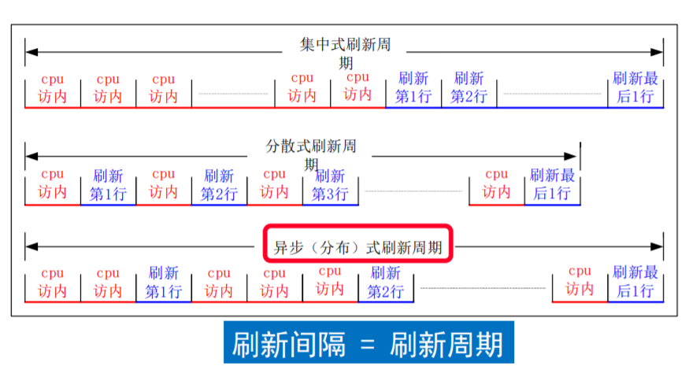
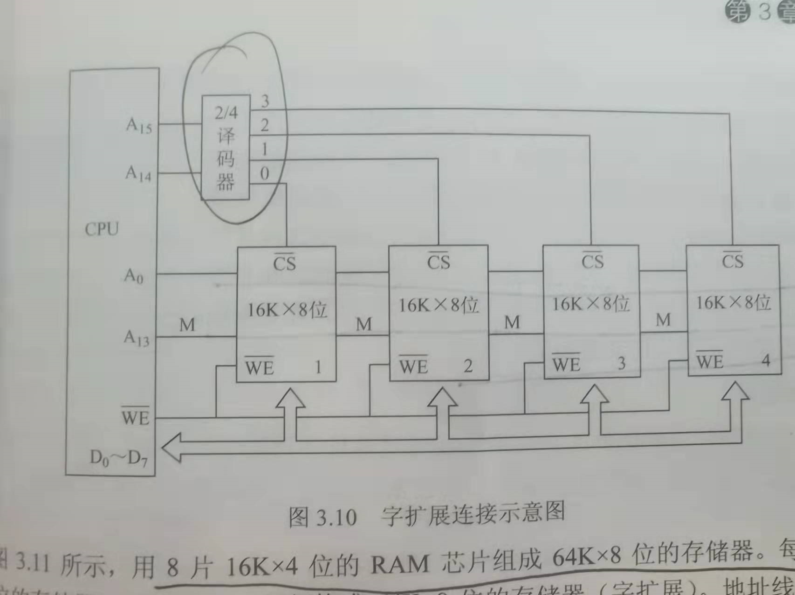
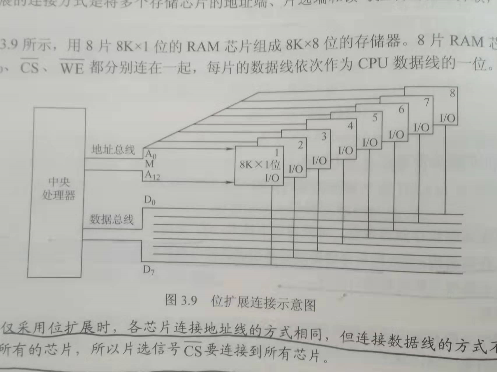

这篇总结并不是一个很好的知识体系，他只是为了考试而临时搭建的一个考试体系。

通常把存放一个二进制单位的物理器件称为**存储元**，**地址码相同的多个存储元构成一个存储单元**（这个定义一针见血！）。若干个存储单元构成一个存储体（又被称为存储矩阵），其特点就是会用到**地址**这个概念。

这个没有更新完，是因为我有看了关于虚拟机的部分内容，感觉挺有意思的，想写一个更加融汇贯通的，所以搭建文章脉络的周期会延长，考试前可能更不了了。

<!-- more-->

## 一、存储概念

### 1.1 存储器性质

#### 1.1.1 存取方式

- 随机存储器（RAM）：存储器的任何一个**存储单元**（就是**编址单位**）的内容都可以随机存取，用作主存或者Cache。
- 只读存储器（ROM）：内容可以随机读出，但是不能写入。还比如U盘
- 顺序存取存储器：只能按照某种顺序存取，存取时间的长短与信息在存储体上的物理位置有关，特点是存取速度慢，比如磁带。
- 直接存取存储器：不像顺序存取存储器完全按位置访问，也不像RAM可以随机访问，存取信息的时候通常先寻找整个存储器中的某一个小区域，然后在这个小区域内顺序查找，比如说磁盘，光盘（CD-ROM）

#### 1.1.2 信息的可保存性

断点后，存储信息即消失的存储器，称为**易失性**存储器，比如说RAM，而断点后仍保有信息的存储器，被称为**非易失性**存储器。如ROM和磁盘。

若某个存储器的存储单元被读出时，原存储信息被破坏，那么就称为破坏性读出，比如说DRAM。具有破坏性读出性能的存储器，每次读出操作以后，必须紧接一个再生操作，以恢复被破坏信息。

### 1.2 RAM

#### 1.2.1 SRAM和DRAM对比

|            | SRAM                 | DRAM         |
| ---------- | -------------------- | ------------ |
| 结构       | 双稳态六晶体管触发器 | 单晶体管电容 |
| 破坏性读出 | 非                   | 是           |
| 刷新       | 不需要               | 需要         |
| 送行列地址 | 同时送               | 分两次送     |
| 集成度     | 低                   | 高           |
| 功耗       | 大                   | 小           |
| 用途       | 高速缓存             | 主存         |

#### 1.2.2 DRAM刷新

因为DRAM电容上的电荷只能维持$1\sim2$ 秒，所以必须在信息消失前进行刷新。此外，即使DRAM的破坏读出后会有恢复过程，那么也必须刷新，可能是应为没法精确定位。

首先介绍**刷新周期**的概念，刷新周期指的是信息的**保存时间**，注意，刷新的最小间隔不是刷新周期，刷新一次用的时间也不是刷新周期。刷新周期说的是在这个时间间隔内，我们必须刷新一次，而不是刷新一次要花一个刷新周期的时间。就好比我们每年放七天假，一年一个年假，刷新周期就类似于一年，而不是七天。

DRAM是按照行刷新的，每次刷新都刷一行，DRAM芯片中有很多行，所以要在一个刷新周期中安排不同的刷新。就好像在一年的时间里要给不同的人安排不同日期的假期一样。以此我们产生了多种方式

- 集中刷新，就是在一段固定的时间里，对所有行逐行刷新，就好像把所有人的假期都安排到一定的顺序时间里，在这个期间内停止对存储器的读写，称为“死时间”，又称访存“死区”。
- 分散刷新，将对每行的刷新分散到各个工作周期中，每个工作周期分为两部分：前半部分用于正常的读写或者保持，后半部分用于刷新（这样一个刷新周期，每行应该就会刷新多次）。这样就没有“死时间”了。但是系统的存取周期会加长，降低了整机的速度。（这个跟图就有点不一样了，不知道具体到底哪个对）。
- 异步刷新：用刷新周期除以行数，得到两次刷新操作之间的时间间隔t，然后每隔t产生一次刷新请求。这样避免CPU的连续等待（但是依然是有死时间的），而且减少了刷新次数。

### 1.3 ROM分类

- 掩模式ROM：MROM，内容在生产过程中写入，不可更改。
- 一次可编程ROM：PROM，允许用户自己编程，但是一旦写入，不可更改。
- 可擦出可编程ROM：EPROM：可以改写，但是编程次数有限，而且写入时间过长。
- 闪存：Flash Memory可以快速擦除和重写，价格便宜。
- 固态硬盘：继承了Flash Memory的优点，但是价格较贵。

---

## 二、存储器的拓展

### 2.1 存储芯片结构

在介绍芯片之前，首先介绍一下**存储矩阵**的概念，它说的是存储单元在存储芯片中的**硬件排列**结构，排成一个矩阵，有行数和列数，根据行数和列数，我们可以取出特定的存储单元。但是行选择线的输入信号是地址，列选择线的信号也是地址。所以不存在行是**字线**，列是**位线**这种说法，这是把存储矩阵与存储芯片弄混的结果。

之说以会弄混，是因为存储芯片同样也可以被视为二维结构，比如说 $1K\times 8$ 。但是我们说，此时的两轴，变成了**地址线（字线）和数据线（位线）**。之前的存储矩阵，相当于把地址线分为**行选线和列选线**两部分。正如前一句话说的，存储器芯片最重要的就是这两个参数，一个是**有多少位（即地址线的表示范围）**，另一个是**字是多少位的（即数据线位数）**。我们做拓展，就是从这两个方向入手。

总结一下，存储芯片的端口有如下几种：地址线，数据线，片选端，读写控制端。

### 2.2 译码器

我们这里特指把地址翻译成独热码的过程，**独热码**是个特殊的码，其特殊之处就在于其不仅可以作为信号表示信息，而且还有**实际作用**，比如驱动字选线。我之所以没有意识到它的作用，是因为在译码器是集成在存储芯片内部的。

当我们做位拓展的时候，需要用到片选信号，此时是需要外置译码器的。

### 2.3 芯片拓展

经过上面的介绍，可以明确，一个存储器我们最看重的两个指标，**一个是地址的范围，一个是字的位数**，也就是这两个标志 $a \times b$。a就是地址的范围，b就是字的宽度。因为单个存储芯片与实际存储区存在差异，所以我们才需要拓展，拓展的对象就是这两个参数。

#### 2.3.1 字拓展

注意这里说字拓展，不是把字拓展，而是拓展字的数量，也就是说，拓展地址范围，此时地址线的位数增加，那么多出的地址线，就会用于控制片选信号，控制前需要经过一个外置的**译码器**，结构如图：

#### 2.3.2 位拓展

就是说对数据位进行拓展，是很简单的操作。装置如下：

---

## 三、高速缓存

块和页都是复制的单位

块和页的大小决定了偏移量的位数

全相连会使命中率提到最高，但是同时比较tag的代价达到最高，我们要在比较付出的代价和缺失付出的代价中权衡。所以越低的层次（比如虚拟存储），就用的是全相连

写直达操作就是访存，所以在底层一般用写回，这样访存次数减少。

## 四、虚拟存储

因为缺页代价惊人，所以我们选择了全相连，后来有因为全相连查找机制代价太高了（拿一个地址去整个内存中进行比较），所以我们选择了用页表（本质是一个索引）来进行查找

页表用虚页号做索引，查找内容是实页号。

页表，程序计数器以及寄存器，确定了一个虚拟机的状态，我们通常称这个状态为一个进程。

由于页表包含了每个可能的虚拟页的映射，所以不需要tag位，页表的地址就是由虚页号组成的。

写直达策略一般采用写缓冲机制作为完善补充

有了虚拟存储以后，cache是按照物理地址进行访问的

虚拟存储为的好像不只是更大的存储系统，而是可以共享的存储系统

虚拟机没有那么可怕，它可以类比于线程

虚拟存储的虚拟二字，或许是与虚拟机同义的
