跟布尔代数那一篇性质类似，可以看做是布尔代数在数字电路中的一个应用。里面介绍的东西跟计组这门课关系不大。

但是可以说，这个实在是太**漂亮优雅**了。首先接触的时候就可以体会出**硬件思想**与编程软件思想的区别（还是多亏了叶哥哥的提醒），然后还可以体会**设计**思想，是一种完全不同于解题的理念，需要考虑的东西更多，有的时候求的不是最完美，而是最合适。

<!-- more-->

## 一、整数

### 1.1 二进制数与十进制数间的转换

首先强调，这里的二进制数是补码形式的（这里的补码就是负数补码，正数原码），我后面进行数学推导的时候，用的是 n 位的二进制数，从高到低，分别是 $ a_{n-1}, a_{n-2}, \cdot\cdot\cdot, a_0 $ 。

对于**二进制转十进制**，有公式

$$
decimal = -a_{n-1} \times 2^{n-1} + a_{n-2} \times 2^{n-2} + \cdot\cdot\cdot + a_0 \times 2^0
$$

这是因为补码的本质是**将一个负数用一个正数表示**，补码的构造是结合溢出，也就是**取余**操作，比如对于四位二进制，-4 对应的是 12，也就是 $-4+2^4 = 12$，可以看出，如果想把补码（负数对应的正数）还原成原来的负数，需要减去 $2^n$ ，所以对于一个二进制数表示的负数，如果按照无符号的算法，有 usigned_decimal，减去 $2^n$，就得到了 signed_decimal

$$
unsigned_{decimal} = a_{n-1} \times 2^{n-1} + a_{n-2} \times 2^{n-2} + \cdot\cdot\cdot + a_0 \times 2^0
$$

$$
signed_{decimal} =unsigned_{decimal} - 2^n = -a_{n-1} \times 2^{n-1} + a_{n-2} \times 2^{n-2} + \cdot\cdot\cdot + a_0 \times 2^0
$$

然后发现，对于二进制正数，上面的计算公式也**恰巧符合**（$a_{n-1}$ 恰好为 0，正负不影响），所以这个公式就很简便了。

对于**十进制转二进制**，对于正数，就可以直接转化，对于负数 $x_0$ ，需要先写出其绝对值的二进制表示 $x_1$ ，在逐位取反得到 $x_2$ ，然后加一，就可以得到对应的二进制数 $x_3$ ，现在我们来**证明**这个操作的合法性。有公式：

$$
x_1 = -x_0
$$

$$
x_1 + x_2 = 111\cdot\cdot\cdot1 = 2^n - 1
$$

$$
x_2 = 2^n-1-x_1
$$

此时如果我们再给 $x_2$ 加 1 ，就得到了式子：

$$
x_3 = 2^n - x_1 = 2^n + x_0
$$

依照**溢出原理**，一个负数加上$2^n$，就可以得到对应的正数。所以 $x_3$ 就是 $x_1$ 对应的那个正数。

### 1.2 通用加法器的实现

对于正数，就是以原码的形式储存，对于负数，是按照补码的形式存储的，这是补码的**第一次应用**，这样存储的好处是可以将原来以**无符号加法**为实现目标的**加法器**，也可以用于**“负数 + 正数”、“正数 + 负数”、“负数 + 负数” **的通用加法器，不需要更改一点硬件设计，这是因为有如下公式：

$$
计算机中负数 + 正数 = 实际负数 + 2^n + 正数 = 实际负数 + 正数（利用溢出原理消去 2^n）
$$

$$
计算机中负数 A + 计算机中负数 B = 实际负数 A + 2^n + 实际负数 B + 2^n = 实际负数 A + 实际负数 B
$$

### 1.3 减法器的实现

这是补码的**第二次**应用，这次跟通用加法器的实现不同，是需要更改一些硬件基础的，对于**减数**，需要在前面增加一个 n 位的异或门，一个 n 位输入接减数，另一个接**减法信号**（sub == 1 时，实现减法器功能，sub == 0 时，实现加法器功能）。此外，还需要把加法器的进位输入端连接到**减法信号**，整体的效果当要进行减法的时候，是对于减数进行取反操作，并给结果加 1，可以知道，这样构造出的减法器应用了补码原理，而且是**通用减法器**。

硬件描述如下：

```verilog
module Adder_subtractor(input [15:0] a, input [15:0] b, input sub, output [15:0] ans);
    wire carry;
    wire [15:0] tmp = b ^ {16{sub}};//如果 sub == 1，就对 b 取反，如果 sub == 0，就不发生变化
    
    add16 sub(a, tmp, sub, ans, carry);//大部分硬件还是与加法器上搭建的
endmodule

module add16(input [15:0] a, input [15:0] b, input cin, output [15:0] sum, output cout);
	assign {cout, sum} = a + b;
endmodule
```

### 1.4 位数拓展

比如要把一个 4 位的二进制数拓展成 8 位，还不能改变他所代表的值。可以这么做，将 $a_{n-1}$ 复制到待扩展位中，就可以满足条件。我们采用迭代证明，对于 n 位数，如果扩展到 n+1 可以，那么扩展到 n+2，n+3，n+4……都可以。

对于正数，前面添一个 0，显然对值本身不会造成任何影响，对于负数，前面添一个 1，我们将其转换为十进制

$$
extend =-a_{n} \times 2^{n} + a_{n-1} \times 2^{n-1} + \cdot\cdot\cdot+ a_0 \times 2^0
$$

我们又有：

$$
a_n= 1， a_{n-1} = 1
$$

所以有

$$
extend =-a_{n} \times 2^{n} + a_{n-1} \times 2^{n-1} + \cdot\cdot\cdot + a_0 \times 2^0  = -a_{n-1} \times 2^{n-1} + a_{n-2} \times 2^{n-2} + \cdot\cdot\cdot + a_0 \times 2^0 = non\_extend
$$

### 1.5 溢出判断

溢出有两种形式，“正数+正数”和“负数+负数”（减法自动转化）。最简单的方法是判断**最高位的进位 carry_out** 和**次高位的进位 carry_out** 是否相同，如果相同，就说明发出了溢出。

对于**“正数+正数”**，显然最高位肯定 carry_out 是 0（两个 0 和一个 carry_in 相加没办法进位）如果被次高位进位了，那么它就变成了一个负数了，所以要求次高位不能进位。

对于**“负数+负数”**，最高位的 carry_out 一定是 1，如果是次高位没有 1 进上来，那么就会在最高位出现 0，就溢出了，如果是进上来了，那么可以证明结果尽管发出了物理上的溢出，但是在数值上没有问题，因为有公式

$$
计算机中负数 A + 计算机中负数 B = 实际负数 A + 2^n + 实际负数 B + 2^n
$$

对于溢出，其实就是减掉一个 $2^n$​​，显然是不会对真值造成影响的。

### 1.6 超前进位加法器

```
C1 = A0 & B0 | C0 & (A0 ^ B0);
C2 = A1 & B1 | C1 & (A1 ^ B1);
...
Cn = An-1 & Bn-1 | Cn-1 & (An-1 ^ Bn-1);

//所以如果我们这样转换变量
Gi = Ai & Bi; Pi = Ai ^ Bi;
//就会有如下式子
C1 = G0 | P0 & c0;
C2 = G1 | G0 & P1 | P0 & P1 & C0;
C3 = G2 | G1 & P2 | G0 & P1 & P2 | P0 & P1 & P2 & C0;
C4 = G3 | G2 & P3 | G1 & P2 & P3 | G0 & P1 & P2 & P3 | P0 & P1 & P2 & P3 & C0;
```

可以看到，$C_i$ 不再和 $C_{i-1}$ 有直接关系了，这样就为**并行计算**提供了方法。但是相应的，电路设计变得复杂。

### 1.7 无符号乘法

首先我们看无符号乘法的的实现，其流程基本上就是 W 次（其中 W 为数据位宽）的加法和移位操作，是二进制竖式乘法的模拟：

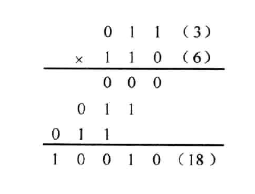

做出来硬件比较直观的是这样：

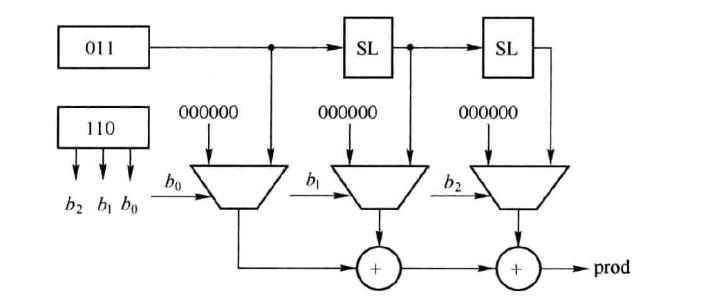

可以看到利用 6 的不同位并配合 3 的左移位（SL）和加法就达到计算的效果。但是这种直观的方法会导致计算时间很长，因为靠右侧的加法单元要等待左侧加法单元的计算结果稳定后（也就是算完后），再进行计算（被串行化）了，每个周期的时延会延长。

所以我们就提出了下面这种模型，相比于上面的简陋版，这种模型使用了一个循环结构，每个周期只完成一次加法和一次位移，这样每个周期的时延就减少了，不过乘法运算所需要的周期数就增加了。这种结构还有一个好处在于节约了硬件资源，原先用 W - 1 个加法单元可以完成的事情，现在用 1 个就可以完成了。

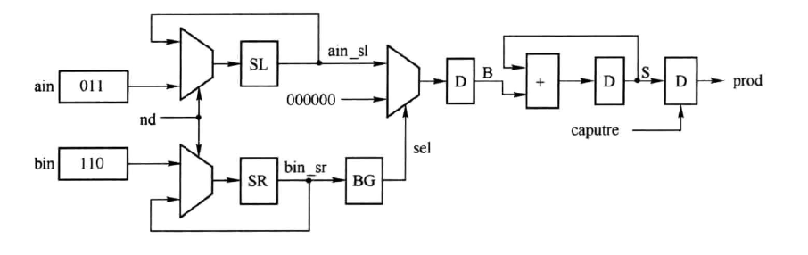

当然还有另一种设计，因为乘法十分优良的并行性（每一位之间是没有关系的），所以可以产生一个树结构来汇总加法计算结果，这样在一个周期内就可以完成运算，而一个周期的时间其实是 logW 个加法单元的时间，其缺点就在于会使用 W - 1 个加法单元，如下所示：

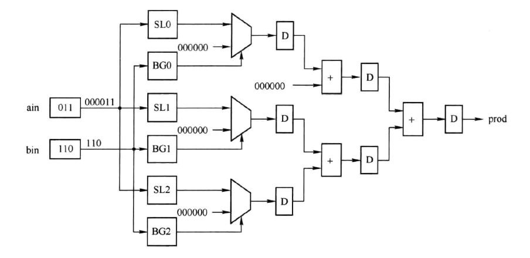

在实际实现中，可以在上面这两种设计思路中取一个平衡，使得计算资源和计算时间更加均衡或者符合要求。乘法实现如此自由，得益于乘法良好的并行性。

### 1.8 有符号乘法

首先应当明确，有符号数乘法与有符号加法不同，有符号加法可以完全使用无符号加法的加法器（利用了溢出原理），但是有符号乘法和无符号乘法是不一样的，比如说 3（`4b'0011`）与 -6 （`4'b1010`）如果做无符号乘法，那么结果是 `8'b00011110`，其对应的有符号数是 30，这与原本的结果 -18 风马牛不相及。

为了保证有符号数的正确性，较为直观就可以想到，可以先对乘数取绝对值，然后对绝对值进行运算，然后将结果改变符号。这种思路非常直观，但是需要的硬件资源较多，因为要进行补码运算（这里插一嘴，我刚开始学的时候总觉得原码和反码是一对，因为俩个数在二进制中“针锋相对”，十分漂亮，但是仔细想，只有原码和他的补码的和是 $2^W$ ，这是更加美妙的数学性质），比较耗资源。

另外其实也可以考虑利用 1.1 节提到的思路，将最高位视为负数（也就是减法器），这样就可以实现正确运算，如下所示

$$
−3 × 6 = (−1 × 2^3 + 1 × 2^2 + 0 × 2^1 + 1 × 2^0) × 6 = −2^3 × 6 + 2^2 × 6 + 2^0 × 6 = -18
$$

一种对应的实现如下：

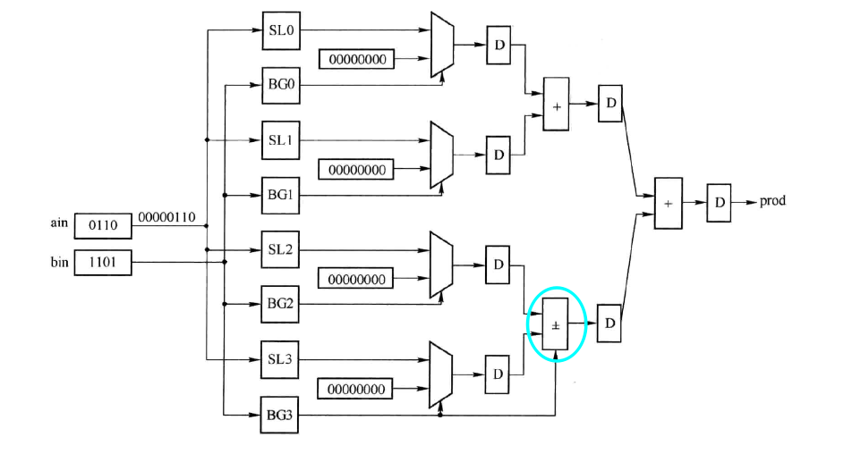

可以看到圈出的部分有可能是加法，也有可能是减法。需要注意，即使 `ain` 是一个负数，这个实现依然是可以使用的。

还有一种设计思路是这样的：我们为了算补码的乘法，可以这样算，首先将乘数符号拓展到 2W 位，然后相乘，得到 4W 的结果，取低 2W 位即为正确的积，演示如下：

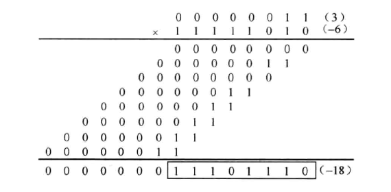

其证明如下（感谢 kg）：

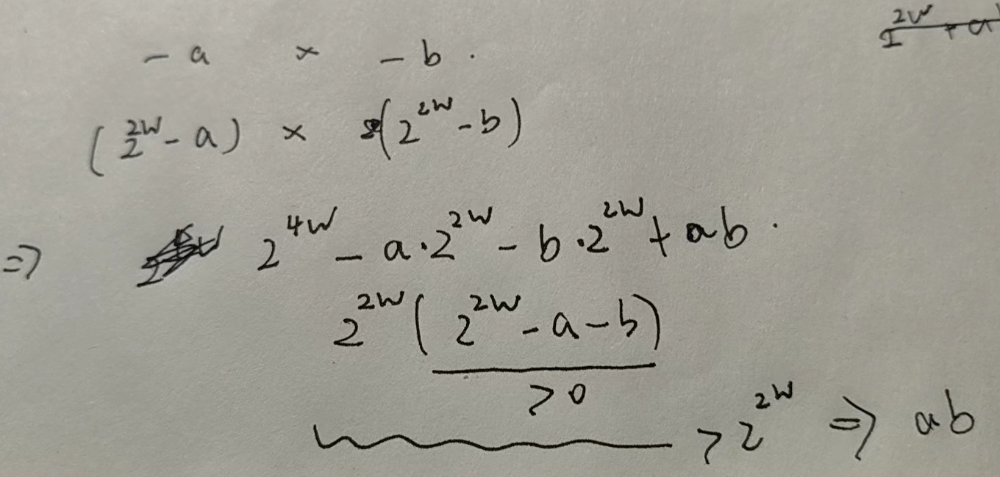

我们可以用硬件模拟这种结果即可。同时也可以这样优化硬件，因为有

```
111.111 x a = -a
```

比如 a x b ，如果 a 最高位是 1，那无符号乘结果高 W 位减去 b 就行，同理 b 最高位是 1，无符号结果高 W 位减 a 就行。

### 1.9 无符号除法

无符号除法也是二进制竖式计算的模拟

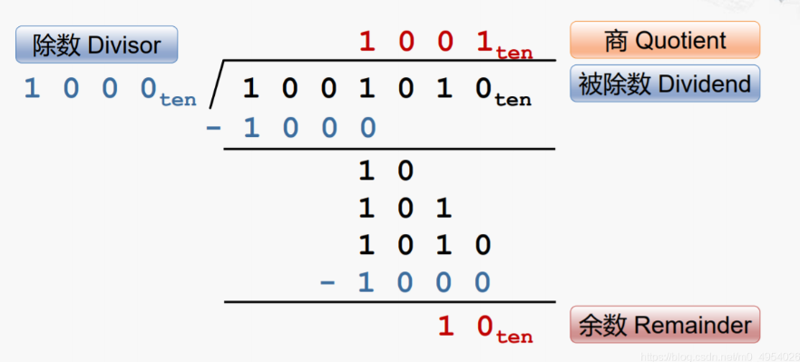

在实际的实现中，会将余数和被除数放在一个寄存器中，其算法流程如图所示

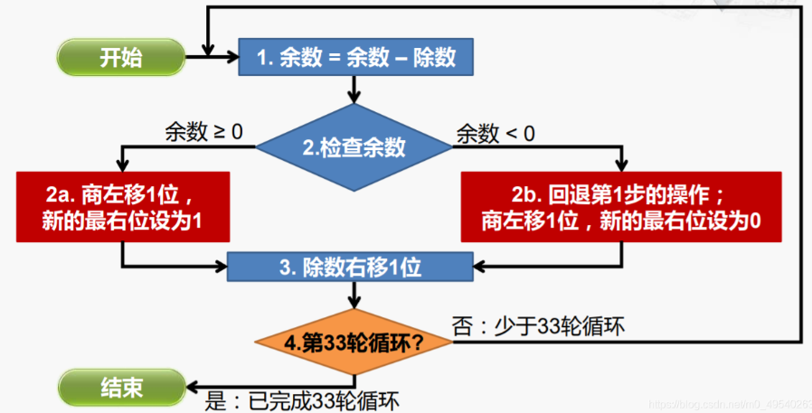

其实现结构如下：

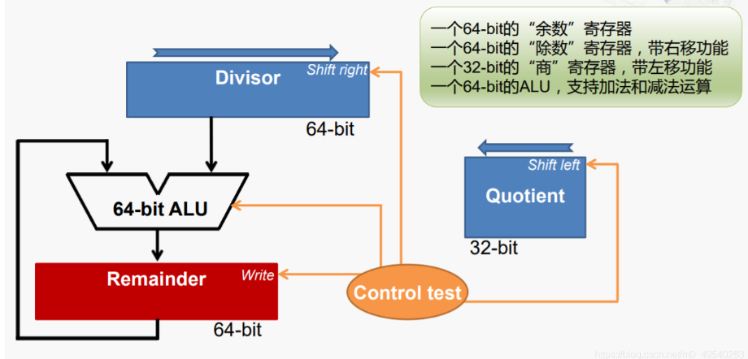

在运算中，我们需要：

- 将除数放在 Divisor 的高 32 位
- 将 Quotient 置为 0

当然这个结构还是十分朴素的，因为还有很多优化的空间，在优化之后我们可以看到如下结构

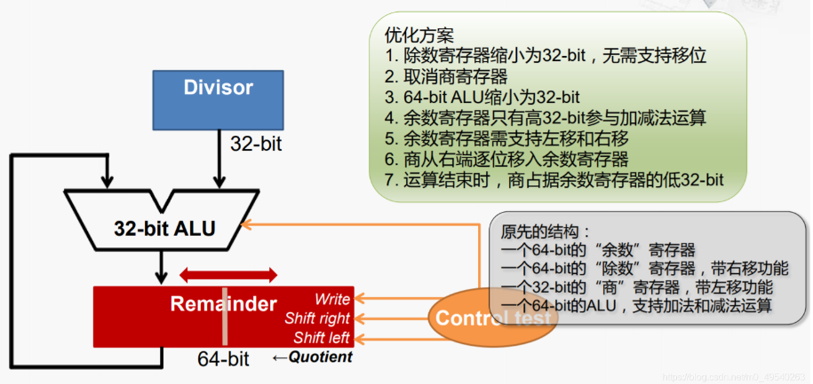

可以解释一下为什么这样可以：

- 首先除数本来就应该是 32 位的，之前是 64 位是为了和 64 位的被除数或者余数做运算。
- 那么如果将除数改成 32 位的，那么为啥还可以和 64 位的被除数做运算，这是因为实际上除法周期的只设计 32 位的比较和加减法运算，所以在局部来说用 32 位 ALU 和余数的高 32 位进行计算式合理的。
- 余数和商是可以共用一个寄存器的，因为由除法的性质可知，余数和商（这里说的都是计算过程中的）的位数加和永远都是 64。
- 左移功能也非常优雅，因为商每次都在左移（产生新的结算结果），而余数为了和除数对齐，每次也都是要左移（对应朴素版本的除数右移），这样余数越来越短，而商越来越长，两者位数之和不变。
- 这种设计很容易得到和 MIPS 或者 RISCV 类似的结果，就是 Hi 存储余数，Lo 存储商。所以严格意义上说，寄存器是不需要右移功能的，右移功能是为了在低 32 位中取出余数（将高 32 位右移到低 32 位），至于为什么非得在低 32 位拿到结果，这是因为这样可以减少高 32 位的 fanout（连在高 32 位上的线），芯片上的线不是理想环境，是个 rc 电路，充电放电都需要时间。一个寄存器对外接的线越多，需要承担的负载就越大，充放电时间就更长，频率就更低。
- 此外无论是这个实现还是上一个实现，里面都用到了“移位寄存器”，这是因为这种每次移动 1 位的功能十分简单，所以放到了寄存器中实现，这样更加优化。但是并非所有移位功能都很简单，这是因为支持任意位功能的移位是十分复杂的，比如移动 7 位，就很容易变成进行 7 次移位，那么一个周期时间就会非常长，这种移位是放到 ALU 中的，有一种设计思路是“第一个周期 1 位移，第二个周期 2 位移，第三个周期 4 位移，第四个周期 8 位移，第五个周期 16 位移”，这样在 5 个周期中结束运算，利用了二进制思想。

上面只是介绍了无符号除法的一种“模拟竖式”的实现方法，而在实际的实现中，还有更加变态的方法，比如说“牛顿插值”（听着就离谱），所以就不再讨论了。

### 1.10 有符号除法

我没有太研究过普世的方法，据说可以依靠“取绝对值进行无符号运算后加上符号”的方法解决。

---


## 二、浮点数
### 2.1 定点数和浮点数
二进制小数相比于二进制的整数并没有什么稀奇的，小数点的部分其实就是 2 的负幂次，比如说十进制小数 1.375 因为可以表示成：

$$
1.375 = 1 + 0.25 + 0.125 = 1 \times 2^0 + 0 \times 2^{-1} + 1 \times 2^{-2} + 1 \times 2^{-3}
$$

所以就可以被表示成二进制小数 1.011 。

所谓的定点数，就是规定某一位与某个幂次的对应关系，比如说第 0 位就对应 $2^{-4}$ ，第 1 位就对应 $2^{-3}$ ，依次类推，那么 `0b0110` 就表示 `0.375` 。这种方法其实和整数的表示方法是相同的，整数本质上是规定第 $n$ 位对应 $2^{n}$ 。

而浮点数则是通过引入“幂次”（阶码）这个概念，使得“某一位与某个幂次的对应关系”变得不再是

### 2.2 最基础的浮点数表示

我们用一个十进制数 288 来举例，288 的二进制表示是 11100100，转换为科学计数法就是 $1.11001 \times 2^{111}$​ 。我们用符号位（sign）存储数的**正负**，用阶码（exponent）存储**基数的幂次**，用尾数（mantissa）存储那个小数。

| 符号（1位） | 阶码（8位） | 尾数（23 位）                |
|:-----------:|:-----------:|:----------------------------:|
| 0           | 0000_0111   | 111_0010_0000_0000_0000_0000 |

### 2.3 隐含前导 1

我们注意到，只要需要存储的数字不是 0，尾数的第一位就一定是 1，所以就没有必要每次花一个数据位去保存了，所以我们就得到了采用**隐含前导 1**的第二种表示方法。

| 符号（1位） | 阶码（8位） | 尾数（23 位）                |
|:-----------:|:-----------:|:----------------------------:|
| 0           | 0000_0111   | 110_0100_0000_0000_0000_0000 |

这也是“尾数”名字的由来，正因为它是小数点 `.` 后的部分，所以被称为尾数。

### 2.4 偏码与补码

那么如果遇到阶码是负数的情况怎么办，当然我们可以用补码来表示，但是补码不太符合浮点数的计算要求，为什么这么说呢？首先我要了解一下**浮点数的加法过程**。

面对浮点数加法，我们与整数加法不同的是，我们要先**比较**阶码的大小，然后利用阶码的差，将**尾数对齐**，那么显然，补码的设计是不适合进行比较的，比如 -1 永远都对应最大的无符号数，比所有的正数都大。我们需要的是一个**好比较的数制**。

这是**偏码**的长处，偏码就是把原始阶码加上了一个**常数偏置**。这个常数一般是 $2^{n-1} - 1$​ ，其中 $n$ 是阶码的位数，这样一来，阶码的大小比较就很容易了，而且计算差值也不会受到影响。所以采用了偏码的 288，储存形式如下：

| 符号（1位） | 阶码（8位） | 尾数（23 位）                |
|:-----------:|:-----------:|:----------------------------:|
| 0           | 1000_0110   | 110_0100_0000_0000_0000_0000 |

那么为什么不所有的数都采用偏码表示，舍弃补码的用法，这可能是因为补码能更好的适应加减法吧。

### 2.5 浮点数的表示范围

需要明确的一点，尽管浮点数的表示范围大了，但是其实他能表示的数还是 $2^{32}$ 个，这跟一个 int 表示的数是一样的，准确的来说，是浮点数的上限高了，但是范围内只能表示特定的一些数。因为只有 $2^{32}$ 中状态，所以只能表示 $2^{32}$ 种数，这是很直白的道理。

所以与浮点数相伴随的，是**舍入**现象和**溢出**现象，因为没办法精确表示每一个数，所以**舍入**是必然的。**溢出**也比整型要复杂，分为**负上溢出**（负数太小了），**负下溢出**（负数太接近 0 了），**正下溢出**（正数太接近 0 了），**正上溢出**（正数太大了）。

### 2.6 特殊情况的表示

正如 2.4 节形容的，有些数是没有办法按常理表示的，所以我们分出了几个状态来表示这些特殊值

| 数字      | 符号 | 阶码      | 小数                         |
|:---------:|:----:|:---------:|:----------------------------:|
| 0         | x    | 0000_0000 | 000_0000_0000_0000_0000_0000 |
| $\infty $ | 0    | 1111_1111 | 000_0000_0000_0000_0000_0000 |
| $-\infty$ | 1    | 1111_1111 | 000_0000_0000_0000_0000_0000 |
| NaN       | x    | 1111_1111 | 非零                         |

### 2.7 IEEE 754 标准

采用隐含前导 1，偏码，特殊情况的数制就是这个标准。

### 2.8 浮点数加减乘除分析

在设计难度上，浮点数加减法 > 浮点除法 > 浮点乘法 > 整数运算。

这是因为对于浮点乘除法，并不需要对齐，只需要尾数相乘除，阶码相加减即可，而加减法要考虑对齐的问题，除此之外，还需要支持许多非标准数和舍入模式。

这里是一份软件实现的 [乘法](https://github.com/ucb-bar/berkeley-softfloat-3/blob/master/source/f32_mul.c) 和软件实现的 [减法](https://github.com/ucb-bar/berkeley-softfloat-3/blob/master/source/s_subMagsF32.c) ，可以看到减法实现要明显复杂过乘法。

---

