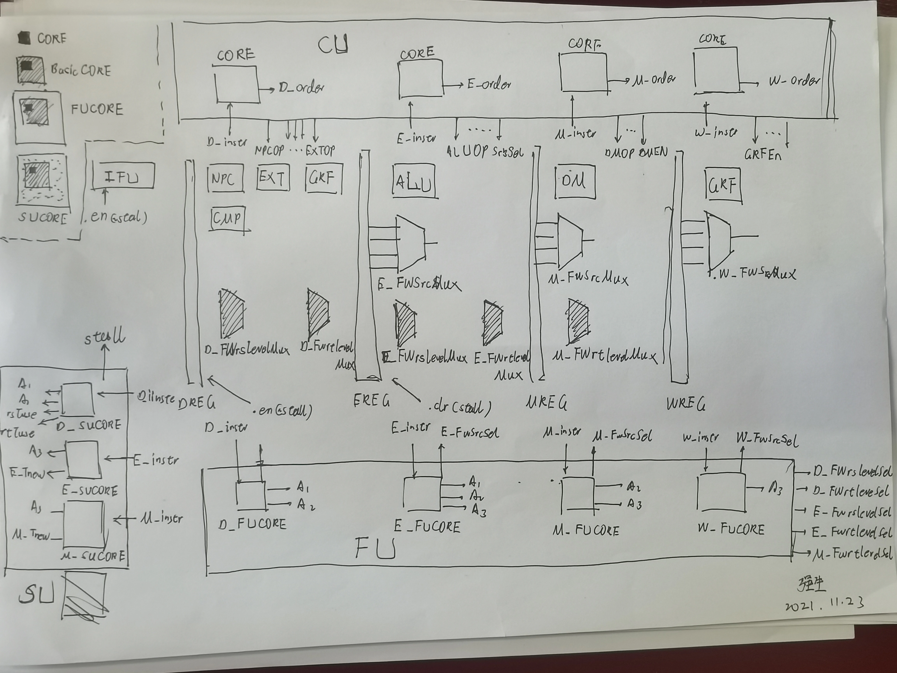

## 一、设计想法

### 1.1 我的 CPU 的整体架构



### 1.2 从单周期到流水线

虽然学长一直在强调重构，身边大佬也都对重构乐此不疲。但是以我个人的感觉，感觉不太需要重构（这可能就是我 TLE 了两天的错误观念）。我个人感觉完全可以在单周期上面改。为了给大家一个直观印象，我从**修改原单周期 CPU，流水线寄存器，加入阻塞刷新功能，加入转发功能**方面分别说一下怎么改（严格说是怎么加，需要改的地方好像没有）：

#### 1.2.1 修改原单周期 CPU

在数据通路方面，就是把 NPC 放到 D 级，相应的输入端口因为要从 F_instr 和 D_instr 中挑选，所以要加一个 MUX，然后加一个 CMP（看过我之前帖子，应该知道我的本来就有 CMP）。然后去掉 GRF 的多功能（正常人 GRF 也没有多功能，只有我的是可以完成 set，link，lui 功能）。数据通路的修改就完成了。最后要在 GRF 中实现一个内部转发功能。

在信号方面，只需要加入用于选择 F_instr 和 D_instr 的 Sel 信号就好了，其他不需要更改。

#### 1.2.2 流水线寄存器

这里集中讨论一下流水线寄存器，对于各级流水线寄存器，需要保存的内容，有下表：

|            | DREG | EREG | MREG | WREG |
| ---------- | ---- | ---- | ---- | ---- |
| instr      | 1    | 1    | 1    | 1    |
| CMPOut     | -    | 1    | 1    | 1    |
| **PC**     | 1    | 1    | 1    | 1    |
| **EXTOut** | -    | 1    | 1    | 1    |
| rsOut      | -    | 1    | -    | -    |
| rtOut      | -    | 1    | 1    | -    |
| **ALUOut** | -    | -    | 1    | 1    |
| **DMOut**  | -    | -    | -    | 1    |

首先介绍命名方式，采用的是 “数据接收流水级 + REG” 的命名方式，比如 “EREG” 的意思就是 EREG 里的数据适用于 execute 阶段（也就是 ALU 运行）的数据。

然后讨论为什么要保存这些数据？instr 和 CMPOut 是 E 级及以后的流水线寄存器必须保存的，因为他们决定了一个指令的所有信息，保存 instr 很好理解，因为诸如 opcode，funcode，rs，rt 都在里面，保存 CMPOut 是因为对于 b 类指令，只依靠 instr 不能确定指令的所有 RTL 操作，必须结合 CMPOut 的结果才能最终确定。但是 DREG 的寄存器中还没有产生 CMPOut，所以他只保存 instr。

有些数据被保存下来，是因为它仅仅为了记录某一流水级的运行**成果**，方便下一流水级的使用，比如说 rsOut，可以用来给 ALUOut 当运算数。但是有的数据，比较特殊，是用来保存需要写入寄存器数据的，比如 ALUOut，EXTOut，按理说，这些数据在某些流水级没法被利用，应该消亡了，但是他们主要起保存作用，我用**加粗**标出来了，他们的生命周期，刚好是 Tnew 的值。我们考虑阻塞的时候，要从这个方面去理解原理。

需要注意的是，当一个数据被保存在了流水线寄存器中，他就是流水线级别的，也就是他就需要加流水线前缀了。

此外，注意被保存的数据是经过转发处理之后的，也就是说，输入到 EREG 中被保存的，不是 D_rsOut（直接从 GRF 中读出的数据），而是经过转发之后的 D_FWrsOut。

#### 1.2.3 加入阻塞刷新功能

在数据通路方面，不需要搭建另外的 MUX 或则其他的功能部件，只需要将 D 流水寄存器和 PC 寄存器改为可以接受 en 信号即可。

在信号方面，需要构建一个 SU 单元接受 D_instr，E_instr，M_instr 产生 stall 信号。具体实现见下文。

关于流水线寄存器的控制信号，是由 SU 产生的，用于产生**阻塞和气泡**（同一件事情）。注意这是一个 stall 信号接在了三个控制端口，PC 寄存器也可以看做广义的流水线寄存器，故一并列出，如此，就完后才能了一个周期的**阻塞和气泡**操作。

| 信号                     | 解释                                 |
| ------------------------ | ------------------------------------ |
| stall（起 StallPC 的作用） | 其实就是将这个信号取反连到 PC 的 en 端   |
| stall（起 StallD 的作用）  | 其实就是将这个信号取反连到 DREG 的 en 端 |
| stall（起 FlushE 的作用）  | 其实就是把这个信号连到 EREG 的 reset 端  |

#### 1.2.4 加入转发功能

在数据通路方面，需要加入两种 MUX，即 Y_FWxxLevelMux 和 Y_FWSrcMux （Y 是流水线级，xx 是数据）。具体的作用下文有。

在信号方面，为了控制这两种 MUX，需要产生两种 Sel 信号。所以搭建了一个 FU 来产生信号。具体的搭建过程见下文。至此，我们的流水线已经实现完成了。

### 1.3 思考流水线 CPU 的一个角度

有些功能，是给定指令就可以得出的，他跟前几个流水级的运行结果没啥关系。比如所有的单周期用到的控制信号：ALUOP，GRFEn，SrcBSel，还有比如说 rtTuse，rsTuse，A1，A2，A3，这样的东西都是给定指令就能确定的，他是一个**向量值函数**。完成了由一个指令到一个控制信号向量的映射。这是我们**分布式译码**的理论基础。

有的时候仅凭一条指令是没有办法完成一个流水级功能的，还需要前几个流水级的 “成果”。比如说 E 级想要完成 ALU 的功能，就必须有 SrcA，SrcB 和 ALUOP，ALUOP 是 E_instr 给出的，但是 SrcA，SrcB 没办法只从 E 流水级中获得，所以才需要 EREG 保存 D 流水级的成果。我们去思考一个一个流水线寄存器需要保存哪些值的时候，其实就是从这个角度去思考的。

先思考一个简单的问题，CMPOut 有没有必要流水（它决定了 beq 的工作状态的差异），是没有必要的，为什么没必要？是因为 beq 或者 set 类指令在 D 阶段就把所有的需要执行的任务都完成了，所以后面的流水级不需要执行功能，所以就不需要 CMPOut 了，这是不流水 CMPOut 的原因。

是不是每级流水线只有他本身的狭义的功能？有一个很有趣的原创指令叫做 lwso，它说的是，如果从 DMOut 中读出的值比 0 大，那么就写到寄存器中，要不然就不写了。这时采用无脑转发理论，就会有一个缺陷，就是在 M 级写数据的时候，如果是数据比 0 小的话，那么就不写了，所以原来持有的数据是错误数据（也就是说，这个错误的数据有可能会被转发，比如先来一个 lwso，再来一个 sw），那么就会发现 sw 会接受到一个错误的负数数据，而且没办法更改。这是因为每个流水线除了自己本职工作以外，还有维持转发系统正常运作的功能。所以正确的解决办法就是保存这个值（其实这个值不用加，就是每级的 rtOut），并且让他接受后面几级流水的转发更新。是可以建立在**无脑转发理论**上的，不需要对这个理论进行任何的修改。

综上，如果不想在考场上现改数据通路，就要保证流水寄存器的存储了这个流水级和其后流水级实现功能（这里的功能包括本职功能，转发提供，暂停）所需要的所有数据，不能轻易的丢弃用不到的数据。

### 1.4 对译码方式的讨论

#### 1.4.1 集中式译码

我个人没有实现过，但是现在看看，这才叫优雅，越写分布式越觉得集中式的美感和高效（不是指做题的，是客观上）。在效率上能稍微看见其脚后跟的只有分立式的多种类 CU 可以达到，但是这个写起来难度跟集中式差不多，所以造成了鸡肋的困境。

集中式译码的难度我从外人的角度看，应该是在设计文档的书写上，因为要设计流水线寄存器要保存哪些控制信号，什么时候级不需要保存了，控制信号因为加了流水级前缀，又多又容易弄混，所以很难第一次就写出来（因为不写永远没办法通观全局）。

唯一的缺点就是由于控制信号的传递，使耦合性增加了，流水线 CPU 被流动的控制信号串成了一个整体。但是好像也没啥不好的，毕竟大家只买 CPU，不买 FU，FU 那么独立也没啥好的（个人观点）。

#### 1.4.2 分布式译码

代表就是吴佬的设计。但是分布式有一个逃不开的问题，就是 FU，SU 的实现都需要嵌套 CU，这是因为 FU，SU 都需要比较两个流水线的 A、T 值，而 A，T 值是**指令相关的**（1.3 的论述），所以必须内置 CU 来完成这类信息的译码，这样的好处就是加指令的时候只需要修改 CU 就好了，因为转发和阻塞的规则是用 FU 和 SU 实现的，每次指令的不同只是 AT 值不用，所以加指令的修改很集中，不像分布式那么分散，要修改的地方那么多。

其实为了避免不在 FU 和 SU 中实例化 CU，还可以考虑把 AT 值作为输入，输入 FU 和 SU，这也是一个很好很优雅的方法，如果不是我 TLE 了两天，我就打算这么干了。

但是无论怎么样，多次实例化 CU，闲置一些端口，一定会造成资源的浪费和效率的降低，采用这个就与**客观的设计**无缘了。

#### 1.4.3 我的尝试

为了写出**多样性的 CU** 来减轻自己的负罪感（真的只是负罪感，写同质化的 CU 没有任何问题，而且更方便，只用在一个文件里就可以完成加指令操作）。我想了一种代码复用的方法，就是独立出一个叫做 CORE 的东西，他就是一个指令的向量值函数，但是每个 CORE 对应的向量值函数是不一样的，比如说阻塞刷新用不到 T 值，那么 SUCORE 就不会产生 T 值，CU 中不需要 A 值和 T 值，那么 CUCORE（就是 CORE）就不会产生 A 和 T 值，FUCORE 和 SUCORE 都需要产生 A 值，那么就做一个 BasicCORE 来实现这个功能，然后让他们嵌套应用。具体如下

| 模块      | 应用      | 功能                                                  |
| --------- | --------- | ----------------------------------------------------- |
| CORE      | 无        | 产生 order                                             |
| BasicCORE | CORE      | 产生 order，A1，A2，A3                                 |
| FUCORE    | BasicCORE | 产生 order，A1，A2，A3，FWSrcSel                       |
| SUCORE    | BasicCORE | 产生 order，A1，A2，A3，rsTuse，rtTuse，E_Tnew，M_Tnew |

这个只是个人习惯，完全没有优势可言，只为博君一笑。

*考完出来了，大家不要在考场上用这种方法，嵌套的形式改端口太麻烦了，整个人麻了，想给 CORE 加个端口，就四个 CORE 还有 FU 和 SU 一个一个加，一个一个布线，累死了。*

#### 1.4.4 郭哥的设计

郭哥的设计是我觉得在我看到的设计里面最漂亮，最优雅，最客观的一种。总的来说，是集中式译码的一种变体，他把控制信号的流水寄存器集成在了 CU 中，在 mips 顶端看，看上去像一个分布式译码，但是实际是集中式。在搭配上郭哥**谨慎**的控制逻辑（没有采用无脑转发理论），可以说，是一个极具个人风格，跟整个 CPU 的设计气质契合的非常好。不得不说，集中式除了写起来难度巨大（尤其是第一遍），但是在加各种稀奇古怪的指令方面，有着天然的优势。我在考前听得叹为观止。

而且确实，如果不采用老师给的 AT 无脑法判断，自己思考转发阻塞机制，虽然有一些不稳妥的代价，但是有两点好处：一个是自己发明的方法，理解起来肯定更深。另一个是自己写的东西，是跟自己 CPU 其他部分的设计思想是契合的。我个人观点，AT 法本身就带着过于彪悍的气质（过于简洁，过于强大，过于让人不相信），很容易跟 CPU 其他设计理念冲突，不是所有人都适合采用这种方法，我自己就亲身见过也是很聪明很牛逼综合素质很好的很多学神（当然包括郭哥），对 AT 法做了改革，或者完全舍弃了 AT 法。不稳妥的代价在强测上线以后，也变得稍微少了一些。

### 1.5 加一条指令需要考虑什么？

- 在 const.v 中，给这条指令一个编码。
- 在 CORE 中，使这条指令可以根据 opcode 和 funcode 进行译码。
- 在 BasicCORE 中，构造这条指令的 A 值。（本质是决定这条指令是读数据的地址，又是写数据的地址）
- 在 FUCORE 中，构造这条指令的写指令数据保存区域 FWSrc，如果没有，就默认。（本质是决定写数据的指令的数据存放的地点）
- 在 SUCORE 中，构造这条指令的 T 值。（本质是决定这条指令与其他指令的相互作用造成的阻塞行为）
- 在 CU 中，构造这条指令的控制信号（使能，功能，选择，本质是确定 CPU 的工作状态）。

其实无论构造什么样子的 CPU，是集中式译码还是分布式译码，是无脑转发还是谨慎转发，最后考虑的一定都是这几个问题，而一个好的（或者说适合应试的 CPU），一定是在考场上，无论这几个问题的答案组合是什么，都可以很轻松的实现添加操作，而不是需要再加控制信号之类的东西。

---


## 二、理论

### 2.1 延迟槽

延迟槽最难理解的是他的表述，**不论判断结果如何，我们都将执行分支或跳转指令的下一条指令。这也就是所谓的 “延迟槽”。通过这种做法，我们可以利用编译调度，将适当的指令移入延迟槽中，充分利用流水线的性能。** 那么到底是谁在 “移动指令”。按我一开始的理解，肯定是编译器啊，因为封装抽象的特性，软件程序员不应该需要了解 CPU 硬件实现机制，他应该按照原来的方式编码，然后编译器就自动将指令进行一个重新排布。但是事实是，这个确实是由程序员实现的。他编写的代码就是按照这种不自然的方式运行的（**我们都将执行分支或跳转指令的下一条指令**）。最快了解延迟槽的办法就是打开 MARS，然后勾选 “Setting-Delayed Branching”，自己写一段指令单步执行一下就好了（延迟槽指令在执行的时候会变成绿色）。

### 2.2 A 和 T 的构造

关于 A1 的构造：

- 如果读指令需要利用 rsOUt，则 A1 是 rs，否则是 0
- 0 的情况对应有两种，一个是 rs 真的是 0，一个是指令不需要利用 rsOut（比如 jal）

对于 A2 的构造：

- 如果读指令需要利用 rtOUt，则 A2 是 rt，否则是 0
- 0 的情况对应有两种，一个是 rt 真的是 0，一个是指令不需要利用 rtOut（比如 jal，lw）

对于 A3 的构造：

- 如果指令的写地址是 rt，那么 A3 就是 rt
- 如果指令的写地址是 rd，那么 A3 就是 rd
- 如果指令是 link 操作，那么 A3 就是 31
- 如果不是写指令，那么 A3 就是 0
- A3 是 0 对应两种，一个是写指令的地址本身就是 0，一个是不是写指令

对于 Tuse 和 Tnew，是一个直接映射，见下表：


| 指令 | $rsT_{use}$ | $rtT_{use}$ |
| ---- | ----------- | ----------- |
| addu | 1           | 1           |
| subu | 1           | 1           |
| ori  | 1           | -           |
| lw   | 1           | -           |
| sw   | 1           | 2           |
| beq  | 0           | 0           |
| lui  | -           | -           |
| j    | -           | -           |
| jal  | -           | -           |
| jr   | 0           | -           |
| nop  | -           | -           |


| 指令 | $ET_{new}$ | $MT_{new}$ | $WT_{new}$ |
| ---- | ---------- | ---------- | ---------- |
| addu | 1          | 0          | 0          |
| subu | 1          | 0          | 0          |
| ori  | 1          | 0          | 0          |
| lw   | 2          | 1          | 0          |
| sw   | -          | -          | -          |
| beq  | -          | -          | -          |
| lui  | 0          | 0          | 0          |
| j    | -          | -          | -          |
| jal  | 0          | 0          | 0          |
| jr   | -          | -          | -          |
| nop  | -          | -          | -          |

### 2.3 阻塞和刷新

先介绍一下**流水线寄存器的本质**，**每个流水线寄存器都保存着一条指令执行所需要的的全部信息**，也就是说，如果 EREG 还正常，前面 DREG 就算炸了，E 流水级对应的指令还是能够得到执行（但是 E 后面的元器件炸了不行）。与之相对的，如果将 EREG 的内容修改了，E 流水级此时对应指令就被修改了，哪怕其他流水线寄存器的都没有发生改变，E 流水级对应的指令还是被修改了。

所谓阻塞，就是对**流水线寄存器和 PC 寄存器**的使能端进行控制，当使能端为 0 的时候，当时钟有效沿再来临的时候，就不会再录入新数据了。结合流水线分析，我们可以得到一个性质，**被阻塞的寄存器之前的寄存器一定是需要被阻塞的**（PC 寄存器被认为在 DREG 之前），这是因为如果靠前的寄存器没有被阻塞，而靠后的寄存器阻塞了，那么靠前的寄存器的指令就会发生**丢失**，这显然是与阻塞的目的不同。

所谓刷新，就是对流水线寄存器的 reset 端进行控制，当刷新信号 Flush 给到时，流水线寄存器重置，由第一段的介绍可以知道，如果一个流水线寄存器被修改了，那么这个流水级对应的指令就被修改了，如果寄存器被清零了，那么这个流水级对应的指令就改成了清零的数据对应的那条指令了，这个指令一般对应的都是 nop（直接说是 nop 是不严谨的，如果清零的数据对应的不是 nop，那么就不是 nop）。

然后我们需要意识到，**阻塞和刷新是由一个信号控制的**，当发生的时候，PC 寄存器和 DREG 被阻塞，同时 EREG 会被刷新。这样，效果就是，指令在 F 级和 D 级不流动了，E 级产生了一个 nop 指令，这也是跟我们的设计构想一致。如果没有阻塞，那么指令要么继续流动，要么丢失，都不对。如果没有刷新，那么 E 级就会接受 D 级的指令，然后 D 级在其被阻塞期间就会一一直传给 E 级相同的信息（D 级一直保持不变），那么流水线上就会多一条 D 级指令（一条是因为阻塞是一个周期），就会造成错误。于此同时，因为 $T_{use}$ 最小是 0（beq，jr），$T_{new}$ 最大是 2（lw），所以最多阻塞两个周期（不只是这几个指令，而是所有指令的上下界），也就是最多产生两个 nop 指令。

我们代码中判断是否发生阻塞的条件如下：

```verilog
wire E_StallRs = (rsTuse < E_Tnew) && (E_A3 && E_A3 == A1);
wire E_StallRt = (rtTuse < E_Tnew) && (E_A3 && E_A3 == A2);
wire E_Stall = E_StallRs || E_StallRt;

wire M_StallRs = (rsTuse < M_Tnew) && (M_A3 && M_A3 == A1);
wire M_StallRt = (rtTuse < M_Tnew) && (M_A3 && M_A3 == A2);
wire M_Stall = M_StallRs || M_StallRt;

assign stall = E_Stall || M_Stall;
```

可以看到，对于特定读地址，特定流水级，阻塞和刷新的条件是这样的：

- A3 == A1，说明读地址和写地址是同一个地址，如果不是同一个地址，显然不需要操心阻塞的问题。

- A3  != 0，这说明 A3 一定是个**不写 0 号寄存器的写指令**的寄存器地址，如果不是写指令，那么自然没有阻塞的必要，如果是向 0 号寄存器写指令，那么数据显然也是不能用的（传到 GRF 后也是不能写入），此时阻塞就是多此一举。
- A1 != 0，这说明 D 级的指令是一个**不读 0 号寄存器的读指令**，如果它不是一个读指令，那么就没有阻塞的必要了，如果，如果是一个读 0 号寄存器的读指令，那么也不需要阻塞，因为 0 号寄存器永远不会被更改，直接读就好了。
- Tuse < Tnew，这是因为读数据等待的最长时间小于写数据产生的最短时间，就需要阻塞。

### 2.4 转发

#### 2.4.1 转发总论

其实就是 **“2 种 MUX，1 个理论”**。

#### 2.4.1 转发的提供者的实现

转发的提供者其实不需要考虑转发的接受者是谁，因为对于一条指令，他能提供的数据至多一种，他如果不是写指令，就不会提供数据，如果他是写指令，也要区分需要写的数据是否产生。这里我们采用的是，如果是写指令，就通过一个 MUX 从流水线寄存器的输出里选择结果，比如 add 就会选择 ALUout，lw 就会选择 DMOut，此时衍生了一个问题，就是万一没有怎么办？比如在 EREG 中，就没有 DMOut，这样我们就随便转发一个数据过去（我转发的是 PC+ 8，其实转个 0 过去更优雅，但是我被 TLE 折磨怕了），也就是转发了错误数据，但是我们会在后面论证这种错误是可以容忍的。

这是第一种 MUX，输入是流水线寄存器的输出，输出是当前指令对应的写数据。

#### 2.4.2 转发的接受者是谁？

无论是教材还是教程，都告诉我们转发的接受者是功能模块的输入端口，比如 NPC 的 PC 端，CMP 的 num1，num2，ALU 的 SrcA，SrcB。但是我觉得不够好。因为按照这种思路设计，那么以 D 级为例，应该在 CMP 两端连两个 MUX 进行转发选择（判断要使用哪一级的数据），再在 GRF 的两个输出端口连接两个 MUX 进行转发选择。再在 NPC 的输入连接一个 MUX 进行转发选择。

但是其实不是这样的。转发的接受者应该是流水级的某个数据，而不是某个模块。比如说在 D 级的时候，我们需要读出的数据就是 rs 对应的寄存器数据（rsOUt）和 rt 对应的寄存器数据（rtOut），然后才是利用这些数据进行各种处理。所以我们转发的目的不应该是仅仅为模块提供正确数据，而应是把 rsOut 和 rtOUt 换成正确的，经过转发后的数据 FWrsOUt，FWrtOut，这样就是两个 MUX（而且无论哪种解释，其实都是俩 MUX，就是上面那种说的很不清楚）。

这是第二种 MUX，输入是各级的第一种 MUX 的输出，输出是当前正确（或者可以容忍的错误）的读数据。

#### 2.4.3 无脑转发理论

当我们实现了阻塞和刷新功能的后，就会发现流水线此时**读数据**一定会在**写数据**产生之后被应用（如果不是这样，对应的就是 Tuse < Tnew，就该被阻塞刷新了），所以我们可以推出一个重要理论，就是**无脑转发理论**（这条理论没有在教程中显式的被提到），这条理论说的是

- 转发只有地址相同判断和非 0 判断，结合**就近原则**（最后一级是本身）
- 不需要用到 T 值

所谓就近原则，就是离自己最近的后面的流水级优先度最高，越远越低，同时最低的是自己，比如，对于 D 级来说，优先级是 E、M、W、D。所谓**无脑**，指的是只要符合条件就转发，所以转发的数据可能是错误的，但是根据这个理论，转发的数据

不需要用到 T 值这条是很不直观的，缺少了 Tnew 的判断，转发的数据可能还没有算出来，比如说 **add(D)-add(E)-add(M)-add(W)**，D 的数据根据**就近原则**是从 E 中获得的（我们假设这后面三个 add 的写寄存器地址都与第一个 add 的读寄存器地址相同），但是 add（E）中的 ALUOut 是错的（在实现的时候，我输进去的是 PC + 8，属于摆烂行为），但是没关系，因为 D 级的 add 就算获得了正确的数据它也不用，他得到了 E 级才用，而当他到了 E 级的时候，原来的 add（E）就成了 add（M），此时还会再进行一次转发，这回就是对的了。

那么 **beq(D)-add(E)-add(M)-add(W) **这样的，也就是说，如果我的转发数据现在就要用（NPC 在 D 级），但是遵循就近原则，我要用 add（E）的数据，这就错了呀，不会的，因为这时候，会触发阻塞机制，所以还是会有正确的 add（M）诞生的。总的来说，在阻塞机制的保障下（**读数据**一定会在**写数据**产生之后被应用），导致就近原则不会出现错误，无脑转发理论是正确的。

判断代码如下（转发 D 级 rsOUt，生成 D_FWrsOut 的 MUX 选择信号）：


```verilog
assign D_FWrsLevelSel = (E_A3 && (D_A1 == E_A3))? E :
						(M_A3 && (D_A1 == M_A3))? M :
												  D ;
```

关于**无脑转发理论**，其实有一个很大的要求，也是一个可以说很大的缺陷，就是他必须保证在一条写指令结束之前，正确的数据会产生，但是实际有可能达不到这种条件，比如 1.3 中介绍的 lwso。不过我已经解决他了。

### 2.5 内部转发

理解这个需要上面提到的六级寄存器观点，将 GRF 看做在 WREG 后面的一级寄存器，可以看到，要在 W 阶段的结尾（将有效沿的来临视为结尾），才能将 WREG 的内容写入 GRF。在没有写入之前，W 阶段的转发数据跟其他流水级是相同的，是可以转发到前面的 D，E，M 流水级的。

我们所说的内部转发，指的就是**从 W 流水级转发到 D 流水级**的情况，这样，我们的解决办法就不像普通转发一样：在 D 级设置的 FWrsLevelMux 是没有转发 W 级的选项的，转发是在 GRF 内部实现的，也就是下面的语句：

```verilog
assign GRFOut1 = (GRFAdd1 == GRFAdd3 && GRFAdd3 && en)? GRFIn : GRF[GRFAdd1];
assign GRFOut2 = (GRFAdd2 == GRFAdd3 && GRFAdd3 && en)? GRFIn : GRF[GRFAdd2];
```

也就是说，转发的条件有三个：

- 读地址和写地址相同：如果不相同当然没有转发的必要。
- 写地址不是 0 号寄存器，因为会出现往寄存器 0 中写数据的指令，所以此时**写数据**非零，但是写数据却没有办法写入 0 号寄存器（可以理解为写数据实际是 0），所以如果贸然转发，就会让一个读 0 寄存器的指令获得**非零的转发写数据**。
- 写使能是 1，这是因为 GRF 无时不刻在有 GRFAdd3，我们控制写不写是靠写使能，如果没有这条条件，就会导致一些**非写指令**的数据被转发，这显然是我们不希望看到的。

---


## 三、模块

### 3.1 CONTROL

#### 3.1.1 CU

##### 3.1.1.1 CORE

他可以根据 opcode 和 funcode 识别指令.

CORE 模块会在 CU 里被实例化四次，用于识别 D、E、M、W 四个流水级的四个不同的指令。进而用于控制信号的产生。

| 端口  | 方向 | 宽度                       | 解释             |
| ----- | ---- | -------------------------- | ---------------- |
| instr | IN   | 32                         | 当前流水级的指令 |
| order | OUT  | 7（6 位 opcode，6 位 funcode） | 当前指令         |

##### 3.1.1.2 CU

这次的 CU 从原来的 “每个指令单独一套控制信号”，变成了 “每个信号单独对应一套指令”。这是第一个修改，不知道是不是适用于应试。

还有一个修改就是取消了 GRFOP 的功能，GRF 的写入功能变得单一，相应的功能被外接的选择信号实现，具体发生改变的有 lui 和 jal，lui 改为在 EXT 中扩展，jal 的 31 号的选择在 GRFAdd3MUX 中出现。

CU 内置的四个 CORE 核，CORE 核只能识别对应阶段指令，但是产生的信号是不分阶段的。这也是设计的巧妙之处，也就是说，信号是全局级别的（与之相对的，还有流水级别和数据级别）

使能信号指令统计表：

| 指令 | GRFEn | DMEn |
| ---- | ----- | ---- |
| nop  | 0     | 0    |
| addu | 1     | 0    |
| subu | 1     | 0    |
| ori  | 1     | 0    |
| lw   | 1     | 0    |
| lui  | 1     | 0    |
| jal  | 1     | 0    |
| j    | 0     | 0    |
| jr   | 0     | 0    |
| beq  | 0     | 0    |
| sw   | 1     | 1    |

功能信号表（具体实现的功能在上一篇帖子有）：

| OP    | default |        |      |      |      |
| ----- | ------- | ------ | ---- | ---- | ---- |
| CMPOP | EQ      |        |      |      |      |
| EXTOP | ZE16    | SE16   | ZE16 | LUI  |      |
| NPCOP | NORMAL  | BRANCH | J    | JR   |      |
| ALUOP | ADD     | SUB    | OR   |      |      |
| DMOP  | W       | H      | B    |      |      |

功能信号指令统计表：

| 指令 | CMPOP | EXTOP | NPCOP         | ALUOP | DMOP |
| ---- | ----- | ----- | ------------- | ----- | ---- |
| nop  | -     | -     | -             | -     | -    |
| addu | -     | -     | -             | ADD   | -    |
| subu | -     | -     | -             | SUB   | -    |
| ori  | -     | ZE16  | -             | OR    | -    |
| lw   | -     | SE16  | -             | ADD   | W    |
| lui  | -     | LUI   | -             | -     | W    |
| sw   | -     | SE16  | -             | ADD   | W    |
| jal  | -     | ZE26  | J             | -     | -    |
| j    | -     | ZE26  | J             | -     | -    |
| jr   | -     | -     | JR            | -     | -    |
| beq  | EQ    | -     | BRANCH/NORMAL | -     | -    |

选择信号表

| Sel        | default |       |      |        |
| ---------- | ------- | ----- | ---- | ------ |
| PCSel      | F       | D     |      |        |
| JumpSel    | EXTOut  | rsOut |      |        |
| SrcBSel    | EXTOut  | rtOut |      |        |
| GRFInSel   | ALUOut  | DMOut | PC8  | EXTOut |
| GRFAdd3Sel | rt      | rd    | Link |        |

选择信号指令统计表：

| 指令 | PCSel | JumpSel | SrcBSel | GRFInSel | GRFAdd3Sel |
| ---- | ----- | ------- | ------- | -------- | ---------- |
| nop  | F     | -       | -       | -        | -          |
| addu | F     | -       | rtOut   | ALUOut   | rd         |
| subu | F     | -       | rtOut   | ALUOut   | rd         |
| ori  | F     | -       | EXTOut  | ALUOut   | rt         |
| lw   | F     | -       | EXTOut  | DMOut    | rt         |
| lui  | F     | -       | -       | EXTOut   | rt         |
| sw   | F     | -       | EXTOut  | -        | -          |
| jal  | D     | EXTOut  | -       | PC8      | Link       |
| j    | D     | EXTOut  | -       | -        | -          |
| jr   | D     | rsOut   | -       | -        | -          |
| beq  | D/F   | EXTOut  | -       | -        | -          |

#### 3.1.2 SU

##### 3.1.2.1 BasicCORE

用于被 FUCORE 和 SUCORE 调用，在其中调用了 CORE。

| 端口  | 方向 | 宽度 | 解释                                                         |
| ----- | ---- | ---- | ------------------------------------------------------------ |
| instr | IN   | 32   | 当前指令                                                     |
| A1    | OUT  | 5    | 如果 D 流水级中的指令需要读取 rs 中的内容，A1 为 rs 的编号，否则为 0（不需要读的情况） |
| A2    | OUT  | 5    | 如果 D 流水级中的指令需要读取 rd 中的内容，A2 为 rd 的编号，否则为 0 |
| A3    | OUT  | 5    | 若输入指令需要写目的寄存器，则 A3 为目的寄存器的编号，否则为 0（不需要写的情况） |

##### 3.1.2.2 SUCORE

SUCORE 是 Stall Unit 单元里的基本组成成分，它内部实例化了一个 CORE，可以看做是功能加强版的 CORE，他比 CORE 多了对于 Tuse 和 Tnew 变量的输出，用于在 SU 中产生 stall 信号。

| 端口   | 方向 | 宽度 | 解释                                                         |
| ------ | ---- | ---- | ------------------------------------------------------------ |
| instr  | IN   | 32   | 当前流水级的指令                                             |
| A1     | OUT  | 5    | 如果 D 流水级中的指令需要读取 rs 中的内容，A1 为 rs 的编号，否则为 0（不需要读的情况） |
| A2     | OUT  | 5    | 如果 D 流水级中的指令需要读取 rd 中的内容，A2 为 rd 的编号，否则为 0 |
| A3     | OUT  | 5    | 若输入指令需要写目的寄存器，则 A3 为目的寄存器的编号，否则为 0（不需要写的情况） |
| rsTuse | OUT  | 3    | 说明再在 D 流水的基础上过 rsTuse 个周期，就需要使用到 rs 中的内容了，如果不使用 rs，则该项为 0 |
| rtTuse | OUT  | 3    | 说明再在 D 流水的基础上过 rtTuse 个周期，就需要使用到 rt 中的内容了，如果不使用 rs，则该项为 0 |
| E_Tnew | OUT  | 3    | 在 E 流水级上的指令再过 Tnew 个周期，就可以产生要往寄存器里写的值了，如果不写寄存器，该值为 0 |
| M_Tnew | OUT  | 3    | 在 M 流水级上的指令再过 Tnew 个周期，就可以产生要往寄存器里写的值了，如果不写寄存器，该值为 0 |

当 A1 == A3 且 A3 != 0 时，说明存在 RAW 冲突，于此同时，如果还有任一流水级的 Tnew 大于 Tuse（说明产生新值的时间要超过了等待时间），那么就需要进行终止了，只需要考虑 E 级和 M 级的 Tnew，是因为 W 级的 Tnew 恒为 0（因为是写寄存器的最后一步了），所以不可能有一个值比 0 小。所以不用考虑 W 级。

##### 3.1.2.3 SU

阻塞模块，其中有 3 个 SUCORE 核，分别用于产生 D、E、M 级产生的阻塞判断信号，W 级一定不会造成阻塞，所以不用判断。

| 端口     | 方向 | 宽度 | 解释        |
| -------- | ---- | ---- | ----------- |
| D_instr  | IN   | 32   | D 级指令     |
| E_instr  | IN   | 32   | E 级指令     |
| M_instr  | IN   | 32   | M 级指令     |
| D_CMPOut | IN   | 1    | D 级比较结果 |
| E_CMPOut | IN   | 1    | E 级比较结果 |
| M_CMPOut | IN   | 1    | M 级比较结果 |
| stall    | OUT  | 1    | 阻塞信号    |

#### 3.1.3 FU

FU 的产生的选择信号：

| 信号           | 解释                                                         |
| -------------- | ------------------------------------------------------------ |
| E_FWSrcSel     | 从 E 级流水寄存器中选择转发数据，其中 jal 写在 PC，lui 写在 EXTout |
| M_FWSrcSel     | 从 M 级流水寄存器中选择转发数据，其中 jal 写在 PC，lui 写在 EXTout，cal 写在 ALUOut |
| W_FWSrcSel     | 从 W 级流水寄存器中选择转发数据，其中 jal 写在 PC，lui 写在 EXTout，cal 写在 ALUOut，load 写在 DMOut |
| D_FWrsLevelSel | 从不同流水级的转发数据中选择出合适的一个，供给 D 级的 NPC 的 jump 和 CMP 的 num1，如果地址是 0，那么应该选择 32 位 0 |
| D_FWrdLevelSel | 从不同流水级的转发数据中选择出合适的一个，CMP 的 num2，如果地址是 0，那么应该选择 32 位 0 |
| E_FWrsLevelSel | 从不同流水级的转发数据中选择出合适的一个，供给 E 级的 ALU 的 SrcA，如果地址是 0，那么应该选择 32 位 0 |
| E_FWrtLevelSel | 从不同流水级的转发数据中选择出合适的一个，供给 E 级的 ALU 的 SrcB，如果地址是 0，那么应该选择 32 位 0 |
| M_FWrtLevelSel | 从不同流水级的转发数据中选择出合适的一个，供给 M 级的 DM 的 DMIn，如果地址是 0，那么应该选择 32 位 0 |

FU 选择信号编码：

| 信号           | 0    | 1           | 2           | 3           | 4                                     | 5    | 6    | 7    |
| -------------- | ---- | ----------- | ----------- | ----------- | ------------------------------------- | ---- | ---- | ---- |
| E_FWSrcSel     | PC   |             | EXTOut      |             |                                       |      |      |      |
| M_FWSrcSel     | PC   | ALUOut      | EXTOut      |             |                                       |      |      |      |
| W_FWSrcSel     | PC   | ALUOut      | EXTOut      | DMOut       |                                       |      |      |      |
| D_FWrsLevelSel | ZERO | D（假转发） | E           | M           | W（这里不会有，因为被内部转发解决了） |      |      |      |
| D_FWrtLevelSel | ZERO | D（假转发） | E           | M           | W（这里不会有，因为被内部转发解决了） |      |      |      |
| E_FWrsLevelSel | ZERO |             | E（假转发） | M           | W                                     |      |      |      |
| E_FWrtLevelSel | ZERO |             | E（假转发） | M           | W                                     |      |      |      |
| M_FWrtLevelSel | ZERO |             |             | M（假转发） | W                                     |      |      |      |

### 3.1 Fetch 流水级

#### 3.1.1 IFU

IFU 跟原来单周期 CPU 完全一样完全，但是原来在单周期最优雅的设计：将 NPC 整合进 IFU，是没有办法在流水线 CPU 中体面的实现了，NPC 被移至了 D 级，断绝了整合的可能性。

IFU 端口

| 端口   | 方向 | 宽度 | 解释           |
| ------ | ---- | ---- | -------------- |
| clk    | IN   | 1    | 时钟           |
| reset  | IN   | 1    | 同步复位信号   |
| nextPC | IN   | 32   | 下一条指令地址 |
| PC     | OUT  | 32   | 当前指令地址   |
| instr  | OUT  | 32   | 当前指令       |

IFU 没有控制信号

### 3.2 Decode 流水级

#### 3.2.1 DREG

DREG 作为第一级流水线寄存器，保存从 F 级传入的数据，并输出给 D 级，供 D 级使用。

**对不起，因为我没有时间写作业了，所以我要开始摆烂了，可能会补，如果 P6 不难**。

#### 3.2.2 GRF

只负责读功能。见单周期。

#### 3.2.3 NPC

见单周期。

#### 3.2.4 CMP

见单周期。

#### 3.2.5 EXT

见单周期。

#### 3.2.6 PCMux

用于选择 NPC 是采用 D_PC 还是 F_PC

#### 3.2.7 JumpMux

用于选择 NPC 跳转的时候，是采用立即数，还是 rsOut

#### 3.2.8 D_FWrsLevelMux

用于选择 rsOut 要接受哪一个流水级的转发数据（将本级的数据也视为一种转发数据）

#### 3.2.9 D_FWrtLevelMux

用于选择 rtOut 要接受哪一个流水级的转发数据（将本级的数据也视为一种转发数据）

#### 3.2.9 D_FWrtLevelMux

### 3.3 Execute 流水级

#### 3.3.1 EREG

见上面。

#### 3.3.2 ALU

见单周期。

#### 3.3.3 SrcBMux

见单周期。

#### 3.3.4 E_FWSrcMux

用于选择想其他级转发的数据存储在 EREG 的那个项中。

#### 3.3.5 E_FWrsLevelMux

用于选择 rsOut 要接受哪一个流水级的转发数据（将本级的数据也视为一种转发数据）

#### 3.3.6 E_FWrtLevelMux

用于选择 rtOut 要接受哪一个流水级的转发数据（将本级的数据也视为一种转发数据）

### 3.4 Memory 流水级

#### 3.4.1 MREG

见上面。

#### 3.4.2 DM

见单周期。

#### 3.4.3 M_FWSrcMux

用于选择想其他级转发的数据存储在 MREG 的那个项中。

#### 3.4.4 M_FWrtLevelMux

用于选择 rtOut 要接受哪一个流水级的转发数据（将本级的数据也视为一种转发数据）

### 3.5 WriteBack 流水级

#### 3.5.1 GRFAddMux

见单周期。

#### 3.5.2 GRFInMux

见单周期。

#### 3.5.3 W_FWSrcMux

用于选择想其他级转发的数据存储在 WREG 的那个项中。

----


## 四、测试

### 4.1 测试样例

#### 4.2.1 单条指令

ori 测试：

```assembly
ori $t0, $t0, 1
ori $t1, $t1, 0
ori $t3, $t3, 0x7fff
ori $t4, $t3, 0xffff
```

addu 测试：

```assembly
ori $t0, $t0, 2
ori $t1, $t1, 0xffff
addu $t2, $t0, $t0
addu $t3, $t1, $t1
```

subu 测试：

```assembly
ori $t0, $t0, 2
ori $t1, $t1, 0xffff
subu $t2, $t0, $t0
subu $t3, $t1, $t1
subu $t4, $t1, $t0
subu $t4, $t0, $t1
```
lui 测试：

```assembly
lui $t0, 0x7fff
ori $t0, $t0, 0x777f
```

beq 测试：

```assembly
#三次跳转
ori $t3, $t4, 1
beq $3, $t0, A
ori $t1, $t1, 0xffff
A:
beq $0, $t0, B
lui $t1, 0xffff
C:
ori $t1, $t1, 1
lui $t0, 1
B:
beq $t0, $0, C
lui $t2, 0xffff
//后跳
beq $t3, $t0, A
ori $t1, $t1, 0xffff
ori $t2, $t2, 0xffff
A:
lui $t1, 0xffff
//不跳
beq $3, $t0, A
nop
A:
beq $0, $t0, B
nop
C:
lui $t0, 1
B:
beq $t0, $0, C
nop
//前跳
beq $3, $t0, A
nop
B:
lui $t0, 1
A:
beq $0, $t0, B
nop

```

j，jal，jr 测试：

```assembly
jal A
ori $s1, $s1, 0x1111
addu $ra, $ra, $t2
ori $s1, $s1, 0x2222
A:
lui $t1, 200

jal A
ori $t0, $t0, 0x1111
subu $t1, $t1, $t0
ori $t2, $t2, 0x1111
beq $t2, $t2, B
nop
A:
jr $ra
addu $t3, $t0, $t0
B:
```

sw，lw 测试：

```assembly
ori $t0, $t0, 4 #t0 = 4
addu $t1, $t0, $t0 # t1 = 8
subu $t2, $t0, $t1 # t2 = -4
addu $t3, $t2, $t2 #t3 = -8
subu $t4, $t0, $t3 #t4 = c
sw $t4, 16($t4)  # add = 1c
sw $t3, -4($t1) # add = 4
lw $t5, 16($t4) 
lw $t6, -4($t1)
```

#### 4.2.2 弱测

这是课 16 进制代码对应的 MIPS 指令，最后那个 beq 是死循环，据叶哥哥说，是为了防止 “CPU 跑飞了” 的现象出现，大家不用理会。

```assembly
ori $28, $0, 0x0
ori $29, $0, 0x0
ori $1, $7, 0x1010
lw $10, 0x0($0)
sw $1, 0x0($0)
lui $2, 0x8723
ori $3, $0, 0x7856
lui $4, 0x85ff
ori $5, $0, 0x1
lui $6, 0xffff
ori $7, $7, 0xffff
addu $1, $1, $2
addu $9, $1, $3
subu $8, $1, $2
subu $0, $7, $0
nop
nop
nop
nop
nop
beq $28, $17, label1
nop
j label2 
nop
label1: beq $1, $2, label2
nop
ori $2, $0, 0xc
nop
nop
nop
jal label3 
sw $1, 0x0($2)
j label2 
addu $1, $1, $2
label3:addu $1, $1, $2
addu $1, $1, $2
addu $1, $1, $2
sw $31, 0x0($2)
lw $1, 0x0($2)
nop
nop
nop
jr $1
sw $31, 0x0($2)
label2: beq $0, $0, label2
nop
```

#### 4.2.3 强测

测试思想：

我认为，测试的本质是对控制信号的测试，而在 AT 法里，其实就是对 AT 中间变量的检测，所以每次测试的时候，考虑转发的接受者和转发的提供者。转发者考虑的是 rsTuse 和 rtTuse，只需要**简单交换**两个源寄存器即可。然后对不同类的指令进行枚举，就可以完成转发接受者的测试。对于转发的提供者。因为每个阶段的 Tnew 是不一样的，所以要进行三个阶段的枚举，其间插入 nop 即可。对于不同类的指令再次进行枚举，总结起来就是两个双重 for 循环：

对于转发接受者

- 交换源寄存器
- 枚举不同类型指令

对于转发提供者

- 枚举位于不同流水级的情况
- 枚举不同类型的指令

测试 0 寄存器转发：

```assembly
ori $0, $0, 1
addu $t1, $0, $0

ori $0, $0, 1
addu $0, $t1, $0
```

测试 E 级 lui 转发功能，不能阻塞

```assembly
A:
lui $t0, 200
beq $t0, $0, A

B:
lui $t0, 200
beq $0, $t0, B
```

测试 E 级 jal 转发功能，不能阻塞

```assembly
jal label1
addu $ra $ra $t2
ori $s1 $s1 0x1111
ori $s1 $s1 0x2222
label1:
jr $ra
```

测试 M 级 addu，ori，subu 功能

```assembly
A:
ori $t0, $t0, 1
beq $t0, $0, A
addu $t1, $t0, $t0
beq $t1, $0, A
subu $t2, $t1, $t0
beq $0, $t2, A
```

测试 M 级 lw 功能

```assembly
A:
lui $t0, 100
lui $t1, 200
sw $t0, 0($0)
sw $t1, 4($0)
lw $t1, 0($0)
beq $0, $t1, A
```

**麻了，写不完了，鸽了。**

---


## 4.2 测试 TLE

这种情况是存在的，而且我已经与他搏斗了两天一夜了。造成这种情况除了要检查循环以外。最重要的是是否存在跳变现象，也就是说，如果组合逻辑存在冲突，那么就会造成**暂停现象**，在 ISim 上表现为没有跑够周期就停了，然后不能增加中间变量，电脑开始疯狂运转，嗡嗡响。组合逻辑的冲突比如这样，额，我本来想举一个简答的例子的，但是发现好像没法举。构造不出来，给大家看我复杂的 CPU 也不太现实，所以就不举例了。我描述一下，就是我的 beq 设计的时候，如果 CMPOut 不等于 0，那么我就视这条指令为 nop，相关触发的信号都是 nop 的信号，但是 nop 有一个问题就是它的比较结果 CMPOut 是 1（也是因为我的一个傻蛋转发设计，觉得要是没得转或者不需要转，就转发 0，结果两个 0 比较是 1），那么这条指令又由 nop 变为 beq 了（组合逻辑很快的），但是 beq 的 CMPOut 又是 0，所以这条指令就又变成 nop 了，所以就会一直反复横跳，造成了 TLE。

如果想要 de 这种 bug，打开 ISim，打到塞住那里，然后打开 objects 面板，就会发现里面有的数据会来回跳动，找到问题所在就可以了，但是在这种状态下是没有办法添加中间变量到观测窗口的，可以点击右上角有一个 break 按钮，就可以跳出模拟，然后就可以添加变量了。

## 4.3 测试工具


## 五、代码风格

### 5.1 译码器风格

#### 5.1.1 指令驱动型

指令驱动型就是为每个指令赋予一个参数，根据参数的不同决定控制信号，我 P4 的时候采用的就是这种方法，大概长这样

```verilog
case(order)
    nop: begin
        NPCOP = NPCOP_NORMAL;
        RegWrite = 0;
        GRFOP = GRFOP_FULL;
        EXTOP = EXTOP_ZE16;
        ALUOP = ALUOP_ADD;
        CMPOP = CMPOP_EQ;
        MemWrite = 0;
        DMOP = DMOP_W;
        RegInSel = 0;
        RegAdd3Sel = 0;
        SrcBSel = 0;
        BranchSel = 0;
    end

    sll: begin
        //Load
        RegWrite = 1;
        RegAdd3Sel = RegAdd3Sel_rd;
        RegInSel = RegInSel_ALUOut;
        GRFOP = GRFOP_FULL;
        DMOP = DMOP_W;
        //Caculate
        SrcBSel = SrcBSel_RegOut2;
        ALUOP = ALUOP_LLEFT;
    end
endcase
```

可以看到，加指令还是很方便的，只要新给一个参数，然后只要一条一条的考虑控制信号就可以了，但是缺点就是太长了。对于每个指令，都需要考虑一遍所有信号，在一个单周期 CPU 中，一个指令我要考虑的信号有 13 项，每个指令都要写将近 10 条（默认时 nop），加 15 条就要 150 行，看起来也不方便（但是过 P4 还是很香的）。

#### 5.1.2 控制信号驱动型

吴佬采用的就是这种办法，每个指令都用一个 wire 值来表示，可以很好的对指令进行分类（对于想分为一类的信号，就是把他们并起来就可以了）。很好的分类可以避免漏填控制信号，比如说加 addu，只关注令 ALUOP 为 ADD 了，忘了写寄存器了，但是只要把 addu 归为 cal_r 类，然后让 cal_r 来控制控制信号，就可以很好避免忘写的尴尬。还有一个很好的优点就是代码量少，而且指令越多，相对代码量越少。

但是缺点也很明显，就是如果译码模块想要与其他模块通信，就必须一个指令一个端口，这样端口就过长了，比如这么长

```verilog
module _CU (
    input [31:0] instr,
    // decode
    output [4:0] rs_addr,
    output [4:0] rt_addr,
    output [4:0] rd_addr,
    output [15:0] imm,
    output [25:0] addr,
    // classify
    output load,
    output store,
    output calc_r,
    output calc_i,
    output shiftS,
    output shiftV,
    output branch,
    output j_r,
    output j_addr,
    output j_l,
    // signals
    output [2:0] Br,
    output [2:0] B_type,
    output EXTOp,

    output [3:0] ALUControl,
    output [1:0] ALUASrc,
    output [2:0] ALUBSrc,

    output [2:0] DMType,
    output DMWr,

    output [4:0] RFDst,
    output RFWr,
    output [2:0] RFWDSrc
);
```

与之相比，指令驱动型的端口

```verilog
module CORE
	(
		input [31:0] instr,
		output reg [6:0] order
	);
```

#### 5.1.3 我的译码风格

我的代码风格本质还是指令驱动型，但是对于其缺点：就是代码量太长，我觉得有了一个还算看得过去的解决，就是利用 case 语句让多个指令对应一个信号，而不是一个指令对应一整套信号，有下例：

```verilog
/********** Stage M **********/
wire [6:0] M_order;
CORE M_core
    (
        .instr(M_instr),
        .order(M_order)
    );

always @(*) begin
     //about DMEn
    case(M_order)
        `sw : DMEn = 1;
        default : DMEn = 0;
    endcase

    //about DMOP
    case(M_order)
        `sw, `lw : DMOP = DMOP_W;
        default : DMOP = DMOP_W;
    endcase
end
```

可以看到，三个信号对应三个 case 语句，即使指令的数目再增加，因为信号的数目是不会变的（信号的数目取决于 CPU 数据通路的功能控制），所以代码行数就被限制住了。

还有一个三目运算符的写法与之类似，就不列举了。

### 5.2 顶层只有模块实例化

在 mips.v 中文件，我看到吴佬代码里有用 assign 语句结合三目运算符实现 MUX 的语句，我个人还是偏爱写一个 MUX，然后在顶层模块实例化。只能说是个人习惯，并没有优劣之分。

### 5.3 $signed

涉及到 sign 的我目前考虑到有两个地方，一个是 CMP 中比较，一个是 ALU 中右移操作，这样处理应该是没有问题的：

```verilog
LT:
	CMPOut = ($signed(num1) < $signed(num2));
	
wire [31:0] res_sra = $signed(A) >>> B;
```

### 5.4 case

```
case(W_order)
    `addu, `subu, `ori, `lw, `lui, `jal : GRFEn = 1;
    default : GRFEn = 0;
endcase
```

**case 的情况是可以用逗号连接的。**

---


## 六、思考题

### 6.1  在采用本节所述的控制冒险处理方式下，PC 的值应当如何被更新？请从数据通路和控制信号两方面进行说明。

PC 的值由有组合逻辑模块 NPC 负责产生，NPC 的输入是 PC 值、立即数和寄存器数据，与单周期不同的是，PC 在不同的流水线上是不同的，我们的 PC 有两个来源，一个是 F_PC，另一个是 D_PC，当非跳转分支指令时，NPC 的来源是 F_PC，当是跳转分支指令时，NPC 的来源是 D_PC。这是因为 F_PC 是 D_PC 的后一条地址，我们在普通情况，想要的是 F_PC 的下一条地址，所以是 F_PC + 4。D_PC + 4 一般就是 F_PC，如果是 D_PC + 4 就是把 F_instr 发送了两遍，是错误的。对于跳转分支指令，要是用 F_PC，就相当于用了 D_PC + 4，显然是错误的。

对于数据通路，需要新加入新的 MUX 来选择 NPC 的输入 PC 是什么，输入是 F_PC 和 D_PC。

对于控制信号，需要产生一个 MUX 选择信号来操控 MUX，这个信号在非分支跳转指令的时候置 1，其他时候置 0。

### 6.2 对于 jal 等需要将指令地址写入寄存器的指令，为什么需要回写 PC + 8？

因为延迟槽的存在，所以跳转分支指令的下一条指令一定会被执行，如果还像原来一样，写的是 D_PC + 4，那么再跳回的时候，就又会执行一遍 jal 的下一条指令，所以这时我们不希望见到的。所以我们写入 PC + 8，就可以跳回第一条没有被执行的指令。

### 6.3 为什么所有的供给者都是存储了上一级传来的各种数据的**流水级寄存器**，而不是由 ALU 或者 DM 等部件来提供数据？

这是因为这与流水线的设计思想是相冲突的，流水线说的是，当流水线达到稳定的时候，每个周期都可以执行完一条指令。他比单周期 CPU 的优势在于，单周期 CPU 的周期要长到可以使每个阶段串行地都执行完，而流水线 CPU 的周期只要比最长阶段的执行时间长就可以了。所以影响流水线效率的就是最长的执行阶段，而如果从每阶流水线的末端获得转发数据，就跟把转发供应阶段与转发需求阶段串联了一样。我们举一个例子，这是各个阶段的时间（我编的）：

| F    | D    | E    | M    | W    |
| ---- | ---- | ---- | ---- | ---- |
| 50   | 100  | 100  | 150  | 100  |

如果此时 D 阶段需要 E 的 ALU 计算的结果，假设数据刚进入 D 和 E 级（即刚刚有效沿到来），我们要 ALUOut，所以需要 100s 等待其出结果，然后过了 100s 后结果出来了，可以转发给 D 级了，但是此时还没完，D 拿到了这个数据，需要对其进行处理，所以又花了 100s。也就是说，为了保证正确性，我们的周期最少是 200s，而其实 150s 就够了（即最大周期 M150s）。只是因为我们进行了这个错误的设计。

### 6.4 如果不采用已经转发过的数据，而采用上一级中的原始数据，会出现怎样的问题？试列举指令序列说明这个问题。

```assembly
ori $t0, $t0, 1
addu $t1, $t0, $t0
```

如果不采用转发数据，addu 拿到的 $t0 还是从 GRF 中读出的，那么此时 \$t0 还是 0，所以会造成错误。

### 6.5 我们为什么要对 GPR 采用内部转发机制？如果不采用内部转发机制，我们要怎样才能解决这种情况下的转发需求呢？

内部转发解决的是 W 存有 D 读寄存器的数据的情况，通过转发，可以保证 CPU 的正确性。如果不采用内部转发机制，还是需要解决这个问题的。据说可以用**半写半读**的机制解决，我理解的应该是 GRF 是下降沿写入数据，而其他寄存器都是上升沿写入数据，这样就可以实现在一个周期中既写又读。还可以利用外部转发，就像其他的转发一样，通过 MUX 选择是否进行转发和转发哪个数据。

### 6.6 为什么 0 号寄存器需要特殊处理？

因为 0 号寄存器是没有办法被写入的。这导致无论是怎样去读，读出来的数据都是 0。于此同时，对于写寄存器指令，即使目的寄存器是 0 号，但是写数据依然会产生，但是此时就不能被转发了，以上文举例：

```
ori $0, $0, 1
addu $t1, $0, $0
```

ALUOut 的结果还是 1，但是这个 1 是不能被转发的，不然就会给 t1 寄存器赋值。这是不对的。

### 6.7 什么是 “最新产生的数据”？

就是靠前的流水级产生的数据，比如 E 产生的数据比 W 新，这是因为靠前的流水线上含有程序后面的指令。新产生的数据会掩盖后产生的数据。

### 6.8 在 AT 方法讨论转发条件的时候，只提到了 “供给者需求者的 A 相同，且不为 0”，但在 CPU 写入 GRF 的时候，是有一个 we 信号来控制是否要写入的。为何在 AT 方法中不需要特判 we 呢？为了**用且仅用** A 和 T 完成转发，在翻译出 A 的时候，要结合 we 做什么操作呢？

因为在构造 A 的时候，就已经考虑了写使能的问题了。我们是这样构造 A 的：

关于 A1 的构造：

- 如果指令需要利用 rsOUt，则 A1 是 rs，否则是 0
- 0 的情况对应有两种，一个是 rs 真的是 0，一个是指令不需要利用 rsOut（比如 jal）

对于 A2 的构造：

- 如果指令需要利用 rtOUt，则 A1 是 rt，否则是 0
- 0 的情况对应有两种，一个是 rt 真的是 0，一个是指令不需要利用 rtOut（比如 jal，lw）

对于 A3 的构造：

- 如果指令的写地址是 rt，那么 A3 就是 rt
- 如果指令的写地址是 rd，那么 A3 就是 rd
- 如果指令是 link 操作，那么 A3 就是 31
- 如果不是写指令，那么 A3 就是 0
- A3 是 0 对应两种，一个是写指令的地址本身就是 0，一个是不是写指令

### 6.9 在本实验中你遇到了哪些不同指令类型组合产生的冲突？你又是如何解决的？相应的测试样例是什么样的？

测试思想：

我认为，测试的本质是对控制信号的测试，而在 AT 法里，其实就是对 AT 中间变量的检测，所以每次测试的时候，考虑转发的接受者和转发的提供者。转发者考虑的是 rsTuse 和 rtTuse，只需要**简单交换**两个源寄存器即可。然后对不同类的指令进行枚举，就可以完成转发接受者的测试。对于转发的提供者。因为每个阶段的 Tnew 是不一样的，所以要进行三个阶段的枚举，其间插入 nop 即可。对于不同类的指令再次进行枚举，总结起来就是两个双重 for 循环：

对于转发接受者

- 交换源寄存器
- 枚举不同类型指令

对于转发提供者

- 枚举位于不同流水级的情况
- 枚举不同类型的指令

---


## 七、上机

### 7.1 上机题目回顾

swc，就是判断 SrcB 有奇数个 0，还是偶数个 0，如果是奇数个 0，那么就循环左移 SrcA，SrcB [4:0] 位。如果是偶数个 0，那么就循环右移 SrcA，SrcB [4:0] 位。循环的写法类似这样（给 a 循环右移 b 位，赋给 c）

```verilog
module ALU(
	input [4:0] a,
	input [4:0] b,
	output reg [4:0] c 
	);

	integer i;

    always @(*) begin
        c = a;
        for(i = 0; i < b; i = i + 1)
        	c = {c[0], c[4:1]};
    end

endmodule
```

bonall，首先进行链接，如果 num1 和 num2 是相反数，那么就进行 16 位立即数跳转，如果不是，那么就**清空延迟槽**。之前没有想过怎样清空延迟槽，考场想的是当 bonall 进入 E 级后，产生一个清空信号，这个信号会连接到 DREG 的 reset 端，然后就把在 D 级的延迟槽指令变成 nop 了，完成了清除。不能 bonall 在 D 级的时候就产生这个信号，因为阻塞会导致这个想法有 bug。

lhogez，从 DM 中取出一个半字，然后判断这个半字中是 1 多还是 0 多，1 多就执行存储 lh 操作，0 多就执行往 31 号寄存器存 PC + 4（好像是这个，不知道为啥不是 PC + 8），这个半字，或者字节读出写入，都是要封装到 DM 中的，具体方法看吴佬代码，判断信号也在 DM 中比较简洁。然后这种判断写，可以用无脑转发解决。吴佬采用的方法我觉得繁琐了，但是我没有写出来，所以不能确定我的想法是不是正确的（杰哥评价是 “太过激进了”，我深以为然）。

### 7.2 反思

确实自己做的 CPU 不够好，这篇文章的 CPU 有大量的缺点，其中最大的缺点就是嵌套 CORE，然后在 CU，FU，SU 的修改也让我精疲力竭。我现在觉得有这么几个修改方向：

- 增加一个 4 位的 flag，让其流水，flag 是为了当**条件指令**出现时，不再大幅修改数据通路
- 让 CORE 结构拥有 flag 端口。
- 将 BasicCore、FUCORE、SUCORE 合并为一个，要不然考试的时候改的太慢。
- 将流水线分级模块化，不然 400 行的 mips 顶层考试翻得太慢。
- 思考有没有更符合我性格和特质的 CU，FU，SU 设计方法。
- 统一流水线寄存器的规格，不再分别写模块，统一模块，而且尽量多流水数据，避免考试的时候修改。

### 7.3 一个想法

lw 或者是**条件写指令**的难搞之处是 Tnew 太大，经常造成堵塞或者其他麻烦，如果 DM 的读和写功能分开（GRF 就分开了），让 DM 的读功能出现在 D 流水级，就可以减少 CPU 的 CPI。

---


## 八、写在后面的话

流水线真的是得到了很多人的帮助，所以可能鸣谢不全（我忘了之类的），总之谢谢你们（顺序就我想起来谁算谁）：

- 叶哥哥：解决了 TLE 的调试问题
- lc 哥哥还有身边另一个助教哥哥：人外有人，天外有天，成功教我做人
- ysy：北航最棒的男人，当之无愧，设计精神榜样
- cjj：不厌其烦教我条件写，让我想出了无脑转发理论的补丁。
- ghy：集中式译码的神，成功打开我新视野。
- ccy：温柔的人。

