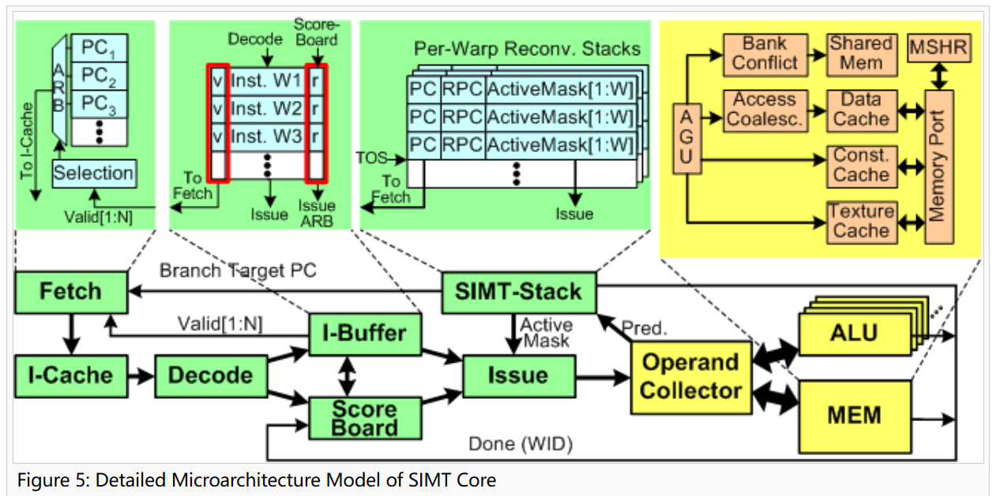
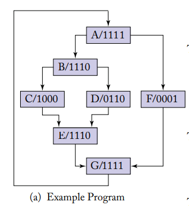
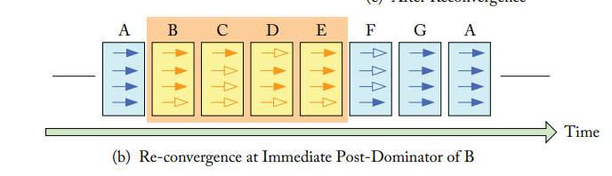
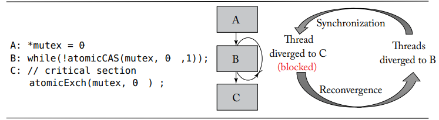
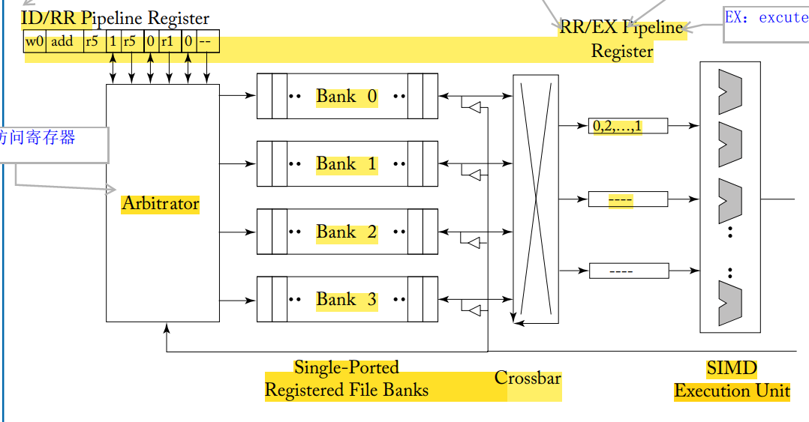
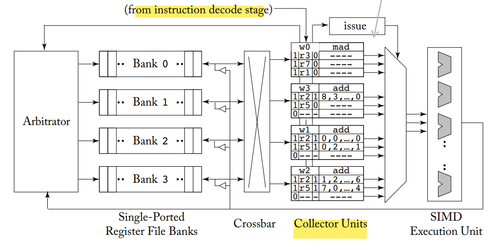

## 一、性能

### 1.1 一个饭店

当我们讨论**芯片的性能**的时候，我们到底在讨论什么？我觉得我们讨论的是**理想的优秀**。所谓的“高性能”，就跟“成功”一样，是一个**绝对正确**的概念，有人会说“有钱”好，有人会说“有钱”不好，有人会说“有媳妇”好，有人会说“有媳妇”不好，成功有很多的标准，但是作为最终目标的“成功”，是绝对褒义的，没有人会说“成功”是不好的。

“高性能”这个概念跟“成功”一样，没人会拒绝“高性能”。但是跟“成功”一样，每个人对“高性能”的定义是不一样。为了方便之后的整章对**性能**的理解，我们这里引入一个贯穿全篇的类比 -- **一个饭店**。一个饭店好不好，站在消费者的角度，出菜快就是好的，但是在掌柜的角度，出菜快只是一个方面，如果一个饭店只有一张桌子，一个厨子，哪怕这个厨子是厨神，做菜又快又好吃，饭店盈利状况也可能不好，毕竟厨子也是凡人，做菜再快一快不到哪里去，换句话说，这个饭店的客流量的上限是很小的，那么对于掌柜的来说，这个饭店就是不好的。

啰嗦了这么多，只是想说，对于“性能”评价，是一个很困难而且复杂的事情，是一个需要从多方面分析的事情。我们去做体系优化的时候，或许只能优化一个方面，或许优化这个方面会导致另一个方面的下降，就好比厨子应付一些，出菜速度会提高，但是菜品就不一定好吃了，所以根据需求的不同，优化的思路和方向就会不同。承认“性能”的**不可度量性**，就跟承认“成功”的不可度量性一样，是我认为比较成熟的标志。

### 1.2 延迟和吞吐量

虽然“性能”没有绝对的定义，但是有一些标准是每个人都追求的，比如一个饭店，如果出菜又快，又不用排队，那么无论是消费者，还是掌柜，肯定都高兴。

**延迟和吞吐量**就是这样的两个基本上受所有人欢迎的标准，延迟指的是**干一件事情的需要的时间**，就好似客人等待出菜的时间，或者排队的时间，吞吐量是**单位时间能干的事情数量**，就好比饭店有一个更大的门脸，一个更大的厅堂，甚至直接开了连锁店，这样同时就可以有更多的消费者享受到服务。

延迟和吞吐量的理解有如下两个要点：

- 两个概念不是浮于最宏观的层面的，而是从**每个层面**都可以进行如下考量。除了在最表层的客流量（饭店层次的吞吐量），在低一层的厨房角度，可以考虑进货量（厨房层次的吞吐量）；除了最表层的出菜时间（饭店层次的延迟），还可以考虑切墩的时间（厨房杂工的延迟）
- 两个概念并**不是相互独立的**，两个指标是互相影响的。比如如果厨师炒菜速度快了（低延迟了），那么就可以在一段时间内多服务几个客人了（吞吐量增大了），如果多雇了几个厨师，那么就可以同时炒好几盘菜了（吞吐量大了），那么有些师傅就可以专职干一些活了，这种流水线的设计又降低了出菜时间（延迟降低了）。这种相互影响也不一定是好的，比如如果一个饭店如果开的很大（吞吐量大了），之前一辆三轮就可以拉来一天的原材料，此时要用集装箱了，那集装箱还得卸载，还得签收，客人要是起得早，难免就得等着，此时延迟就升高了。或者为了让延迟降低，我们雇佣了厨神，但是厨神聘价高，那么我们就没钱再雇一个了，所以此时就开不了连锁店了，那么吞吐量就降低了。
- 两个概念还代表了两种**优化策略**。**指标可以指导设计**，如果以优化吞吐量作为目标，可以想见，这个饭店一定是雇更多的厨师，开更多的连锁店，24小时营业，这些优化可以说是“吞吐量导向的”。而当一个饭店思考怎样做快餐，怎样提高厨师的技术，怎样利用半成品，怎样设计服务路线，那么这些优化就是“延迟导向的”。

### 1.3 用高吞吐隐藏高延迟

可以说，CPU和GPU就是1.2章所述的两个概念的优化策略的代表。首先需要强调，在处理器中，最让人恶心的事件就是**访存**，这个东西耗费的时间太多了，尤其是当我们没有任何缓存的时候，每次访存的目标都是**磁盘**，磁盘这个东西是顺序访问的，真是要多慢有多慢。为了解决这个最关键的因素。我们可以朴素的理解为CPU和GPU提出了两种不同的方案。

CPU建立了多级缓存系统，这使得访存时间大大的减少，就好比饭店在进原材料的时候，在沿途修了无数个冷藏站，每个冷藏站只把材料运到下一个冷藏站，那么遥远的路途就变成了去快递站取快递。而GPU提高了访存并行度，一次访存获得的数据是恐怖的，就好像一次进货把一年的原材料都搬到饭店了。

可以想见，在CPU的芯片上，大部分的面积都用来分配给缓存了，而GPU芯片上，大部分的面积都是并行单元，这一点都不奇怪。

除了上面讲的关于访存方面的思路，在其他许多方面，都有类似的应用，比如CPU有复杂的转发和预测机制，来消除数据依赖和避免阻塞，而GPU并不回避阻塞，而是采用细颗粒度切换线程（fine-grained threading），阻塞就阻塞了，趁着阻塞的功夫，先干别的活儿。

总的来说，GPU的设计思路是**用高吞吐隐藏高延迟**，这是一个**以力破巧**的策略，降低延迟需要很多的设计和复杂的实现，但是增加吞吐量的技巧性就差了很多了，我想起我的导师说的话：

> 你现在学的CPU是一个很简单的CPU，真实的CPU是很复杂的，GPU与其相比，是一个很简单的东西。

此外，需要强调的是，尽管现在出现了多核CPU，但是它们采用的不是**用高吞吐隐藏高延迟**这个策略，它们的性能提升应该来自的是**并行对资源的进一步利用**，我们可以用下面的图解释这个区别：


可以看到，多核CPU的高效来自于Cache的效率没有被单核CPU完全开发（当数据集增长到与Cache容量相当的时候，Cache的效率开发到了最大），而GPU的高效来自于并行的收益要大于访存的损失，一个是优化，一个是献祭，这就是区别。

### 1.4 度量性能

虽然在1.1我论述了性能的**不可度量性**，但是在实际生产生活中，我们还是需要一套方法来对性能进行度量的，尽管这套方法一定是不合理的。就好像用营业额评判一个饭店的好坏一样。

我们量化的性能是这样的：
$$
性能 = \frac{1}{执行时间}
$$
这个式子传递出来的朴素思想是：**如果一个体系的执行时间短，那么他的性能就好。**这只是一个**理想**式子，因为执行不同的程序的执行时间肯定是不一样的，一个饭店做汉堡，一个做佛跳墙，肯定是没有办法比速度的；而且认为某个程序就可以度量性能，也是不科学的事情。就好像考核饭店性能的时候，非得要求所有饭店去做狗肉火锅，有的饭店是西餐店，有的饭店不卖狗肉，不能因为西餐店不会做狗肉火锅，饭店不卖狗肉，就说这些饭店是不好的饭店。

于是为了细化这个思想，我们又提出了2种举措：

- 引入了**相对性能**的概念：对于同一个测试程序，两个硬件同时跑，性能之比就是相对性能。引入这个概念，就提供了**标准化**的方法，在看论文结果的时候，我们常见的性能（performance）都是不带单位的，因为都是与某个标准性能的比值。
- 引入**基准测试程序**（benchmark）的概念。用户日复一日的使用的程序是评价新型计算机最完美的程序，所运行的一组**程序集**构成了**工作负载**（workload）。而我们没法将其直接用于测量。最常用的测量方法是使用一组专门用于测量性能的的基准测试程序（benchmark）。这些测试程序形成了与实际工作负载相似的测试负载。

---


## 二、并行处理器

### 2.1 可伸缩性

可伸缩性（Scalability）是一种衡量系统的**设计指标**，高可伸缩性代表一种弹性，在系统拓展成长的过程中，系统能够保持旺盛的生命力，通过很少的改动，就可以实现系统处理能力的线性增长。

简单地说，可伸缩性就是“**以更大的规模来做你现在所做事情的能力**”。与性能优化有着本质区别。

可伸缩性可分为两种：

| 种类         | 解释                                                         |
| ------------ | ------------------------------------------------------------ |
| 纵向可伸缩性 | 在同一个逻辑单元内增加资源以提高处理能力，如在现有服务器中增加CPU |
| 横向可伸缩性 | 增加更多逻辑单元的资源，并令他们像一个单元一样工作。如大多数的集群方案，分布式文件系统，负载平衡，GPU |

架构师都在为达到线性的可伸缩性而挣扎，目的是让系统产出的增长与系统中投入资源的增长保持稳定的比例。然而，增加资源会导致一般耗费（overhead）的额外增长，因此难以达到线性的可伸缩性。

我们还有一个量化指标来衡量可伸缩性，对此，我们又引入了两个概念：

| 概念                         | 解释                                                         |
| ---------------------------- | ------------------------------------------------------------ |
| 强比例缩放（strong scaling） | 在多处理器上不需要增加问题规模即可获得的加速比               |
| 弱比例缩放（weak scaling）   | 在多处理器上增加处理器数量的同时按比例增加问题规模所能获得的加速比 |

传统认为弱比例缩放会比强比例缩放简单，但是存储器的层次结构可能会对这个传统认知产生影响。例如，如果弱比例缩放数据组不在适用于多核微处理器告诉缓存的最后一层（这种情况就对应1.3的valley区），会导致系统的性能比使用强比例缩放更加糟糕。

可伸缩性就是GPU架构设计面对的最重要问题之一，但是这一章我的落脚点不在GPU，因为GPU是很简单和特殊的并行处理器，所以落脚于此，会导致理论的不完善，我希望落脚与整个并行处理器系统。

### 2.2 其他概念

#### 2.2.1 基本概念

**多核微处理器**（multicore microprocessor）就是说一个芯片上有多个协同工作的处理器，这些处理器被称为核（core），这些多核处理器通常都是**共享内存处理器**（shared memory processor，SMP），因为它们通常共享一个单独的物理地址空间。

| 概念 | 英文       | 范围 |
| ---- | ---------- | ---- |
| 顺序 | sequential | 软件 |
| 并发 | concurrent | 软件 |
| 串行 | serial     | 硬件 |
| 并行 | parrallel  | 硬件 |

需要说明的是，并发软件是可以运行在串行硬件上的，比如操作系统（我们认为是并发的）是可以运行在单核处理器上，又比如矩阵乘法（我们认为是顺序的）是可以运行在多核处理器上的。这种看似矛盾的行为，归功于**体系结构的封装**。

#### 2.2.2 并行硬件分类

我们对于硬件的分类，可以从两个维度给出定义，一个是**数据流角度**，另一个是**指令流角度**。可以以此分成SISD，SIMD，MISD，MIMD四种。

关于MIMD，需要强调的是，就是是multi，也没有几个，一般也就4个（比如Intel Core i7），所以这四个一般不是完全并行的，或者说，他不是那种四个core执行的是相同的指令，而是四个人分走了一个程序的四个部分。也就是说，如果用厨房来类比，这四个人是一个切墩的，一个白案，一个红案，一个掌勺的。而不是四个啥都干的厨师。我想要强调的东西是可能是因为先学习GPU造成的错误观念，但是可能一般人是没有这个错误观念的。

关于SIMD，其实将其理解为向量机就好了，那么此时可以同时处理的数据流就是很多的了，一般是128位，所以跟MIMD的数据流有明显的区别。如果还用厨房比方，这回不是师傅多了，而是小刀换成了铡刀，之前同时只能切一根葱，现在能切一捆葱了，或者说之前的师傅只有两只手，而现在的师傅长了128只手，可以同时干好多事情，但是并不是有了64个雇员，这期间的灵活性存在差异。如果再说开一些，这个分类标准其实不是按照数据流或者指令流的多少来分的，而是按照workload是怎样被划分的来分的。

#### 2.2.3 硬件多线程

**软件多线程**指的是MIMD通过多个线程来努力使**多个处理器**处理忙碌状态（不让掌勺的师傅在切墩师傅切菜的时候闲着，而是让他去炒别的菜，或者去切墩）。**硬件多线程**允许多个线程以重叠的方式共享**一个处理器**的功能单元，这里说的是一个长了128只手的师傅，尽管有两只手炒京酱肉丝去了，但是剩下的126的只手不能闲着，而是应该赶快炒下一个菜。

每个线程必须拥有自己的寄存器文件和PC的独立备份，存储器自身可以通过虚拟存储器机制实现共享。从这里看出，GPU的芯片中，缓存一定是少的，但是寄存器文件是很多的。这里不打算讨论线程和进程的区别，只是想说，切换线程必须是低代价的，线程切换应该是实时的。

切换线程的一个好处就是单个处理器的功能单元被充分利用了，比如说一些功能单元是访存用的，那么其他的算术资源就被闲置了，那么如果切换线程的话，那么算数资源就可以被有效利用了，不过其实这只是一点，因为这个有点**多发射**也能实现，比如同时发射一条算数指令和一条访存指令，就可以达到充分利用功能单元的目的。切换线程还有一个优点是**消除数据依赖**，切换线程可以有效的消除一个线程前后指令的数据依赖，所以有降低阻塞发生几率的作用。

关于切换线程的方式，有两种实现方式，一种是**细粒度多线程**（fine-grained multithreading），也就是每条指令执行后都会进行切换线程，细粒度多线程的主要优点是同时隐藏短阻塞和长阻塞引起的吞吐量损失，因为当一个线程阻塞的时候就可以执行其他线程的指令。主要缺点是降低了单个线程的执行速度，因为就绪状态的线程会因为其他的线程而延迟执行。

**粗粒度多线程**（coarse-grained multithreading）仅在高开销（最后一级缓存缺失）阻塞的时候才进行线程切换，这种方式的优点是降低了对高速线程切换的要求，并且几乎不会降低单个线程的执行速度，但是其切换线程的代价较大。有如下示意图：


GPU不像CPU一样依赖多级存储来隐藏访存的长延迟，GPU依赖硬件多线程来隐藏延迟，在存储器请求和数据到达之间，GPU会执行数以百计与该请求无关的线程。可以说，硬件多线程是GPU优化性能策略的核心。

### 2.3 GPU

#### 2.3.1 总论

**GPU是一个由多个多线程SIMD处理器组成的MIMD处理器**。这句话的意思是说，如果以厨房为例，这个厨房不但有很多厨子，而且每个厨子还长了很多只手。

此外，这一章的概念都是对简单科普文章谬误的纠正。比如说有人说可以将CPU比喻成一个教授，而GPU是成千上万个小学生。这种理解是错误的，我们的GPU不是有一万个核，他却是核挺多的，但是以Fermi架构举例，根据价格不同，最多的GPU只有15个处理器，也就说，若还以厨房举例，，那么厨师的个数不是成百上千，而是十几个，还是挺正常的，只不过，这些厨师每个人都长了64只手（可能更多）。

#### 2.3.2 重解概念

这里如果按照那本《GPGPU架构》的书来讲，它讲的thread是一个标量操作，而warp是32个tread的集合，不过在这本黑书里讲到，如果将一个warp看成一个SIMD的线程，那么我觉得未尝不可。总之这本黑书提供了很多有意思的观点，比如以下观点

- grid：即**可向量化循环**，由一个或者多个可并行执行的**线程块**（threading block）组成
- threading block（CTA）：向量化了的循环体展开后的程序块，有一个或者多个SIMD指令线程组成
- warp：SIMD指令的一个线程，在SIMD多线程处理器中执行
- thread：对应一个SIMD的标量元素执行单元的执行序列

我们有一种warp在处理器上的说法，我一开始以为是有几个warp分别占据了处理器SM的不同部分，其实可能是同一时间SM只执行一个warp，只是在不同的时间，由warp调度器，使SM执行不同的warp。

#### 2.3.3 通道

线程是由SIMD指令组成的，SIMD处理器必须有并行功能单元来执行这些操作，我们称这些为**SIMD通道**（SIMD Lane）。我个人认为：通道（lane）就是一条可以完整执行功能的通路。

---


## 三、指令集架构

### 3.1 MIMD封装

在编程的时候，比如说CUDA或者OpenCL，会给人一种MIMD模型的假象，每一个标量的线程都可以拥有自己的执行轨迹并进行独特的访存。而实际在硬件实现过程中，是采用SIMT的方式的，SIMT实现，这也就意味着可以更好的利用指令的一致性和空间的局部性。

### 3.2 kernel

kernel不是一个完整的程序，这跟GPU只是CPU的一个device有关，所以在其上执行的指令，不过只是一个函数，如果用黑书上更加犀利的观点，只是一个**可以循环展开的代码块**。我觉得认识到这种**不独立性**是至关重要的。

正是因为这种不独立性，所以每次发挥GPU功能之前，都需要把代码拷到GPU存储上，各种数据也需要拷贝，如下所示

```c
__global__ void saxpy(int n, float a, float *x, float *y)
{
	int i = blockIdx.x*blockDim.x + threadIdx.x;
	if(i<n)
		y[i] = a*x[i] + y[i];
}

int main() 
{
    //h是host的意思，说明此时的向量存储在CPU的memory中
	float *h_x, *h_y;
	int n;
	// omitted: allocate CPU memory for h_x and h_y and initialize contents
    //d是device的意思，说明此时要在GPU上复制出两个相同的向量
	float *d_x, *d_y;
    //这句话的意思是nblocks = n/256 向上取整,一个CTA有256个线程，也就是8个warp
	int nblocks = (n + 255) / 256;
	cudaMalloc( &d_x, n * sizeof(float) );
	cudaMalloc( &d_y, n * sizeof(float) );
	cudaMemcpy( d_x, h_x, n * sizeof(float), cudaMemcpyHostToDevice );
	cudaMemcpy( d_y, h_y, n * sizeof(float), cudaMemcpyHostToDevice );
	saxpy<<<nblocks, 256>>>(n, 2.0, d_x, d_y);
	cudaMemcpy( h_x, d_x, n * sizeof(float), cudaMemcpyDeviceToHost );
	// omitted: use h_y on CPU, free memory pointed to by h_x, h_y, d_x, and d_y
}
```

### 3.3 RISC

无论是PTX，还是SASS，都是具有很强的RISC性的，这或许与GPU的简单有关。

### 3.4 dump

dump指的是把汇编码翻译成机器语言的工具（这个过程叫做**汇编**，把高级语言翻译成汇编语言的过程叫做**编译**）。这个东西我也不知道为啥要记在这里，可能就是开心吧。

---


## 四、处理器

### 4.1 总论

这个处理器，指的就是SM，也就是一个SIMD的处理器，大概长成这个样子：


还是需要再次强调，这个东西，一片GPU上面最多十几个，而不是成百上千个，这个东西应该也是同一时间只会运行一个warp，只不过细颗粒度的线程切换，在一个不太短的时间内，会看到SM核上交替运行很多个warp，这些图里面的小单元就是并行的功能单元，一个指令如果只用LD/ST，那么计算core就会空缺，此时如果切换线程，就可以达到充分利用执行模块资源的目的。

如果从流水线的角度看，一个处理器的结构如下：



这个里面引入了一个在简单CPU中没有概念，就是**发射（Issue）**，这个概念挺有意思的，因为我们课上见到的CPU，都是顺序执行的（偶尔的跳转，也是软件层面的跳转）。但是发射这个概念，让指令的执行变得更加灵活，比如说可以进行**乱序执行**（out of order），也就是说，如果前后两条指令没啥数据依赖，换换顺序又何妨，进而衍生出一系列概念，比如说buffer，虽然之前也有，但是之前的buffer是当cache那么用的，而这里的buffer是当备选项那么用的，每次发射，都需要从buffer中挑出一个比较好的指令进行发射。当然，为了完成这个挑选功能，那么相应的控制元件也要跟上，那么就是图里面的计分板（scoreboard）了。

正是因为思考的问题变得复杂了，所以对问题的划分也跟之前不一样了，按照教材的说法，三个部分是由**循环**组成的、分为front-end和back-end两部分（我个人对循环的理解，就是一个比流水级稍微大一点的组织单位，并没有实际意义）

- 取指令循环（instruction fetch loop）：包括的组件有被打上fetch标签的blocks（blocks labeled Fetch），指令cache（I-cache），解码器（decode），指令缓存器（I-buffer）
- 指令发送循环（instruction issue loop）：包括被打上I-buffer标签的blocks（blocks labeled I-buffer），计分板（scoreboard），发射（issue），SIMT栈（SIMT Stack）
- 寄存器访问调度循环（register access scheduling loop）被打上Operand Collector的blocks（blocks labeled Operand collector），计算单元（ALU），存储（memory）

在下面的几章中，因为时间关系，我只能介绍几个重点的元件，并且解释他们是干什么用的，但是对于整体的设计的介绍，可能就会稍微薄弱一些，这也是没有办法的事情。

### 4.2 SIMT Stack

SIMT Stack的本质是一种控制流元件，我更喜欢强调它的功能是完成了**由SIMT到MIMT**的封装。我们知道，一个warp里的线程本应该执行相同的指令，那么很容易就会让软件编程人员发现这个厨师是长了128只手的，我们希望不要发现这个事情，所以我们必须让warp内部的线程可以执行不同的指令。解决办法是连载执行那些需要不同分支的过程，也就是并不是同时分支，而是先让warp中符合某些条件的线程完成一个分支，再让warp中符合另一个条件的线程完成另一个分支，在一定程度上“串行”了。



实现这个功能用到了一个栈，这个栈有三个数据段合成了一个条目（entry），分别是合流指令地址（reconvergence programer counter，RPC），下一条执行指令地址（the address of the next instruction to excute，Next PC），活跃掩码（active mask）。下面结合这张图介绍一下栈的原理：



首先，在第一幅图，当第一个分支指令出现的时候，分支指令导致的两个分支相关信息都会入栈，也就是分别分向B和F，最后在G合流，那些线程属于这个分支，然后弹一次栈，NextPC的值就是下一条指令的地址，执行的线程就是1110。

其次，对于每个**分流点**，都会先把它对应的**合流点**压入栈中，然后再把各个**分支**压入栈中。当弹栈元素的Reconv.PC与此事栈顶的元素的next PC相同时，就说明这个分支结束了。

如果说的玄学一点，可以说借助这个**栈结构**，SM完成了一次对**分支流程图**类似DFS遍历的过程。

教材里还介绍了这种栈结构的一种缺点，即栈死锁，其实**与后续研究关系不大**，但是较难理解，故仅仅录于此：




```c
*mutex = 0;

while(1)
{
	int mutexPreValue = atomicCAS(mutex, 0, 1);
	x:
	if(mutexPreValue == 0) //对应幸运儿
		break;
    y:
	else
		//do nothing，对应31个不幸的线程
}

w:
atomicExch(mutex, 0);//因为幸运儿要等待不幸的线程，所以幸运儿永远无法执行这句话。
```

先把这个图片中的代码写的清楚一些。

首先先介绍一下代码中出现的函数，CUDA的**原子操作**可以理解为对一个变量进行“读取-修改-写入”这三个操作的一个最小单位的执行过程，这个执行过程不能够再分解为更小的部分，在它执行过程中，不允许其他并行线程对该变量进行读取和写入的操作。基于这个机制，原子操作实现了对在多个线程间共享的变量的互斥保护，确保任何一次对变量的操作的结果的正确性。**原子操作确保了在多个并行线程间共享的内存的读写保护，每次只能有一个线程对该变量进行读写操作**，一个线程对该变量操作的时候，其他线程如果也要操作该变量，只能等待前一线程执行完成。原子操作确保了安全，代价是牺牲了性能。简而言之，在这个代码里，auto的作用是保证不会出现在同一个时刻有两个thread接触到mutex，避免了冲突，但是**跟死锁现象没啥关系**。

atomicCAS函数实现的功能是比较第一个参数和第二个参数的值，如果值相等，就把第一个参数的值换成第三个参数。其实就是**替换**目标值的函数，他的返回值是第一个参数没被修改前的值。atomicExch可以修改指定地址的值。

但是在这个程序中，mutex就是**一个**地址，会被一个warp中的一大堆线程执行这个函数，也就是说，只有一个幸运儿可以接触到mutex等于0的时候，然后把它修改成1，幸运儿的mutexPreValue是0。其他线程见到的都是1，所以其他的线程的mutexPreValue是1。所以只有一个线程满足走出while循环的条件（**注意它还没有走出循环**）

在我们设想的情况下，那个走出循环的幸运儿会执行修改后的标签为w的代码，那么就可以通过atomicExch函数把mutex修改为0，那么那31个困在while里的线程，就又会有一个成为幸运儿，那么就又走了出来，那么就又把mutex改为了0，然后30个困在while里的线程就又会诞生一个幸运儿……最后所有线程都走出while，目的达成。

但是很不幸的是，应用了SIMT stack的GPU不会按设想实现，因为当程序运行到x标签的时候，栈是这种结构

| Reconv PC | Next PC | Active Mask |
| --------- | ------- | ----------- |
| -         | w       | FFFFFFFF    |
| w         | y       | FFFFFFFE    |
| w         | x       | 00000001    |

当运行完那个幸运儿以后，栈会变成这样

| Reconv PC | Next PC | Active Mask |
| --------- | ------- | ----------- |
| -         | w       | FFFFFFFF    |
| w         | y       | FFFFFFFE    |

然后就会一直保持这样，或者每次增加两个没有必要的元素入栈（不知道循化的机制），像这样

| Reconv PC | Next PC | Active Mask |
| --------- | ------- | ----------- |
| -         | w       | FFFFFFFF    |
| w         | y       | FFFFFFFE    |
| w         | y       | FFFFFFFE    |
| w         | x       | 00000000    |

总之出不去了，这是因为stack对于分支的处理就是，必须所有线程都到达分支点，才能继续往下一步走，也就是**分支串行思想**，所以这个思想其实跟我们编程的时候一个线程是具有**很高独立性的认识**是有冲突的。

另外说一句，这里对于不同分支的入栈顺序，教材上推荐活跃线程数多的分支要先入栈（也就是后执行），这是为了减少栈的深度，多线程的分支更可能产生新的分支，新的分支又要入栈，而之前的线程少的分支还留在栈里面，就会造成累积。就像先干难活儿，就会导致可能最后难活儿会把简单活儿的时间挤占了一样。

### 4.3 Scoreboard

在介绍Scoreboard之前，还是先介绍一下GPU采用的**硬件多线程**思路，主要还是以**细颗粒度切换**为主。也就是说，每次发射完一个指令后，就切换一个warp。发射完指令以后，需要执行指令（一般是访存或者计算），执行指令的时间应该都要比一个周期长，这段时间SM的其他资源就被闲置了，为了隐藏这个延迟，果我们把这段时间用来切换另一个warp，让他发射指令，就可以隐藏延迟。这种切换可以一直进行。当一个SM上有更多的warp的时候，这种切换就可以隐藏更多的延迟。

不过有一组矛盾在这里面就是切换线程的时候需要有寄存器保存之前那个线程的状态，所以一个SM上要是有更多的warp，就要有更多的寄存器，就会导致SM的硬件面积变大，那么一个GPU上的SM的数量就会减少。

不过，要实现细颗粒度的切换，SM上的warp必须多，多到足以掩盖延迟，比如说一次访存操作需要5个周期，那么如果一个SM上只有3个warp，那么再怎么切换，都会有2个周期，SM核是不工作的，所以warp的数量要多，尤其是访存操作一般几千个周期，为了不这么死板，我们考虑存在连续从一个warp中发射指令的情况的。而这种情况，就必须要考虑**数据依赖**了。

我们解决数据依赖的总体思路如下：我们把待发射的指令先存到一个buffer中，然后通过scoreboard的比较，来挑出没有数据依赖的指令发射（这里CPU用的是转发和暂停，策略的不同可见一斑）。I-buffer里会存储一些等待发射的指令，由scoreboard来判断他们有没有资格发射。

传统的scoreboard就是给每个寄存器一个标志位，当一个指令被发射的时候，与他相关的那个寄存器对应的标志位就会被置1，只有当这个指令将结果写回这个寄存器，这个标志位才会清空。

传统的计分板对于GPU来说用两个缺点，一个是GPU寄存器过多，导致计分板的标记位也相应过多。另一个是每次warp都需要访问计分板看看能不能访问了，GPU有那么多warp，需要提供给warp的端口过多，端口也太占资源了。

而GPU的计分板，只有3-4位标志位就够了（这个数量是I-buffer的容量），每次指令从I-cache解完码进入I-buffer的时候，就会比较是否与I-buffer中现存的指令的操作数寄存器存在冲突，如果冲突，那么就将其中的一位置1，等这条前面的指令执行完了，就把这个置1位消掉，可以看出，这样就节省了大量的空间。

### 4.4 Operand Collector

这里首先介绍一下切换线程的时候存在的一个问题，就是寄存器的切换，这是就涉及读寄存器的问题，我们最希望看到的，是比如一个warp32个寄存器，warp一切换，32个寄存器立马更新成了新的值，但是实际上，不可能有32个读端口，这样太浪费资源了。

因此我们引入了bank的结构：**bank**是一种把好多寄存器放到一块，用一个端口访问的结构，很多个bank组合成了banks。我们可以用高一点的延迟，来换取一个32个端口的假象。



这是传统bank的结构，但是会存在一个问题，就是如果同时访问同一个bank，那么就会造成bank conflict，那么就需要**串行化**处理，那么就显然会造成延迟增加，所以有没有办法解决呢，我们对这个结构加上改善



加装了一个collector结构，可以这样形象地说明，虽然存在conflict，但是有的时刻，还是有bank的端口没有被光临，那么不如这个时候自动读取里面的内容到collector中，这样当这个端口存在conflict的时候，可以查看collector有没有之前空闲的时候拷贝的数据，这样达到了一种**保险**的思想。

### 4.5 Replay

尽管做了这么多的举措，但是有的时候还是没能隐藏掉延迟，那么应该怎么办？CPU采取的策略是暂停。GPU并不适合暂停的策略，因为暂停需要大量的硬件资源，而且会阻碍其他warp的发射。所以我们采取的策略是replay，就是把这条指令让这条指令保持在I-buffer中，直到这条指令真的被执行完。其实就是重复执行，一次不行就先跳过，轮一轮以后再试一遍。

---


## 五、存储

### 5.1 Bank

bank的目的是为了并行化，比如MIPS里就只有两个读端口，一个写端口，那么很容易就发生结构冲突，不过也不能每个寄存器一个lane，也不现实

### 5.2 Scratchpad Mem

scratchpad memory可以理解为适合GPU的cache，是片上SRAM，与主存统一编址，其抽象概念对应的是shared memory。shared memory 比 L1cache还要快。

如果request会引起conflict，那么就需要把requeset分为两个部分，让第一个部分没有conflict，而第二个部分replay，但是不需要存在I-buffer中，而是存在load/store unit中
