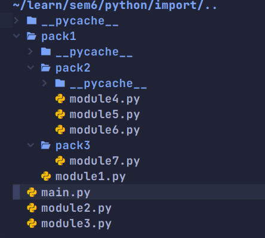

## 一、符号查找

在编译课中我们学过，符号是编译中的重点，我们必须确保我们的每个符号都是“指向它应当指的地方”。但是在实际工程中，符号分散在多个文件中，可能会出现“符号相同”和“符号查找不到”两种经典的情况，所以每门语言都在尽力解决多个符号的问题，python 也不例外。

一般解决这种问题，都是通过一种加 **namespace** 的方式解决的，当我们有两个 `name` 的时候，可以考虑给他们分别一个 `namespaceA.name` 和 `namespaceB.name` 去进行区分。**namespace** 是一个很自然的事情，尤其是一个大工程，可以认为 `namespace` 本来就是一种很自然的嵌套的结构（尤其是与文件和目录结合在一起的时候），比如说“编译器的错误检测部分的错误类型中的未定义符号错误”，就是 `compiler.check.ErrorType.UNDEFINE_SYMBOL` 。我们在实际使用的时候，其实是不是担心我们没法把相同的符号区分开，而是担心“没法用较短的字符串表示我们想要的符号”，毕竟不是每个人都愿意在工程的任何一个地方，使用 `compiler.check.ErrorType.UNDEFINE_SYMBOL` 来描述一个枚举常量。我们更喜欢只用 `UNDEFINE_SYMBOL` 去表示。

---


## 二、不同语言

在 CPP 中，我们用的是头文件机制，当前文件中需要用到的符号，要么来自当前文件定义，要么来自头文件，头文件中的符号冲突了，那么就会导致实际的冲突，所以我们需要用 `namespace` 机制进行区分。

在 Java 中，我们采用 `import` 机制，对于 `import` 后的部分，采用的是相对于根目录的绝对路径，比如说 `Pansy/parser/Parser.java` 中想用 `Pansy/lexer/token/Token.java` ，那么就需要写这样的 `import`

```java
import lexer.token.Token;
```

也就是相对于 `Pansy` 这个目录去查找即可，而我们在使用的时候，只需要如下所示，

```java
ArrayList<Token> tokens
```

即直接使用即可，不需要考虑任何前缀。但是当如果真的出现重名的情况，可以在使用的时候指明到底是哪个，如下所示

```java
//错误方式
import java.util.Date;
import java.sql.Date;

//正确方式
import java.util.Date;
import java.sql.*;//java.sql.Date  同名类解决方法:改用.*并且使用Date类时前面加该类的包路径


public static void main(String[] args) {
        //同名类的极端情况解决方法
        java.util.Date day1 = new java.util.Date();
        java.sql.Date day2 = new java.sql.Date(2019, 9, 16);
    }
```

可以看到有些繁琐。

---


## 三、Python import

在 python 中，对于命名空间，也是和 java 一样，并不显式的使用，而是利用文件和文件夹进行构造。python 认为一个名称空间为一个 module，这个 module 可以表现为一个文件夹，一个 `py` 文件，一个 `so` 动态库，什么都行。对于文件夹形式的 `module` 我们也称它为“包 `package` ”。所以我们想要指明“包 package1 下的包 package2 的模块 module1 的函数 f” ，就可以写作 `package1.package2.module1.f`。

下面我们用例子来描述一下 `import` 的使用，我们的文件结构如下所示



当我们想在 `main.py` 中使用 `module3.py` 中的函数的时候，可以这样

```python
import module3
module3.print_info()
```

当我们想使用 `pack1` 下 `pack2`  下的 `module4` 的时候

```python
import pack1.pack2.module4
pack1.pack2.module4.print_info()
```

可以看到在 `import` 处和 java 很像，都是将路径完完整整的 `import` ，但是在使用的时候，没有办法直接 `print_info` ，而是必须跟着前面的命名空间，也就是 `pack1.pack2.module4.print_info` 。这无疑是麻烦的，所以我们又衍生了 `as` 语法，`as` 语法可以给 import 后的内容取一个别名，比如说将 `pack1.pack2.module4` 称之为 `m4` 。这样我们使用这个 `module` 的时候会方便一些：

```python
import pack1.pack2.module4 as m4
m4.print_info()
```

这样就可以比较方便的使用这个模块了。

但是依然不够简单，因为**`import` 后的内容只可以是 `module` **。也就是下面的语句是不对的：

```python
import pack1.pack3.module7.print_info
```

这就导致我们只要想用其他文件的内部东西（函数和变量），那么就需要这样写 `module_name.inner_name` 。这个时候 `from...import...` 语法就发挥了作用：

```python
from pack1.pack2 import module5
from pack1.pack2.module6 import print_info
module5.print_info()
print_info()
```

 可以看到，`from` 会让“前缀变短”，而且最短可以短到没有前缀（也就是没有 `module` 修饰）的函数和变量，这无疑是很方便的。需要注意的是，此时的 `import` 后是不可以出现 `.` 的，也就是下面这种是错误的。

```python
from pack1 import pack2.module6
```

至此，我们其实已经拥有了实现所有功能的全部能力，我们只需要记得任何一个文件，在 import 的时候都是从项目根目录（其实本质是运行文件所在的目录）出发去写就好了。

---


## 四、相对引用

但是有的时候我们就是不想进行绝对引用，因为这样的 `import` 实在是太长了。比如说 `module7` 想要引用 `module4`，那么他就需要完整写出 `pack1.pack2.module4` ，这无疑是很长的

```python
from pack1.pack2 import module4
module4.print_info()
```

因此我们可以使用相对引用，也就是开头的 `.` 或者 `..` ，如下所示：

```python
from ..pack2 import module5
module5.print_info()
```

但是有的时候我们却没有办法使用相对路径，比如说当我们运行 `main.py` 的时候，如果将原来的

```python
from pack1.pack2.module6 import print_info
```

改成

```python
from .pack1.pack2.module6 import print_info
```

这就是不可以的。这是因为相对引用的原理是基于 `__name__` 进行搜索，在一个 `py` 文件**被引用而不是被执行的时候**，`__name__` 就是路径，但是当其被执行的时候 `__name__ == "__main__"` ，所以没法展开相对引用搜索。

其实还有一些更加微妙的地方，但是时间关系就不叙述了，具体的可以参看[这篇文章](https://zhuanlan.zhihu.com/p/463969303?utm_campaign=shareopn&utm_medium=social&utm_oi=1124048358603636736&utm_psn=1599895913148669952&utm_source=wechat_session)。

总之总结下来就是，不要在有可能被当成执行文件的 `py` 文件中使用相对引用（最容易犯错的就是 `test` 类脚本）。
