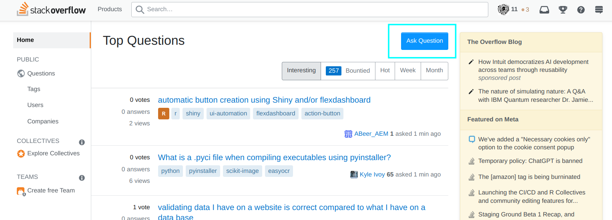

# 巴别塔——问答平台调研

> 任何失去的东西，都会以另一种形式归来。

我选择的是第一个题目，我会调研 CSDN 问答区、StackOverflow、SegmentFault（思否）三款 IT 问答软件。

## 一、调研与评测

### 1.1 问答的意义

> 朝闻道，夕死足矣。

每个人都会有问题，问问题并且得到解答，可以快速的进步，chatgpt 的出圈大火，我认为除了因为这是一个伟大的科技进步，还有一个重要原因是，人们可以直接向一个“赛博圣人”提问了。就好像这样一样：


这里可以引出问答平台的第一个作用：**为有问题的人提供答案**。同时，问答平台会收录这些答案，这样会减轻答题者的负担。

但是并不是所有的问题都是有“意义“的，很多时候人们发问的同时，就已经知道了这个问题是没有人可以回答的了，就好像这样：


当然了，还有一些问题的诞生接近于自问自答，有一种“王婆卖瓜，自卖自夸”的感觉（在知乎中很常见），比如说下面这种：


上面这两种问题，显然是没有什么普世性可言的，问答平台收录答案的时候，应该不会收录这些问题，毕竟没有人会对别人 23 号女朋友的小手指感兴趣。这就引出了问答平台的第二个作用，也就是“收录有价值的问题和答案”，但是问答平台作为一个网络平台，人工去审核所有的问题显然是不现实的，所以更多的时候，问答平台的作用变成了“**引导用户去提出更加有价值的问题**”。

当平台上有了有价值的后，平台的另一个问题就出现了：它需要让这些问题被回答。显然在 chatgpt 没有出现前，大部分回答的工作是由人来进行的，但是回答者是不获利的，所以怎么才能调动其回答者的积极性，也是一个需要研究的点。同时，正因为回答是不获利的，所以回答者可能会很傲慢很消极，这会让提问的人有一些不好的感受。所以问答平台还要**保证整个问答过程是有序的**，这是问答平台的第三个功能。

在完成了前面三点后，问答平台就具有了高质量的问题和答案，那么它还需要让优质且共性的问答让人们看到，而普通且个例的问答蜷缩数据库的角落，这便是**问答的推荐算法**，也是问答平台的最后一个功能。

总结一下，我个人认为，问答平台必须具有这四个基本功能：

- 为有问题的人提供答案。

- 引导用户去提出更加有价值的问题。

- 确保问答的过程是有序的。

- 推荐优质问答。

接下来我会以这四个功能去介绍和评估软件。

### 1.2 功能与体验

> Rules are the basis of all cooperative ventures." - George Lincoln Rockwell

#### 1.2.1 提问

我们通过一个实践说明，我有一个这样的问题：“python 为啥这么著名？”

三个网站的首页都是类似的，其中“提问”的 UI 按钮都出现在右上侧（这个位置一般在网页布局中有“重要”的暗示），而且都是非常大的实心按钮，可以说一眼就可以明确这些网站就是“问答网站”，这里只展示 StackOverflow 的设计



当我们点击那个按钮，就可以进入“发布问题”的页面了，对于 StackOverflow，它的整个流程——之所以这样强调，是因为它的流程是强制性的，如果不写完标题就没有办法写问题内容——是这样的：

首先写标题，我们创立一个引战话题“python 为啥这么著名？”


可以看到在右侧有“如何写一个好标题”的提示。

然后我们写问题的内容


同样的，右侧也有提示来帮助我们写出更好的问题内容

然后还需要填写我们为了解决这个问题做出的努力和对于答案的预期，我们按照提示写好：


然后还需要选择问题的标签


然后 StackOverflow 会根据标题在网站里搜索类似的问题，避免重复问题的提出：


然后还需要重新审核一遍自己的问题（真的好繁琐的流程）


最后就可以发表了。

对于 **CSDN 问答区**，我们进入提问界面


可以看到在页面上虽然有“怎样提问题”的提示，但是并没有“程序式”的流程限制，我们填写问题


必须强调，这样其实是有利于 CSDN 的，因为通过先写 StackOverflow 的问题，我本身已经对于“python 为啥这么著名？”有了一个更加清晰的认知，但是如果是 CSDN 这种非强制性的引导，我可能还是不会进行一定的思考的。

然后在右侧填写标题和标签


然后会发现“氪金区”，可以通过充值获得更加快速的解答


在**思否**上进行同样的操作：

思否的见面如下


可以看到引导性强了一些，引导的模板分为四种，这是我认为比 StackOverflow 强一些的地方


我们将问题填好（标签和内容），大致是这样的


在填写标题的时候，我们看到思否也是有与 StackOverflow 相似的“相似问题推荐”的


总结一下：

- 在问题的规范性引导上，StackOverflow 强制引导用户按照流程操作，思否提供了多种规范模板，CSDN 只是提供了模板虚影。

- 在问题的划分上，StackOverflow 将问题划分为多个部分，但是其他两家都是一体的问题描述。

- 在避免重复问题出现上，StackOverflow 和思否都在写标题的时候提供了相似问题的自动搜索，但是 CSDN 没有。

- 在氪金上，只有 CSDN 可以通过氪金来改变问题的影响度。

#### 1.2.2 回答

我们尝试在 StackOverflow 上找一个问题进行回答，为了寻找我会的问题，我需要将问题分类（我猜测 C 的问题我可能会解答），StackOverflow 提供了一个基于标签的分类系统


最后我找到一个关于 shell 脚本的，这是它的错误代码

```shell
#!/bin/bash
val1=$*
for i in $val1
do
   if (( $i -gt 1.0 | bc ))
   then
           echo $i
   fi
done
```

`$i` 作为字符型变量，是没有办法进行数值型的比较的，所以我们应当这样修改

```shell
#!/bin/bash
for i in "$@"
do
    if (( $(echo "$i > 1.0" | bc -l) ))
    then
        echo $i
    fi
done 
```

然后我们准备作答


会发现是在一个小的富文本编辑框里，我个人作答的体验不是很好，代码块还有复制的英文都会发生错位等现象，最终还是在文本框中写入 md 解决的。同时回答问题，并不会有什么即时生效的奖励。


在 **CSDN 问答区**，我们回答一个问题，他的分类也可以基于标签系统，但是分类没有 StackOverflow 细，“编程语言”被划分为完整的一个类。


最终我们找到这样的问题，他贴出了一个图片形式的算法题


但是十分难看懂，这可能和 CSDN 社区没有问题约束有关，然后我们写出这道题的答案

```c
#include <stdio.h>

int main()
{
    int M, N;
    scanf("%d%d", &M, &N);
    int P[10000] = { 0 };
    int i, j;
    int flag;
    int num = 0;
    int a = 0;
    for (i = 2; i <= 10000; i++)
    {
        flag = 0;
        for (j = 2; j < i; j++)
        {
            if (i % j == 0)
            {
                flag = 1;
                break;
            }
        }
        if (flag == 0)
        {
            P[a] = i;
            a++;
        }
    }
    for (i = M-1; i < a && i < N; i++)
    {
        printf("%d ", P[i]);
        num++;
        if (num % 10 == 0)
            printf("\n");
    }
    return 0;
}
```

然后给他回答


同样采用的是富文本编辑界面，但是体验感要好于 StackOverflow，使用代码块的时候没有出现错位等 bug。


同样没有啥奖赏之类的东西。

然后我们在思否中答题


这个页面就和 StackOverflow 很像，然后找到一个问题，首先会发现这并不是一个单纯的问答网站（其实 CSDN 也不是），它兼具了博客的功能


我们撰写回答


然后发现多了一个神秘的人工审核过程


至此所有流程走完，总结如下：

- 在富文本编辑方面，CSDN 用得最舒服，StackOverflow 用得最不舒服。

- 在人工审核方面，只有思否有人工审核。

- 在答题奖励方面，三家都没有直接的奖励，但是 CSDN 回答氪金大佬的问题，应该有奖励。

- 在检索问题方面，StackOverflow 的标签系统做得最好，CSDN 做得最差。

#### 1.2.3 秩序化

StackOverflow 有多种衡量指标来确保社区的有序化，下面介绍几种，

vote 是对于一个问题的赞成程度，他可以是负值


当一个 reputation （声望值）是 15 以上的用户可以选择增加或者减少这个问题的 vote，vote 如果过低，这个问题就会被关闭（就是不允许其他人作答），如下所示：


换句话说，vote 的存在可以充分的让声望值高的人人工筛选问题。

声望值 reputation 则是另一个指标，他是和个人绑定在一起的，当一个人的 vote 变多了（可以通过问问题或者解答问题），那么相应的 reputation 就会发生变化，比如说我的 reputation 变化


因为问了一个愚蠢话题，导致 reputation 下降，但是昨天我问了一个好一些的问题，导致了 reputation 的增加。

reputation 声望分数用于显示用户作为社区成员的贡献和影响力，并影响特殊权限和社区特权的获取。

StackOverflow 的排序算法是这样的

定义问题或答案的得分为：

$$
\text{score}=\text{upvotes}-\text{downvotes}+\max(0,(\text{accepts}-1))\times 15+\frac{\text{bountyAmount}}{10}
$$

其中，$\text{upvotes}$ 表示赞成票数，$\text{downvotes}$ 表示反对票数，$\text{accepts}$ 表示采纳数，$\text{bountyAmount}$ 表示悬赏分数。

将问题或答案的浏览量表示为 $\text{views}$，则其浏览量因子为：

$$
\text{viewsFactor}=\ln(\text{views}+2)
$$

设问题或答案的发布时间与 2005 年 12 月 8 日之间相差的秒数为 $\text{timeOfCreationInSeconds}$，则其时间因子为：

$$
\text{dateFactor}=\frac{\text{timeOfCreationInSeconds}-1134028003}{45000}
$$

最终排名值为：

$$
\text{rank} = \frac{\text{score}}{\text{viewsFactor}\times\text{dateFactor}}
$$

似乎这个算法并没有公开，所以有很多种说法，比如说我还找到一个比较“像真的”的版本：[基于用户投票的排名算法（三）：Stack Overflow - 阮一峰的网络日志](https://www.ruanyifeng.com/blog/2012/03/ranking_algorithm_stack_overflow.html) 。

无论到底是哪一个，可以看到排序算法都是和多种很理性和客观的因素绑定的，这种算法我是信服的。

而实际的效果也确实是很好的，StackOverflow 通过问答流程引导和客观标准评价，确实使得整个社区充满了高质量的回答，基本上找不到任何“水帖”或者“氪金”的痕迹。

**CSDN 问答区**就是完全的反面，完全！

首先有影响力的人不会在社区发挥作用，不然也不会让这种“标题党存在”啊


然后我们之前介绍了 CSDN 的标签分类系统，标签的类别太少了。是 CSDN 的缺点，我没有办法找到我可以解答的题目。

然后我们来介绍一下排序算法：

可以看到他是一个多维度比较，包括“最新、最热、精华、悬赏”之类的。

“最新”十分显然，就是按照时间排序。

“最热”我没有找到算法，但是看上去是按照悬赏金排序


最让我失望的是精华帖，因为精华帖的首帖是如下所示：


我不知道一个简单的输出 java 字符画的程序会被当成精华帖，这个程序不涉及控制流，不涉及循环，不涉及 OO，不涉及任何有思想含量的东西，但是依然被作为了精华帖，这是我理解不了的，这并非偶然现象，基本上排名前几的精华帖都是同样的画风：


除了对于问题的秩序化外，CSDN 问答区还有一些利用 chatgpt 答题的机器人，在我的问题发布的一分钟内，我收到了这样的回答


然后发现她的所有回答都是相同的套路，以“小魔女参考了 bing 和 GPT ……” 开头，内容是 chatgpt 提供的内容


这种“刷答案”的行为从 2023 年 2 月 27 日开始，大概写了有一百多个回答，而她的声望值是“变态”高的，这显然是不利于社区发展的。


关于思否的分析，我觉得有一个重点就是它本质上不是一个全栈的问答社区，它的重心完全在前端。

比如说在 `vue.js` 这个标签下，一切都会那么的欣欣向荣


但是在 `c` 的标签下，就会充斥着刷屏和无意义文字


所以总结如下：

- 只有 StackOverflow 实现了较为良好的秩序化。

#### 1.2.4 收到回答

在 StackOverflow 上发布我的问题大约五分钟后，它就被封了，大佬给出了封它的理由


他认为我的措辞并不够好，毕竟在语法层面上 python 只有“缩进”一个显著特征。但是我其实不知道我被封了是不是一个很严重的行为，毕竟我 CO 博客也被人怼过，似乎我的文字确实不够讨人喜爱。

当然随着我在 StackOverflow 上答题，我逐渐发现似乎是我的问题的原因，大家可能确实不欢迎“python 有什么语法特征导致它很流行”这样的问题，大家的问题都是一些很具象的问题，而对于一些很“语文”的问题，并不感冒。

在 **CSDN 问答区**，我收到了如下两个回答


一个之前介绍过了，只是脚本而已，另一个回答肯定是真人，十分感谢他理解了我想要表达的意思，并且我可以从中获得“弱类型语言在解决复杂的嵌套数据结构的时候有一定优势“这个知识。只不过我想对比的是 `ruby` ，所以可能并不太符合我的要求。

在思否上面迟迟收不到回答，然后我通过某个界面查看，发现了这个现象


可能是因为发帖需要人工审核吧，所以经过了近三个半小时也没有发布。

### 1.3 用户调研

> **柳长街道："有很多人都问过我，为什么要取这么样个怪名字。"**  
> 
> **龙五也问："为什么？"**  
> 
> **柳长街道"因为我喜欢长街。"**  
> 
> **柳长街微笑着，又道："我总是想，假如我自己是条长街，两旁种着杨柳，还开着各式各样的店铺，每天都有各式各样的人从我身上走过，有大姑娘，也有小熄妇，有小孩子，也有老太婆……"**  
> 
> **他眼睛似又充满了孩子般的幻想，一种奇怪而美丽的幻想，又道："我每天都看着这些人在我身上闲逛、在柳荫下聊天、在店里卖东西，那岂非是件很有趣的事，岂非比做人有趣得多？"**

#### 1.3.1 法学专业

我采访的第一位同学是一个法学生，目前就读于中国政法大学，采访他的原因是因为他和我不是一个专业的，而且专业的相似性几乎没有。同时他是一个很爱思考，对我很了解，同时有自己的一套理论的人，我需要他帮助我搞清楚我到底在想什么？


这里他提出了一个很有意思的观点“只有学计算机的才有论坛（他可能分不清论坛和问答社区，不过我觉得并不太重要）”。这是一个很好玩的事情，因为在我看来这就好像说，“只有摊煎饼的才有紫米面”一样。问答社区肯定和计算机没有关系，问答社区和问题有关系，又不是只有学计算机的有问题。

但是似乎在法学里面，似乎确实没有问答社区这个概念，所以我进一步采访了他，法学中问题都是什么样子的，还有他们遇到问题会怎样处理。我首先问了一些比较抽象的问题咋办（我尽量问出了一种“大括号要不要换行”的感觉），可以发现他们是很受到老师的影响的：


然后我又问了一下他们具体的问题应该怎么解决


这里我意识到确实法学专业不太适合有一个问答社区，因为他们的问题似乎没啥必要放到社区去问。他也表达了一点对于计算机专业的看法，他认为我们遇到的问题的类型是不一样的，解决问题的成本也是不一样的，我同意他的看法。


至此我的采访告一段落，总结一下：

- 问题是多种多样的，不是每一种问题都适合采用问答社区的形式。

- 在外人看上去，解决一个计算机问题是一个很容易的事情。

#### 1.3.2 数学专业

随着第一段采访的结束，我立刻投入了第二段采访。这次我的目标更加明确，我希望找一个专业，他们的问题是在我看来是可以用问答社区的形式来解决的。

我选择了数学专业，因为我觉得解决一个数学专业的问题要比计算机问题还要轻松，因为按照上一段采访的成果，问题必须要好解决。在我的高中生活中，只要老师抛给我数学试卷的答案，我就肯定不会去问他题了，所以或许在数学专业有我要的答案。

第二段采访的受访者也是我的一个朋友，他来自北京大学数学系（大概吧，我也不清楚），采访他的原因是我只熟识他一个数学系的人，同时他也很了解计算机专业的事情。

遗憾的是，数学专业似乎也不咋使用问答社区，他给出了一个他认为的原因


这个比喻就很妙，这里解释一下涉及的典故（出自 chatgpt）

> 巴别塔是一座传说中的塔楼，其在《圣经》（创世纪）中有记载。据说，这座塔楼在古代人们的建造中极其出名，而上帝却不喜欢他们的骄傲和自大，因此上帝让人类语言不通，让他们无法理解彼此的意思，导致人们无法继续建造巴别塔，最终这座塔楼未完成。这个故事象征着人类骄傲和自大的愚蠢行为，并且警示人们要谦虚和和平相处。
> 
> 大榕树通常指的是一种榕树的品种，呈现出宽大的冠幅和树干，长有众多气根，气根会从树干和枝干向下延伸，形成自然的“绿色屏障”。

我对他的隐喻做出了**自己**的理解：

> 巴别塔形容的是泾渭分明的区别，这种区别同时因为过于具象，所以其实很好突破，只需要一个“翻译”就可以了，但是大榕树是错综复杂的，区别是抽象而且紊乱的，所以你们不太需要“翻译式”的沟通。

我已经不确定他到底想不想表达这个意思了，但是他的话确实启发了我，结合我之前问“python 为什么流行？”被封杀事件，我意识到，即使有些问题是属于计算机专业的，但是也并不适合问答社区。因为这些问题更像是“大榕树”或者“法学问题”，他们错综复杂，就算是天才也难以穷尽其中的奥妙，他们确实称得上“好问题”，但是却不适合问答社区。

问答社区可能更适合“翻译型”的问题，也就是更接近工科或者实践性质的问题。我已经可以预感到，如果我下次去问“我炒的西红柿鸡蛋没有西红柿味应该怎么办？”这样的问题，应该会得到很好的解答。

更进一步的说，我离“问答社区应该有什么样的问题”更近了一步，结束采访后总结如下：

- 回答问题的成本并不太影响问答社区的建立。

- 问答社区的问题应该是一种“工科性质”的问题，一定要足够具象。

#### 1.3.3 生物专业

吸收了上一段采访的心得，我决定去采访一个工科，最终选择了生物专业。我选择这个专业的原因是因为我对这个领域有一定的了解，我觉得这个领域应该充斥着“西红柿问题”。

而且我选择这个专业是因为我有一个朋友也是生物专业的，所以我确定他们一定会用到我分析的那款软件，也就是 CSDN，在结束了两场漫无边际、信马由缰的采访以后，我需要采访一个可以让我完成作业要求的人（上手使用软件、有什么困难、有什么需求、改进方向）。

我选择的采访对象是我的另一个一个朋友，她来自华中科技大学，采访她的原因是因为我想起她来了。

让人振奋的是，确实他们是有论坛的，这大概说明了前面推理的正确性


但是非常遗憾，她不怎么用过，说明这个论坛并不怎么火。我尝试水了一下这个论坛，确实是一个问答性质的论坛，有人在上面问问题


然后确实有人给出解答


这就立马看出了和计算机答案的区别：计算机专业的答案都是唯一的，而且是正确的，哪里有像这两个答案一样，连病变的器官都不一样。不过这似乎才是诸多工科的特征，就是问题的解并不唯一，只要“合理”即可，就好像对于“西红柿问题”，有人考虑多加一个西红柿，有人考虑多加番茄酱，有人考虑勾芡，只要操作得当，都是可行的办法。但是这样问答的意义似乎就衰退了，因为解的不确定性和鲁棒性，导致了正确答案没有那么的稀缺。

然后我们的对话中就自然而然的出现了 CSDN（终于开始写作业了）


确实“生物信息”作为生物和计算机的交叉学科，用到 CSDN 并不奇怪，据我之前的了解，似乎很多生物专业的人都渴望掌握一门编程语言（`matlab, R, python`）。

但是同样的，她也谈到了 CSDN 的两个问题（在我的诱导下）：

一个是 CSDN 的“搬运和更新”现象


另一个是 CSDN 不把问题解释清楚的现象（其实是计算机回答的常见现象），不过她的回答可能受到了一些她的对我的共情的影响。


另外她在采访中的一段话也很有意思

> 我只是觉得每个人做事情都有自己偏好的方式，所有人都用的方法也不一定是解决问题唯一且最优的方法，但是你说的这个问题又不是单一个体能改变的，所以也许要看自己怎么想吧，能通过论坛找到有意思的思路当然好，不用或者用得少也照样能做出很好的东西也是一种本事。最后可能又要归结于管别人怎么想，我用着舒服用着顺手就行。

这个态度虽然挺自然的，但是对于当时深陷“打造一个赛博圣人的问答社区”的我来说，无异于当头一棒，即使我真的可以做出一个比 chatgpt 还要厉害的问答社区来，也架不住有人只是把它当做一个“可选路径”而不是“唯一路径”来认知。我费尽心力去将这个社区做的充满秩序化，里面的回答都是高质量的，难道我就能排除那些不具有很好 CS 素养的人的“污染”吗？我希望维护的“圣人”形象，在这群手里不知道沾了多少只啮齿动物鲜血的人面前，真的可以保持“纯洁”吗（\doge）？

最终采访信息如下：

| 条目         | 内容                  |
| ---------- | ------------------- |
| 为什么选择这个人采访 | 角度新颖，同时有使用 CSDN 的经历 |
| 需求         | 解决一些学科交叉的问题         |
| 产品栏目       | CSDN 博客，CSDN 问答     |
| 问题         | 照搬国外、更新慢、回答不解释原理    |
| 亮点         | 有解决问题               |
| 改进         | 用着更加舒服就行了           |

总结一下这次的采访：

- 验证了一部分“西红柿问题”的正确性。

- 对于“西红柿问题”有了一个更深的了解，在某种程度上来说，西红柿问题同样不适于问答社区。

- 了解了一部分并非本专业的 CSDN 用户。他们关注的点只是解决问题。

#### 1.3.4 巴别塔

下面来总结一下：

这三次采访可以说是三个都不需要问答平台的专业的人去思考“为什么只有计算机专业需要问答平台“这个问头。思考清楚这个问题可以有助于设计出一个高质量的问答平台来。

在法学专业眼里，他们不认为他们做的工作是可以量化或者说可以确定的，所以对于一个没有标答的学科，当然是不需要问答社区的。

在数学专业眼里，他们认为自己的学科是“大榕树”，是玄妙至极的，问答社区这种具象的东西，无疑会将某些玄妙的联系斩断，所以他们不需要问答社区。

在生物专业眼里，他们更喜欢听学长学姐的，或者直接查外国期刊，他们并不会寄希望与一个问答社区，毕竟问答社区也不能为他们的决策负责，这是工科的性质。

所以其实可以放到问答平台上的问题只是很小的一类，他们不能是没有标答的，应该是可以被检验的，尽量是具象的，还是工程的。这基本上就是 StackOverflow 的思路，他们发明的那套秩序化的流程，正是为了屏蔽其他问题的进入的。

如果一个问题是可以在标题就说清楚的，那么这个问题一定足够具象（“失恋求安慰”不行）；如果一个问题的描述需要超过一定的字符，那么这个问题一定不是泛泛的（“她爱上别人了”不行）；如果一个问题还需要为之付出可以用语言描述的努力，那么这个问题必须脚踏实地（“我喝了好几天大酒”不行）；还要具有预期的结果（“能陪我待一会吗”不行），那么这个问题的解空间就也被固定死了；甚至还需要写完后复审一遍，不能和别人重复（“别人失恋我也失恋”不行），那么这个问题就一定是一个简单问题。在这个问题发出后，还有有一堆熟读《提问的艺术》的大佬去 judge 你的问题，那群大佬懂个锤子的失恋？不懂！

相比而言，虽然 CSDN 和思否更加鱼龙混杂一些，但是它起码是更加包容的，它就好像是一个老旧的街市，不可否认里面的食物或许有不卫生的情况，但是她平等地向每一个人张开她的臂膀。这里面虽然会有脚本去刷回答，会有氪金大佬抢占资源，但是它总是让人十分的舒服，它没有高高在上的约束你必须要变成什么样子，它是一个毫无压力的垃圾堆。一个垃圾堆，是不会让人有压迫感的。所以我的很多生物专业甚至是设计专业的同学，才会喜欢去 CSDN 去寻找答案。

1.3.4 这个小节的目的本来是为了论证“如果站在计算机系外看计算机，计算机的问答社区并无傲慢的资本”可言。但是不得不承认，StackOverflow 确实做得足够好了，在某种意义上，这个社区有一种理想主义的优雅和慷慨，即使对于初学者偶尔有些傲慢的行为，不过其实相对于获得的帮助，承受这些傲慢是十分值得的。

我曾经以为 CSDN 是一个“当下最不坏”的选择，它是很多人的“母亲”，我到现在还能回味我可以在 CSDN 上搜到数据结构的作业答案时的喜悦。但是或许让 CSDN 变好并没有那么的困难，即使它有着专业素养参差不齐的用户，即使国内的竞争环境激烈，即使整个社区都浸润了一种浮躁的情绪。但是 $\tt{use \space code \space to \space make \space the \space world \space better}$ 是我们的信念，我们不会满足一个“最不坏”的选择。

如果技术真的会造成一座座巴别塔，引来上帝惩罚的傲慢一定不源于计算机学科。相反，在上帝降下天罚后、人们因为地域和语言的原因不再团结，或许其他学科会习惯在巴别塔的废墟上继续生活。但是计算机学科的人们，会像那个黄金年代的守望者一样，一次又一次的跨越傲慢与偏见的天堑，向远方的人发出共赴理想的邀约。

### 1.3 评测

#### 1.3.1 评分表

| 条目      | 权重  | StackOverflow | CSDN 问答区 | segmentfault |
|:-------:|:---:|:-------------:|:--------:|:------------:|
| 提问流程    | 2   | 5             | 2        | 3            |
| 回答流程    | 2   | 3             | 5        | 5            |
| 社区秩序化   | 2   | 5             | 2        | 3            |
| 收到回答    | 2   | 5             | 2        | 0            |
| 排序算法    | 1   | 4             | 2        | 3            |
| UI 设计   | 0.5 | 2             | 3        | 4            |
| 创意程度    | 0.5 | 5             | 3        | 0            |
| 程序员的自尊  | 1   | 5             | 1        | 0            |
| 国内 SEO  | 1   | 0             | 5        | 1            |
| 我个人主观意愿 | 2   | 4             | 4        | 0            |
| 总计      | 14  | 56.5          | 41       | 28           |

#### 1.3.2 评价

- 对于 StackOverflow：我“非常推荐”。会将它推荐每一个 CS 专业的朋友，并且和他们解释，里面的人又好又有耐心，要用最理想主义的态度去理解里面人的行为。
- 对于 CSDN：我觉得“好，不错”。CSDN 并非一无是处，毕竟想要进入 StackOverflow 还需要科学上网和一定的专业素养。CSDN 的门槛很低，这是 CSDN 很好的优势。
- 对于思否：我觉得“一般”。其实对于思否的评价带有十分浓烈的个人因素，以为我不喜欢它的名字，中文名字和“知乎”撞车，英文名字和“StackOverflow”撞车，我觉得很不好。

### 1.4 bug 测评

#### 1.4.1 测试环境

电脑配置：

```shell
 ██████████████████  ████████     **********
 ██████████████████  ████████     OS: Manjaro 22.0.4 Sikaris
 ██████████████████  ████████     Kernel: x86_64 Linux 5.15.94-1-MANJARO
 ██████████████████  ████████     Uptime: 1d 20h 45m
 ████████            ████████     Packages: 1777
 ████████  ████████  ████████     Shell: zsh 5.9
 ████████  ████████  ████████     Resolution: 1920x1080
 ████████  ████████  ████████     DE: KDE 5.103.0 / Plasma 5.26.5
 ████████  ████████  ████████     WM: KWin
 ████████  ████████  ████████     GTK Theme: Breeze [GTK2/3]
 ████████  ████████  ████████     Icon Theme: breeze
 ████████  ████████  ████████     Disk: 336G / 1.3T (27%)
 ████████  ████████  ████████     CPU: Intel Core i7-10750H @ 12x 5GHz [42.0°C]
 ████████  ████████  ████████     GPU: NVIDIA GeForce GTX 1650 Ti
                                  RAM: 6363MiB / 15906MiB
```

浏览器配置

```shell
Google Chrome 110.0.5481.177
```

#### 1.4.2 bug 严重性量化

采用五星级量表标准

| 等级                          | 描述                                           |
| --------------------------- | -------------------------------------------- |
| $\star$                     | 无关紧要，甚至可以被看成一个 feature                       |
| $\star\star$                | 不妨碍功能实现，不会影响用户体验，不会导致安全问题，不经常出现              |
| $\star\star\star$           | 不妨碍功能实现，影响用户体验，不会导致安全问题，经常出现                 |
| $\star\star\star\star$      | 妨碍功能实现，影响用户体验，会导致安全问题，经常出现                   |
| $\star\star\star\star\star$ | 妨碍功能实现，影响用户体验，会导致安全问题，经常出现，而且不易修改且造成了大规模恶劣影响 |

#### 1.4.3 发布问题 bug

当在 CSDN 问答区发布问题的时候，如果因为不符合发布格式导致无法发布，修改格式后继续发布，就会出现“请先登录后操作”的提示语，如下所示：


bug 性质表格如下

| 条目     | 内容                                                           |
| ------ | ------------------------------------------------------------ |
| 可复现性   | 必然发生，只需要先犯格式错误（比如说没有加标签），然后修改后提交就会发生如上错误                     |
| 具体描述   | 见上方配图和描述，这显然不是一个 feature                                     |
| 可能成因   | 可能是由于犯下格式错误后，下一次的格式检查就进入了另一个总体的分支，这个分支会无条件的让“请先登录后操作”这个提示语显示 |
| 严重性量化  | $\star\star\star$                                            |
| 系统功能分析 | “提交问题”这个功能依然是可以正常工作的，只需要再次点击“提交问题”即可解决                       |
| 安全性分析  | 并不会导致用户的信息泄露，应该只是一个前端显示的 bug                                 |
| 用户体验分析 | 有些糟糕，因为看到这个提示语会让用户下意识刷新页面，那么之间填写的问题表单就需要重新填写                 |
| 未修复原因  | 应当是测试的覆盖率并不完全和开发人员粗心大意导致的，没有考虑在特殊情况下提交表单的情况                  |
| bug 改进 | 只需要将这个提示语去掉即可，应当只是一个分支判断的 bug，很容易修改                          |

#### 1.4.4 修改问题的 bug

在发布问题后再次进入编辑问题界面，然后不做任何编辑直接点击“提交问题”按钮，就会导致出现“内容长度应在 30 - 65535 范围内”的提示语，再次点击后消失。


bug 性质表格如下

| 条目     | 内容                                                                                                           |
| ------ | ------------------------------------------------------------------------------------------------------------ |
| 可复现性   | 必然发生，只需要进入编辑界面后点击“提交问题”即可必然复现                                                                                |
| 具体描述   | 见上方配图和描述，这显然不是一个 feature                                                                                     |
| 可能成因   | 这可能是由于在检测问题正文内容长度的回调函数的时机选择错误，这种界面可能需要先渲染出一个空内容，再将原有内容写入这个输入框中，可能回调函数是在空内容是对于正文长度进行了测量，而在原有内容写入的时候没有再次测量导致的。 |
| 严重性量化  | $\star\star\star$                                                                                            |
| 系统功能分析 | “提交问题”这个功能依然是可以正常工作的，只需要再次点击“提交问题”即可解决                                                                       |
| 安全性分析  | 并不会导致用户的信息泄露，应该只是一个前端显示的 bug                                                                                 |
| 用户体验分析 | 有些生气，因为这个问题一看就是 CSDN 前端 bug                                                                                  |
| 未修复原因  | 应当是测试的覆盖率并不完全和开发人员粗心大意导致的，应该就完全没有测试这种边界情况                                                                    |
| bug 改进 | 正常情况是不出现这个提示语，同时可以正常发布问题。需要改进回调函数的触发事件即可                                                                     |

#### 1.4.5 bug 反馈

在客服处反馈 bug


然后填写表单


最后提交


最终结果是


---

## 二、分析

### 2.1 工作量分析

#### 2.1.1 CSDN 问答

CSDN 网站是用 java 语言和前端语言进行开发的，回顾 CSDN 的大事记，会发现 CSDN 在 1999 年建站，在 2004 年的时候完成了一次大型的改版，就是那次改版形成了我们现在的 CSDN 格局。

据悉，当时的改版是分批进行的，大概持续了不到半年时间，而当时 CSDN 的规模是几百人，核心团队大概是几十人。所以说改版的工作量是很大的。

但是如果只考虑实现**CSDN 问答**功能，那么工作量会小一些，因为实际上 CSDN 主营博客业务。

从我之前从事数据库开发的经验来看，对于后端，CSDN 问答的概念模型并不算复杂，数据库的结构不会复杂，所以后端的压力并不大。对于前端，因为 CSDN 问答的界面比较简洁，没有太繁复的功能或者花哨的界面，所以开发难度同样较小。

同时 CSDN 问答是依托于 CSDN 网站的，所以相关的运维难度会减小，所以应该会加快开发时间。

所以我觉得如果我带领一个六个人的团队，那么大概需要 5 个月完成开发。

#### 2.1.2 StackOverflow

StackOverflow 网站是用 .NET 框架和前端语言进行开发的，通过查阅文献知

> StackOverflow还利用了Redis、SQL Server等技术实现了网站的高性能和高并发特性。网站的设计和开发侧重于实用性和用户体验，以满足技术人员高效获取和分享知识的需求。总体来说，StackOverflow采用了多种前沿的技术和工具，以保证网站的性能和安全，并提高用户体验。

可以看出开发难度是要大于 CSDN 问答的，有些技术甚至涉及了我的技术盲区，所以严格意义上讲，我是没有办法依靠过往的经验去较为准确的估计时间的。

所以我利用 chatgpt 进行了估算，chatgpt 估计大致需要 9-12 个月时间。这个时间和历史上 StackOverflow 的开发时间较为吻合。

#### 2.1.3 思否

分析与 CSDN 问答类似，对于数据模型的设计和性能的要求并不是太高。但是思否是完全体的网站，而且网站内部出了支持问答以外还支持文章等功能，所以我觉得大概需要 6 个月完成。

### 2.2 软件质量分析

#### 2.2.1 同类产品比较

CSDN 问答类、思否和 V2EX 都是中文 IT 问答社区，所以我将他们放在一起比较。虽然 CSDN 的 SEO 完全碾压思否和 V2EX，但是在其软件质量方面，我觉得思否做的是最棒的，我尝试发现这三家的 bug，但是只有思否没有被我发现 bug，此外思否的 UI 设计我觉得更加简约（毕竟大量借鉴了 StackOverflow），所以我将思否排在第一。V2EX 本质上更像是程序员版的知乎，对标的应该是掘金，所以我没有办法评价他在“问答社区”层面的质量（建议课程组将 V2EX 移出指导书）。

在外文 IT 问答社区这方面，StackOverflow 占据了绝对的霸主地位。这个生态位上只有 StackOverflow 一家独大。所以没有办法和同类产品比较。

StackOverflow 是 2008 年成立的，在StackOverflow建立之前，已经有不少问答社区存在，如Yahoo Answers、Askville、Answerbag等等。但是，它们中大部分都没有专注技术领域的专业问答社区。

> StackOverflow 最初是在2008年创建的，最初仅仅是一个专注于程序员和开发人员的问答社区，它的目标是帮助开发人员更快地解决技术问题，提高他们的学习效率。由于其内容的质量高，社区活跃度高以及出色的用户体验，StackOverflow 在业界迅速引起广泛关注。

如果光看 StackOverflow 的质量，那么我认为也是最高的，无论是前面叙述过的排序算法，还是 vote/reputation 机制的引入，流程式的提问引导，都是管理学、理想主义、软件工程融合的典范。除了这些显而易见的优点，StackOverflow 在细节处也做得十分理想，比如说在搜索的时候会提示用户智能搜索的方法，在个人中心里会有多种形式的 view 辅助用户理解，是一个让人暖心的存在。    

#### 2.2.2 提高方向

对于 CSDN 问答来说，我觉得最重要的是解决社区的高质量成员的问题，社区的成员里高质量、高水平的程序员太少了，相反的，脚本机器人太多了。我觉得具体可以有两个措施，一个是增加验证手段来屏蔽机器人，另一个是充分发挥氪金的吸引力，用悬赏吸引大佬回答问题。

对于思否来说，我觉得最重要的是解决自身的定位问题，与其打着“全栈”的名头去和拥有强大 SEO 的 CSDN 去争取用户，倒不如裁剪目标，将用户限制在前端开发人员，充分发挥自己小而精的特色，实现弯道超车。

对于 StackOverflow 来说，我觉得很难说有什么硬伤，其生态位上的垄断地位，也不至于让它每天提心吊胆，人心惶惶。贸然的变革反而更容易损失用户。我建议 StackOverflow 开发一些新的技术用于社区的秩序化，比如说考虑将 chatgpt 引入社区进行语义分类（\doge）。

----

## 三、建议和规划

下面以 CSDN 问答为例，只对中国内地市场进行分析。

### 3.1 市场概况

根据 2020 年发布的《中国互联网络发展报告》数据，截至 2019 年底，中国互联网领域从业人员数量为 439 万人。我在某个网站上查到目前是 705 万人。但是在 CSDN 官网说上可以查到，CSDN 上的注册用户超过 3500 万。

我觉得这起码说明了两点问题：

- 市场是很大的，B 站的用户注册量是 3 亿，CSDN 是其十分之一，可以说是非常大了。

- CSDN 的潜在用户很多，计算机专业的学生并不计入“从业人员”，同样的，交叉学科比如说生物专业、动画专业、设计专业同样不计入“从业人员”。

### 3.2 市场现状

#### 3.2.1 现有产品

在中文问答 IT 领域，市场上有 CSDN 问答、思否、V2EX、掘金、知乎等网站，

#### 3.2.2 产品分析

| 产品      | 定位         | 优势                 | 劣势          |
|:-------:|:----------:|:------------------:|:-----------:|
| CSDN 问答 | 中文 IT 问答社区 | SEO 强悍，用户基数大       | 低质量问题较多     |
| 思否      | 中文 IT 问答社区 | 社区更加秩序化，有高质量的前端程序员 | 定位不清晰，SEO 差 |
| V2EX    | IT 知识回答平台  | 感觉是 IT 版知乎         | SEO 差，用户量少  |
| 知乎      | 知识问答平台     | 有很多高质量回答           | 不是专业的 IT 平台 |
| 掘金      | IT 博客平台    | 与技术会议、招聘、网课、活动绑定更深 | 受商业利益影响大    |

如果从定位上来看，只有 CSDN 和思否构成竞争关系，但是从实际上看，思否已经放弃了和 CSDN 的正面交锋，转而有向“博客网站”发展的趋势。CSDN 问答的竞争更多来自的是知乎，因为只有知乎的 SEO 才可以抗衡 CSDN 的流氓战术。而且知乎的回答质量是明显比 CSDN 要高的。

至于 V2EX，知乎，掘金，他们似乎在“知识分享”层面构成了竞争态势，不过实际上，因为知乎的 SEO 也很强大，在百度上是搜不到另外两家的。而如果用 Bing 搜索，确实可以搜索到掘金，不过此时的帖子一般都是需要付费观看的，显然和知乎不会造成冲突了。至于 V2EX，我搜不到它。

#### 3.2.3 市场与产品生态

我是这样思考这个问题的，就是中国的很多网站在开发的时候，并不会完全考虑清楚他们的定位，而是先抄出一个成功案例来。比如说知乎完全就是 quora 的复制体，甚至他都会被 Chrome 直接翻译成知乎


我认为“中文 IT 问答社区”的现存的几款产品，都具有这样的特征，或许他们并没有进行细致的产品调研，就匆匆地奔向了“让资本买单”的幸福中去了。所以我感觉他们的产品并没有一股很明确的“精气神”，这才是导致 CSDN 荒芜破败，其他网站无人问津的最重要原因。

所以题目让分析“核心用户”，其实是办不到的，因为我觉得这些产品不是失败在了“没有满足核心用户的需求“上，而是失败在了“没有确定谁是核心用户”上。

但是本着 CSDN 的 logo “成就一亿技术人”，我认为 CSDN 并不太在乎用户的高质量，毕竟如果目标是让用户基数达到一个亿，那么必然不可能强求每个用户都是高质量的。相反，CSDN 的设计思路或许是让每一个产生了 IT 疑问的人都可以在 CSDN 上找到答案。他们或许是一个不会装机顶盒的大爷，或许是希望给自家广场舞做一个公众号的大妈，或许是渴望拥有一个博客的文科生，或许是在网上寻找游戏外挂的小学生，或许是因为科研任务，不得不硬着头皮学习 IT 知识的生物系学生。

如果真的是这种思路的话，那么显然 CSDN 是不需要向高质量用户进行谄媚的，CSDN 或许可以打造成一个 IT 行业的“百度知道”，解决普罗大众的问题。

如果按照这种思路去定位软件，那么用户群体之间一定是可以形成关系的。例如，CSDN 上的网站开发设计者可以与程序员合作，共同实现网站的开发；信息技术从业人员可以在CSDN 上了解最新的技术信息，提高他们的专业技能，以更好的为客户提供技术服务；管理者可以使用 CSDN 中的一些工具和资源，使他们的企业更具竞争力。

同样的，产品之间的联系同样是多样且深邃的。CSDN 上的 BBS 社区、博客、问答社区等，都是为用户提供 IT 技术交流和互动的场所。用户可以在这些子产品中与同行交流、分享经验，获得互惠互利的收益。此外，CSDN 上的在线课程、培训课程和资讯服务等，也是为用户提供IT技术方面的信息和知识。

### 3.3 产品规划

#### 3.3.1 新增产品功能

我希望新增一个“问题流程引导功能”，这个功能类似于 StackOverflow 中的问问题的流程，同时还具有多个模板，就好像思否问问题的模板一样。

之所以增加这样一个功能，是因为如果 CSDN 的定位真的如我推断的那样，那么它必然面临“秩序化”一个如此大的用户消息的问题。显然我们没有办法通过像 StackOverflow 那样的“严刑峻法”，那样不仅会耗费大量的社区资源，同时还会打消用户的积极性。但是如果是友善的用户引导程序，就会从源头上遏制糟糕信息的诞生，同时并不会打消大家的积极性，在一定程度上维持了社区的秩序化，同时这项新的功能是向后兼容的，并不会导致较大的变革，所以变革的阻力应该会比较小。

至于为什么不先选择其他优秀的功能开发？是因为我认为治病当治病灶，只有现在源头上营造出更加良好的社区氛围，才可以使得社区变得更加可持续发展。而如果选择一个看似更容易出成效的功能，比如说“验证码”或者“人工智能的引入”，虽然看上去威力很大，但其实不过是“抱薪救火，薪不尽而火不灭”。

采用 NABCD 分析

| 条目               | 内容                                                   |
| ---------------- | ---------------------------------------------------- |
| Need (需求)        | 让问答社区更加有秩序，让问答更加高质量                                  |
| Approach (方法)    | 因为时间紧张，所以采用敏捷开发                                      |
| Benefit (益处)     | 高质量，高秩序化的社区可以更好地解决问题，同时增加用户粘性                        |
| Constraints (约束) | 四个月时间，六个开发人员                                         |
| Delivery (交付)    | 分为两个阶段完成，我们第一个阶段会搭建起引导流程，然后观测客户反馈，根据客户反馈进行第二个阶段的重点开发 |

#### 3.3.2 团队分工

引导流程应该只需要在前端就可以实现，并不需要后端的实现。但是引导流程必须设计的足够巧妙，否则很容易引起用户的不满情绪，然后综合时间和人员因素，我做出如下分工：

| 职位      | 人数  | 作用                  |
| ------- | --- | ------------------- |
| 产品经理    | 1   | 关注产品和用户变化，及时反馈给开发人员 |
| 测试      | 1   | 测试各种问题              |
| 用户界面设计师 | 1   | 设计足够“友好”的 UI 界面     |
| 引导内容设计师 | 2   | 设计出足够优秀的引导用语        |
| 前端工程师   | 1   | 前端的具体实现             |

#### 3.3.3 详细规划

| 时间          | 开发流程                    |
|:-----------:|:-----------------------:|
| 第 1 - 2 周   | 市场调研，设计引导语              |
| 第 3 周       | 确定开发文档，撰写单元测试           |
| 第 4-5 周     | 实现 $\alpha$ 版本          |
| 第 6 周       | 部署上线 $\alpha$ 版本        |
| 第 7 - 10 周  | 收集用户反馈                  |
| 第 11 周      | 确定 $\beta$ 版开发文档，撰写单元测试 |
| 第 12 - 13 周 | 实现 $\beta$ 版本           |
| 第 14 周      | 部署上线 $\beta$ 版本         |
| 第 15-16 周   | 收集用户反馈，进行轻微调整           |
