## 一、快速编辑

### 1.1 普通快捷键

IDEA提供了功能强大的快捷键，可以通过 `setting -> keymap` 进行查询设置，这里列举一些我常用到的，并不能保证涵盖所有。

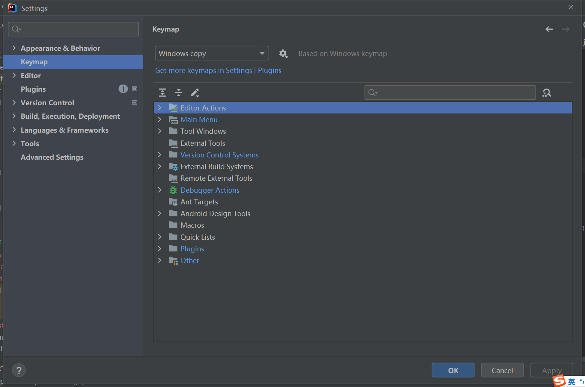

- `alt+insert`：生成固定代码
- `Ctrl+d`：删除一整行，好像是我自己设置的，原来是复制一整行
- `Ctrl+alt+下`：复制一整行
- `alt + /`，选中内容加注释
- `Ctrl + 鼠标左键`：查看类名
- `Ctrl + alt + L`：格式化代码，这个具体什么风格可以自己设置。比如我就把默认的大括号形式改为上下对齐，在 `setting -> Code Style -> Java` 中设置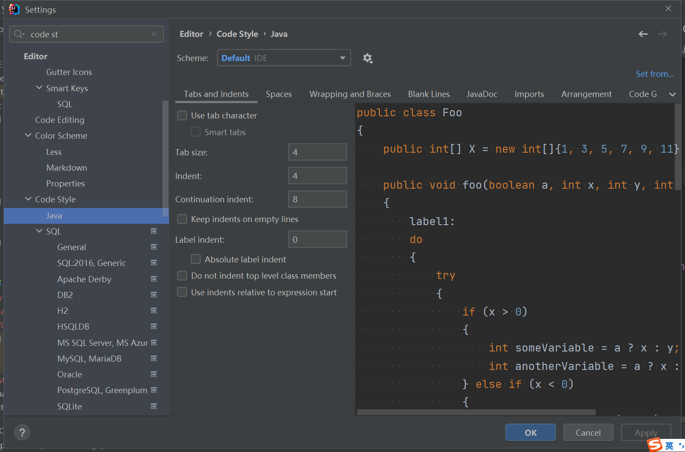
- `shift + F6` ：重命名，可以一键修改

### 1.2 live template

live template的意思是通过敲击较少的字符，来生成一个固定的代码模板，可以在 `setting -> editor -> Live Templates` 中查询和自定义。

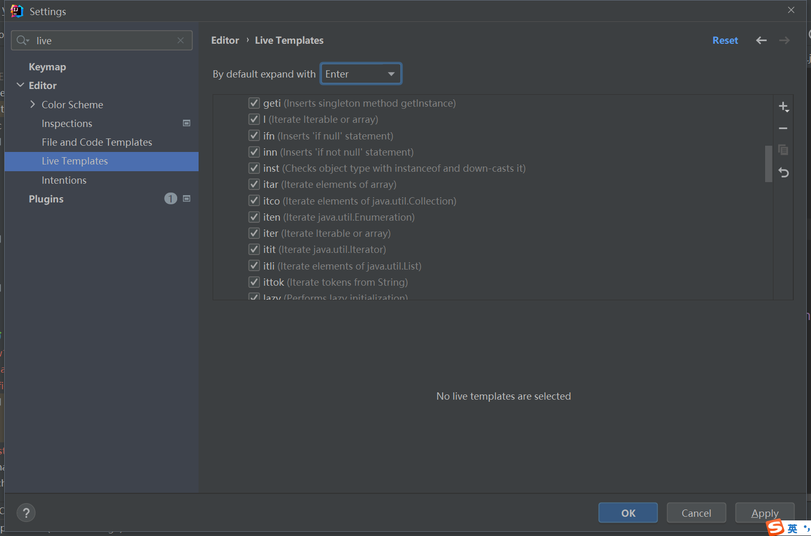

列举我经常使用的 ：

- `main`：可以直接生成公有，静态，void 的 main 方法
- `sout`：直接生成 `System.out.println()`
- `/*` 敲完回车可以开启多行注释，`/**`敲完回车课可以开启文档注释
- `ifn`：可以生成一个 `if (object == null)` 的代码块
- `inn`：可以生成一个 `if (object != null) ` 的代码块

### 1.3 后缀快捷键

我不知道是不是叫这个名字哈，就是敲一段代码以后可以后面加一个 `.something` 。就可以生成一些固定的代码了。比如我经常用的：

- 生成一个对象： `new Object().var` 。可以直接生成代码 `Object object = new Object();`
- 生成一个循环：对于一个可以遍历的东西，可以是数组，可以是某些特定的容器，可以这样 `数组名.for` 就会生成一个 for 循环来遍历
- 生成一个条件语句：`condtion.if` 会生成一个 `if (condition){}` 的代码块
- 生成一个 try 语句：`statement.try` 会生成一个 `try{}catch{}` 代码块

---

## 二、绘制UML

 IDEA是可以根据写完的代码自己绘制UML图的，具体方法是按鼠标右键选择 `Diagrams -> show Diagrams...`

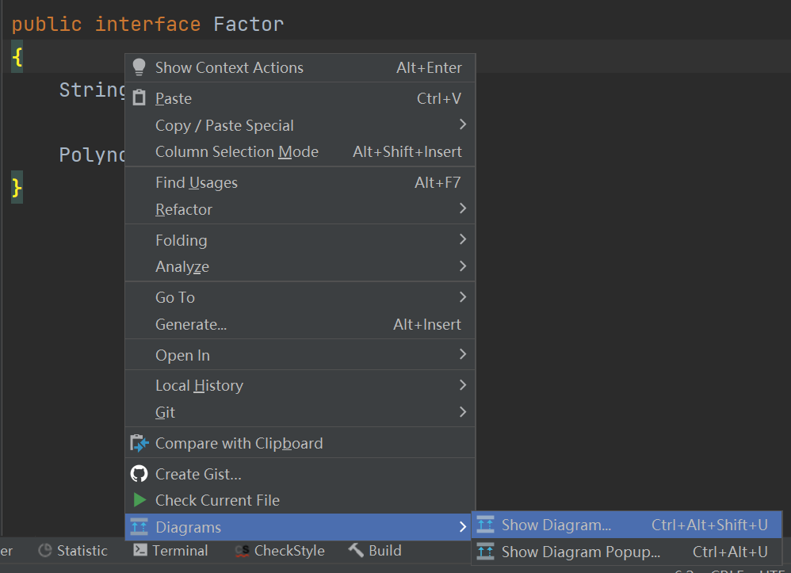

然后就会打开一个新的文件，相当的简洁

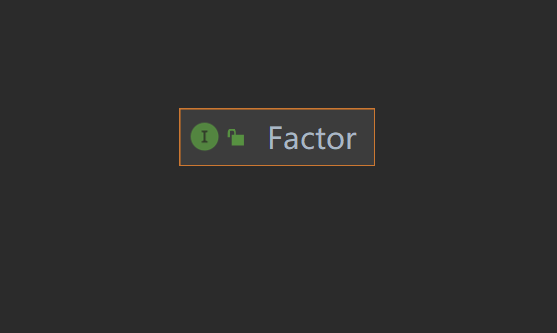

为了让其显示的信息更多，我们可以操作最上面的操作条，比如我现在选择了那个粉红色（我定义它为粉红色）的 m。就可以显示所具有的方法，如图，其他操作类似：

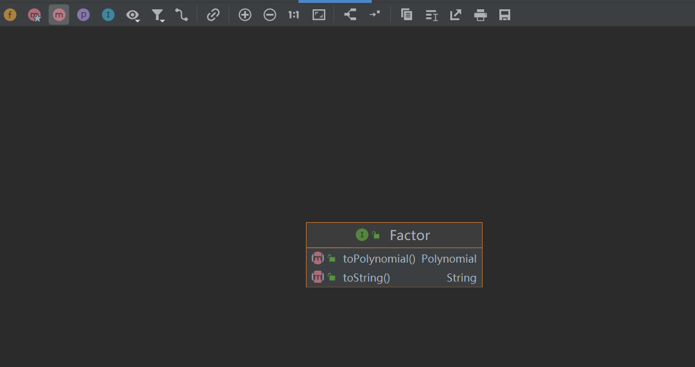

为了调出其泛化关系，可以在所选择的类或接口上右键进行选择 `Show Implementations` 或者 `Show Parents`

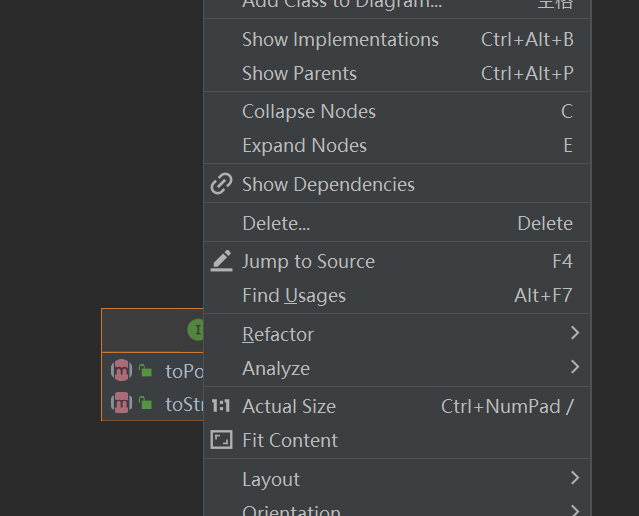

效果如下：

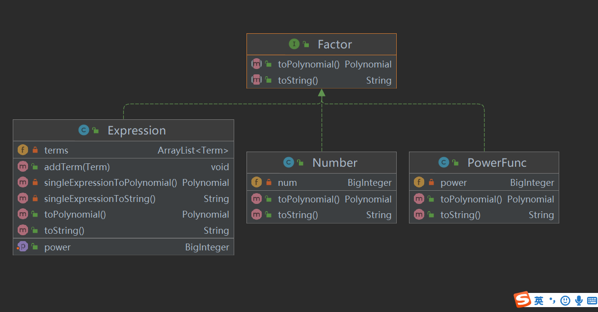

---

## 三、调试

### 3.1 断点调试

我特别喜欢 IDEA 的断点调试功能，因为真的超级漂亮。

我个人对断点调试的看法是，如果是自己的代码，采用输出法进行调试似乎是更快一些，可是如果是别人的代码，那么断点调试可以让我快速了解算法的执行流程。断点调试可以让我们在阅读别人（包括小姑娘和 JDK ）的是时候快速理解提供了强大的工具支持。

断点调试需要先下断点，下断点的方法就是点击侧边栏

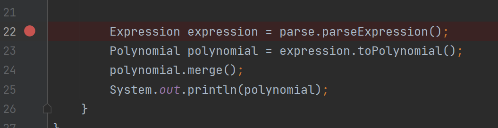

然后点击上面这个瓢虫形状的按钮，

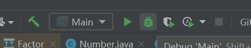

就进入调试模式了

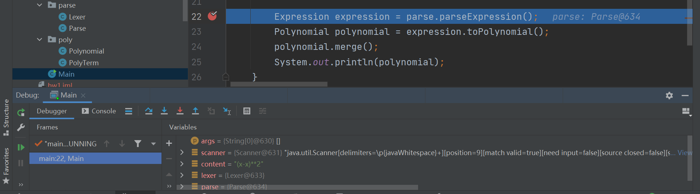

这个比 Codeblocks 的优点就是不用自己添加需要观测的变量，他会自动显示在右下方，而且其实在代码区也会有显示，真的超级好看，如图

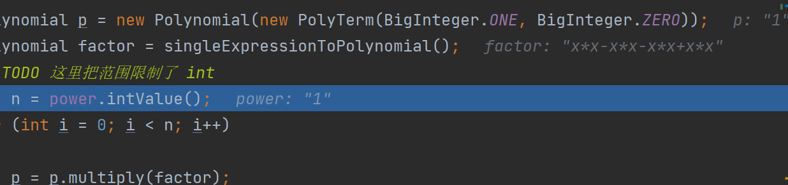

浅灰色就是显示，实在是很方便。
	
步进有以下几种形式：

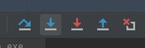

- step over：就是到下一行
- step into：就是进入到方法内部
- force step into：就是强行进入方法内部，可以看 JDK 源码
- drop frame：就是到达下一个断点

### 3.2 Junit调试

先打出 `@Test` 然后按 `alt + enter` 然后选择如图，就可以了：

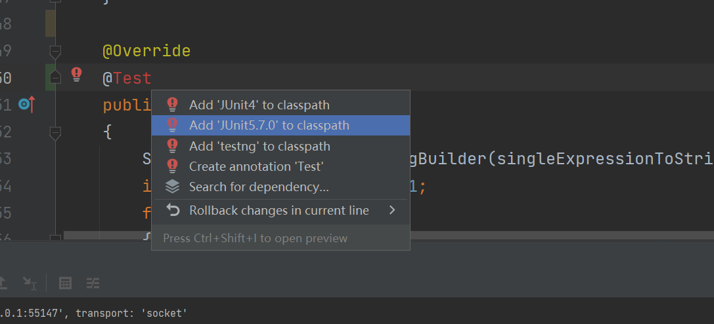

这个方法我不会用，比如说有参数的函数。

---

## 四、阅读代码

### 4.1 快速跳转

当按住 `Ctrl` 键的时候，就可以用鼠标点击方法或者类，找到源码，像这样

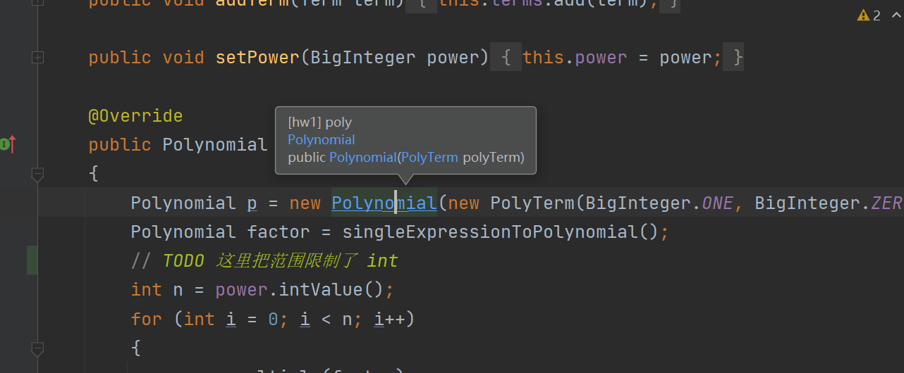

### 4.2 结构

有的时候一个类太长，一个一个找方法很麻烦，可以在侧边栏发现 `Structure` ，点开以后就类似于这个类的一个索引目录结构，如图：

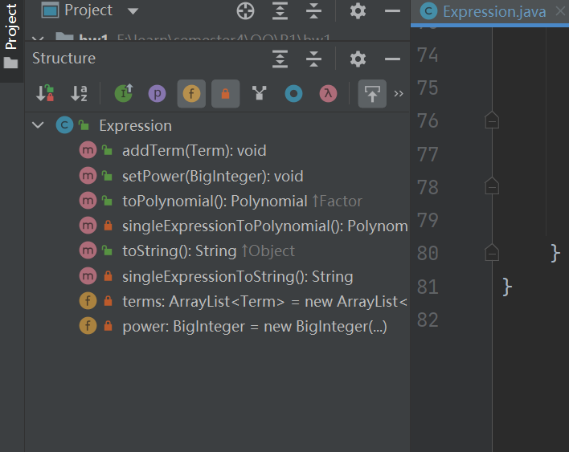

---

## 五、Git 使用

首先要让项目使用git进行版本控制

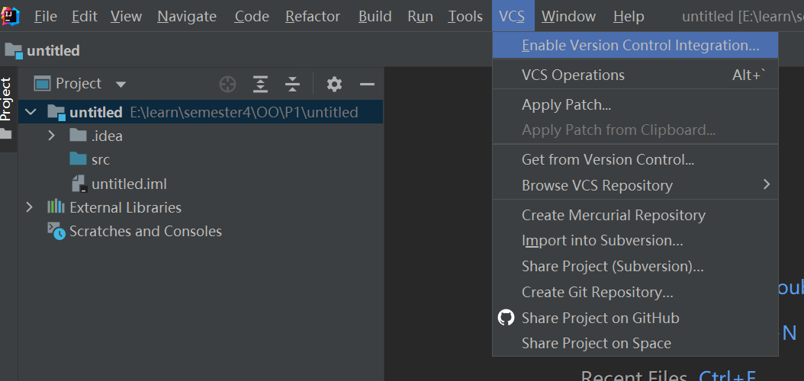

当点完上面的按钮以后，就可以使用了git了

可以设置一下远端库：

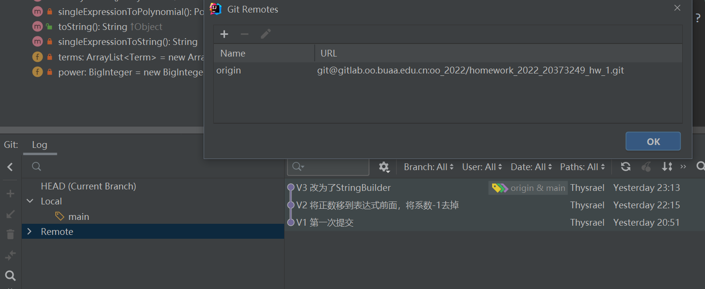

也可以进行提交

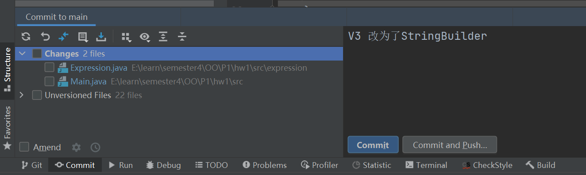

我觉得很好用。

涉及到具体的git，我一开始初学的时候写过一个小玩意：https://thysrael.github.io/posts/ac261492/
