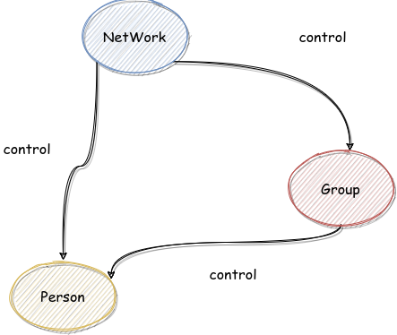
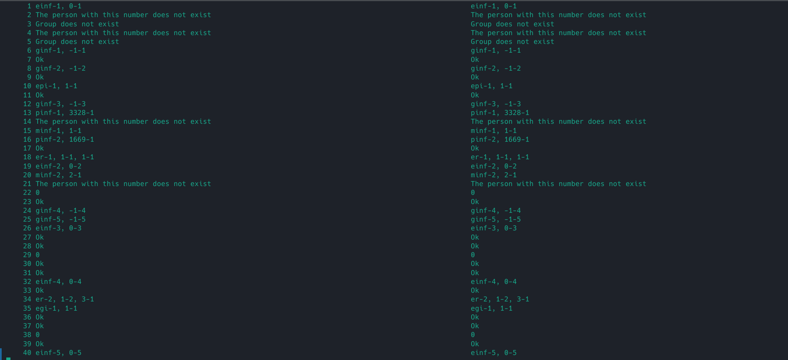

## 一、总论

第三个单元作为从第二个单元的心态考验中解放的一个单元，很容易让人先入为主的松了一口气。这个单元干的事情确实要之前两个单元要少，这是因为其实我觉得 `OO` 最体现思维的“架构设计” 部分被 `JML` 剥夺了（这么说并不严谨，之后分析）。导致确实这个单元的任务重心并不在完成作业本身，这是大部分人呈现的情况。

但是人的精力总是一定的，没有被写 `OO` 本身浪费掉，就会被其他事情浪费掉。而这个单元恰恰有两件浪费精神的事情。一件是去优化算法的复杂度，，一件是去做测评。

关于算法时间复杂度的优化，我个人感觉是一种“被动卷”。这种卷带来的不好受并不是像前两个单元，因为简化一个表达式，或者改一种电梯策略的“主动卷”。而是一个必须参与的“默认卷”，一个很死板的东西。从三个方面分析：

- 代价过大，比如说如果没有进行算法优化，不是没有性能分，而是直接被人 hack 掉，虽然分数确实不多，但是太令人恶心了。
- 毫无美感，所谓的优化就是内部维护一个中间变量，不涉及算法（当然图算法也算用到了，但是最恶心的是其他的维护变量）
- 与 `JML` 无关，哪怕是图算法或者并查集，很精妙，但是跟 `JML` 没有关系，`JML` 是用于规范代码的行为的，算法是用来改善代码行为的。类似于一个是法律，一个是经济，要研究法律（`JML`），探讨的应该是“张三与 20 个老婆结婚但是都不领结婚证，算不算重婚？”这一类明显需要细细甄别的问题，而不应该探讨“如何让张三与 20 个老婆结婚但不领结婚证”这个问题（这是一个经济问题（算法））。

关于做测评，这个单元推出了“单元测试”的概念，但是我会在下面分析，我个人觉得其实也是不太适合这个单元的命题背景。

---


## 二、架构设计

### 2.1 总体架构

这个单元的架构设计很简单，还是被约束好了的，大概是这样：



就是很自然的“社交网络里面有人，有小组，小组里有人”这个结构，更直白的是，这次里面并不设计 `Network` 通过 `Group` 进行中转然后再对 `Person` 进行比较复杂的操作，所有对于 `Person` 的复杂操作都是直接通过 `Person` 进行的，这无疑降低了难度。

### 2.2 图算法

这个单元会涉及一些最短路径，最小生成树的图论算法，还有并查集算法。算法本身的实现就算困难，但是反正网上都有，抄就好了。但是 `Java` 在很 “面向对象” 的，所以实现这些算法的时候总会让人感觉“丑丑的”（就是那种很可爱的丑）。为了解决这个问题，可以考虑采用内部类等手段进行优化，或者直接像面向过程的语言一样，直接开数组，而不用已经有的容器。

### 2.3 架构再评价

这里放上我对于这个单元架构的看法，仅是个人看法，我还挺喜欢这个单元的。我觉得这个单元最大的问题就是“架构太简单”。架构一旦简单，就会导致很多问题。

首先是 `JML` 变得很没有必要，我个人觉得 `JML` 的意义就在于，自然语言已经没办法描述清楚需求了，这才需要一种“歧义性小的，类似与数学语言”的 `JML` 来进行描述。但是我们现在来看一个例子，这是 `JML` 语言的描述：

```java
/*@ public normal_behavior
      @ requires containsMessage(id) && getMessage(id).getType() == 0 &&
      @         !isCircle(getMessage(id).getPerson1().getId(), getMessage(id).getPerson2().getId());
      @ ensures \result == -1;
      @ also
      @ public normal_behavior
      @ requires containsMessage(id) && getMessage(id).getType() == 0 &&
      @          isCircle(getMessage(id).getPerson1().getId(), getMessage(id).getPerson2().getId());
      @ assignable messages, emojiHeatList;
      @ assignable getMessage(id).getPerson1().socialValue, getMessage(id).getPerson1().money;
      @ assignable getMessage(id).getPerson2().messages, getMessage(id).getPerson2().socialValue, getMessage(id).getPerson2().money;
      @ ensures !containsMessage(id) && messages.length == \old(messages.length) - 1 &&
      @         (\forall int i; 0 <= i && i < \old(messages.length) && \old(messages[i].getId()) != id;
      @         (\exists int j; 0 <= j && j < messages.length; messages[j].equals(\old(messages[i]))));
      @ ensures (\exists Person[] pathM;
      @         pathM.length >= 2 &&
      @         pathM[0].equals(\old(getMessage(id)).getPerson1()) &&
      @         pathM[pathM.length - 1].equals(\old(getMessage(id)).getPerson2()) &&
      @         (\forall int i; 1 <= i && i < pathM.length; pathM[i - 1].isLinked(pathM[i]));
      @         (\forall Person[] path;
      @         path.length >= 2 &&
      @         path[0].equals(\old(getMessage(id)).getPerson1()) &&
      @         path[path.length - 1].equals(\old(getMessage(id)).getPerson2()) &&
      @         (\forall int i; 1 <= i && i < path.length; path[i - 1].isLinked(path[i]));
      @         (\sum int i; 1 <= i && i < path.length; path[i - 1].queryValue(path[i])) >=
      @         (\sum int i; 1 <= i && i < pathM.length; pathM[i - 1].queryValue(pathM[i]))) &&
      @         \result==(\sum int i; 1 <= i && i < pathM.length; pathM[i - 1].queryValue(pathM[i])));
      @ ensures \old(getMessage(id)).getPerson1().getSocialValue() ==
      @         \old(getMessage(id).getPerson1().getSocialValue()) + \old(getMessage(id)).getSocialValue() &&
      @         \old(getMessage(id)).getPerson2().getSocialValue() ==
      @         \old(getMessage(id).getPerson2().getSocialValue()) + \old(getMessage(id)).getSocialValue();
      @ ensures (\old(getMessage(id)) instanceof RedEnvelopeMessage) ==>
      @         (\old(getMessage(id)).getPerson1().getMoney() ==
      @         \old(getMessage(id).getPerson1().getMoney()) - ((RedEnvelopeMessage)\old(getMessage(id))).getMoney() &&
      @         \old(getMessage(id)).getPerson2().getMoney() ==
      @         \old(getMessage(id).getPerson2().getMoney()) + ((RedEnvelopeMessage)\old(getMessage(id))).getMoney());
      @ ensures (!(\old(getMessage(id)) instanceof RedEnvelopeMessage)) ==> (\not_assigned(people[*].money));
      @ ensures (\old(getMessage(id)) instanceof EmojiMessage) ==>
      @         (\exists int i; 0 <= i && i < emojiIdList.length && emojiIdList[i] == ((EmojiMessage)\old(getMessage(id))).getEmojiId();
      @          emojiHeatList[i] == \old(emojiHeatList[i]) + 1);
      @ ensures (!(\old(getMessage(id)) instanceof EmojiMessage)) ==> \not_assigned(emojiHeatList);
      @ ensures (\forall int i; 0 <= i && i < \old(getMessage(id).getPerson2().getMessages().size());
      @          \old(getMessage(id)).getPerson2().getMessages().get(i+1) == \old(getMessage(id).getPerson2().getMessages().get(i)));
      @ ensures \old(getMessage(id)).getPerson2().getMessages().get(0).equals(\old(getMessage(id)));
      @ ensures \old(getMessage(id)).getPerson2().getMessages().size() == \old(getMessage(id).getPerson2().getMessages().size()) + 1;
      @ also
      @ public exceptional_behavior
      @ signals (MessageIdNotFoundException e) !containsMessage(id) ||
      @         containsMessage(id) && getMessage(id).getType() == 1;
      @*/
    public int sendIndirectMessage(int id) throws
            MessageIdNotFoundException;
```

四十多行，但是其实用自然语言描述 “最小生成树”五个字就够了（哪怕把离散数学这一章中关于最小生成树的内容全介绍，也没这个多）。会发现 `JML` 并没有辅助开发，而成了开发的阻碍。这其实是个很正常的现象，因为自然语言的描述主体就是简单的事情，如果架构很简单，那么就是用自然语言描述有优势。、

那种 `JML` 很严谨的语言，不是不好，而是其描述的主体就是复杂的事情，如果一个方法会抛出 100 个异常，那么这 100 个异常的优先顺序是怎样的，检测条件有什么不同，每个异常要怎样处理，这些东西用自然语言是很难描述的，用 JML 就很合适。如果一个方法很不符合人的逻辑，比如一个有负边的图的行为的定义，那么用 JML 也很合适。但是这次的架构是没有这些东西的，这次的架构很简单，唯一有这种感觉的是那个小组人数不得超过 `1111` 人，这个特殊的行为，如果再复杂一些，就没有办法用自然语言描述了，是一个很好的地方。

其次，架构一旦简单，单元测试就变得没有必要。我个人觉得，对于 `Person` 进行单元测试，不如直接通过 `Network` 对 `Person` 进行测试，还能顺便测试一下 `Network` 对于 `Person` 的管理能力。我们解释单元测试的意义，常用的例子是制造飞机的时候，不能上来直接测试飞机，而是应该先对飞机的部分，比如说发动机，机翼等进行测试。但是如果我们制造的就是机翼呢？那还有没有必要进行单元测试呢？如果还有，那么如果我们制造钢板，那么是不是还要进行单元测试。一旦单元的复杂度下降，那么单元测试的必要就变少。就好像我们搭建乐高的时候，从来不会测试积木块。

最后，因为架构的难度没有上去，就会导致其他的卷的地方被开发出来。这是一个必然的现象，如果一个部分简单了，那么其他部分的难度就会上去，不然这个课程就太安逸了。但是架构简单导致的不只是 `JML` 部分的难度上不去，而且还导致了很多正确的 `OO` 的难度都上不去，比如抽象出新的类，利用已有的高级容器之类的。难度只能在算法上进行提高（毕竟算法在哪里都有），要是这样也还好，用 `Java` 实现数据结构学过的算法，是一件很有意思的事情。但是算法依然没有筛选度，最有筛选度的是无聊的 `quary group value sum` 的 `O(n^2)` 优化，这个就维护一个中间变量就好了，算法简单，除了很难想到会被卡以外没啥难度。这就是一种不健康的卷，我这个单元关注群消息关注的远远比前两个单元，因为很担心因为自己的疏忽导致一个简单的算法没有被优化，我个人觉得不太好。

---

## 三、测试

### 3.1 总论

在这个单元因为答题思路被 `JML` 限制了大部分的设计（这其实是一个很有意思的话题，底下聊），所以节约出很多时间来思考测试相关的东西。

我个人观点，一个测评机（无论是单元测试还是黑箱随机测试）主要由三部分组成：

- 数据生成器
- 正确性检验器
- 自动化测试器

对于这个单元来说，由于引入了单元测试，我觉得测试的方法变成了三种，即：

- 全局的白箱测试
- 单元测试
- 全局随机黑箱测试

在下面我会就这些方面去介绍我的思考。

### 3.2 白箱测试

#### 3.2.1 单元测试理解

对于单元测试来说，测试的是每一个方法的执行效果，如果按照上面的逻辑去分析，数据生成器的任务就由人脑承担了，正确性检验的任务也是由人脑承担的，自动化测试由 `junit 4` 承担。

正确性检验是结合 `assert` 来实现的，具体的语法如下

```java
assert conditon : "assert information"
```

condition 本质是一个布尔表达式，如果其为 `true` 的话，就啥都不会发生，而其为 `false` 的时候，就会向 `stderr` 输出 `assert information`。

#### 3.2.2 全局白箱测试

对于全局白箱测试，我将其定义为人脑构造样例然后扔进去跑的行为。数据生成器和正确性个检验依然是由人脑承担，自动化测试部分可以由 `Juint4` 承担，也可以对拍承担。

其与单元测试的区别就是，他不再限制于只测试某个特定的方法，而是将整个程序看为一个整体，对于特定的功能或者说接口进行测试。

#### 3.2.3 单元测试的初步分析

那么这个单元到底适不适合单元测试呢？我个人观点是不适合的（求轻锤）。我个人觉得，单元测试的特点就在于它的测试的粒度更加小，对于一个庞大的系统来说，如果只对系统本身进行一种全局性的测试，其缺点在于不能覆盖到每一个方法，同时也不能方便的定位到底是哪里除了问题。这些全局测试没有办法解决的事情，单元测试都可以有较好的表现。

我们知道，对于一个系统来说，可以有这样一个划分，方法和组织方法的方法，类似于“生产部门”和“管理部门”。“生产部门”去负责实际的算法实现，“管理部门”去负责组织和管理“生产部门”。单元测试的对象是“生产部门”，我们可以测试飞机的发动机正不正常，翅膀好不好看，但是我们没有办法单元测试这个飞机的整体飞行效果，因为唯一的测试方法就是造好一架飞机然后放一个驾驶员去指定路线让他去飞行，这就变成了全局的事情。当然也不是完全不能测，但是就要求搭建一个飞行模拟器，显然是不适合很快速的测试的。

那么这个单元的“生产部门”？对于 `People` 来说，就是一堆的 `getter,setter` 。对于 `Group` 也类似，对于 `Network` ，大致分三个部分，一个是异常的检测，一个是图论算法的实现，一个是一大堆的 `getter,setter` 。那么这些方法有必要单元测试吗？我们认为图论算法是有必要的，因为他复杂，但是其他的呢？写异常的时候丢掉一个 `!` ，用肉眼de都比写单元检测快。

那么这个单元的“管理部门”呢？只有 `Group` 和 `Network` 具有管理功能，但是这种管理是直白的，单一的，对于一个对外的接口，这个接口里根本不会调用两个复杂的生产零件，只会调用一个，那么这种管理就是个“包装性质”的接口，`queryGroupAgeVar` 根本跟 `Network` 没关系，他本质上测试的就是 `Group` 的 `getAgeVar` 这个方法，所有方法都是这个特点，`sendIndirect` 就是求最短路径，里面用到其他复杂算法了吗？没有。

那么就没有必要对于任何的“生产部门”进行测试了，因为都可以转换成对相应“管理部门”的测试，而对于管理部门的测试，就又会变成一种全局的测试，这样以来，单元测试成了一种不经济的选择。

#### 3.2.4 单元测试与架构设计

如果接着上面的分析，这个单元不适合单元测试的原因我个人认为就是架构太简单了（不是说题目简单），`Pre2` 的架构设计都比他复杂，这个单元的架构说白了就是 `Network` 管理 `Group` 和 `People`，然后 `Group` 有可能管理 `People` 。在 `Pre2` 那个冒险者类还可以管理好几种类，两个冒险者之间还可以互相作用，管理的层次还是一个递归的（冒险者管理冒险者）。

一旦架构变得简单，单元测试就没了意义。这是因为单元测试的最朴素的认知就是，因为看不清全局，所以要保证每一个局部。对于一个这么简单的架构和代码量，单元测试就像是检查一万遍 `1+1=2` 一样。只是一种浪费时间的行为。

另外还可以从一个角度考虑，就是架构设计到底支不支持单元测试，单元测试最基本的就是要有测试的单元，底下这个东西是没有单元测试可能的。

```c
int main()
{
	printf("Hello, world.\n");
    return 0;
}
```

只有把架构改成这样，才具有单元测试的可能。

```c
void printHello()
{
	printf("Hello, world.\n");
}

int main()
{
	printHello();
	return 0;
}
```

但是因为 `JML` 的约束关系，让人很去掉原有的简单的架构设计（如果 `Runner` 里只传入 `MyNetwork.class` 估计就可以），而改成一个复杂而清晰的架构。所以只能说很遗憾了。

但是在这里还是提供几个可以抽象出新的零件的思路，一个是对于图论算法，可以单独抽象出一个图论工具类，一个是对于并查集，可以单独抽象出一个类，最后一个是对于异常检测，可以在 `MyNetWork` 中抽象出方法来检验比如说人员或者信息的合法性问题。但是其实还是没有改变很多架构设计的简单性。

#### 3.2.5 全局白箱测试的优势

全局黑箱和全局白箱最大的一个区别就是全局黑箱对于控制测试的种类很难达到一种细颗粒度（或者说覆盖度），比如说如果是全随机式的数据生成器，那么现在 HW11 有 26 个接口，那么想测到某条指令的概率就是 1/26。如果只随机 25 条指令，那么肯定最少有一条指令没有被测试到，再加上有些指令是有逻辑顺序的，如果在 `ap,ar` 前就 `sm` ，那么只会得到异常，对于正常的功能是没法测试的。虽然有水平的黑箱数据生成器会用很多方法增加覆盖率，但是不得不承认，这个单元比第一单元和第二单元采用黑箱测试的时候的覆盖了低多了（因为前两者的数据间的依赖性没有那么强），这也是这个单元一个优秀的数据生成器，动辄就是 `100000` 这个量级指令的生成。

但是全局白箱就不具有这个缺点，因为他是人脑构造的，所以用较小的数据就可以达到较高的覆盖率，而且精细度很高，因为即使是优秀的随机生成，也没办法保证比如说一个联通分支上只有两个点（如果有可能，我个人觉得以我的智商代价稍微大了一些）。而且全局白箱也并非具有“全局”的缺点，他依然是可以参照某一个功能进行测试，我的全局白箱依然用的是 `Junit4` 架构，在 `MyNetWorkTest` 中进行测试，依然是每个方法构造相关的例子，可以做到针对某一特定功能（接口）的测试。

一般而言，全局白箱的缺点是只能针对功能进行测试，而不能针对具体的方法零件进行测试，这就会导致对于方法的一些参数的覆盖率降低，但是很遗憾的是（对于单元测试很遗憾），这次的接口全都是包装接口，所以基本上测试接口就是在测试零件。

### 3.3 黑箱测试

#### 3. 3.1 个人感言

因为我确实不太会做这个测试，尤其是不会写测评机中的数据生成器这个部分，我干了很多次写完以后发现只能再写一个评测机去评测我的数据生成器的傻蛋事情。所以这个部分大量的东西都是关于数据生成的，所以求轻锤。

#### 3.3.2 与白箱对比

黑箱测试的覆盖率并不能说完全不如白箱，因为很重要的一个点就是黑箱只是指定规则，然后生成的数据是依照规则生成的，而白箱则是需要人脑全程制作，这就导致如果一个 bug 是人脑都没有意识到的，那么白箱就一定测不出来，比如我 HW11 有一个 bug 是当发送表情信息不成功的时候，表情的热度依然会增加，但是我本来就是认为会增加的，所以我做自己的白箱测试是通过了的。只有通过黑箱测试，才能检测出这个 bug。

所以说道这里，应该说黑箱和白箱即使不比较成本问题，光讨论测试强度问题，也可以说是黑箱和白箱各有所长，只有两者都结合起来，才可以说是尽量完美的测试。

#### 3.3.3 提高测试强度

那么如何提高黑箱的测试强度呢？通过对于大佬数据生成器的研究，我总结出一下规律（我好卑微，呜呜呜）

- 数据量一定要大，大到让人恶心到没法定位 bug 的地步
- 用参数去控制生成器行为，比如限定生成器的生成指令的种类，数量啥的，可能还有更高级的参数，但是我看不懂

#### 3.3.4 其他组件

上面讨论的是数据生成器部分，但是一个评测机还有其他部分组成。我个人观点是数据生成器只负责制造数据（只制造一个数据），而其他部分交由其他程序负责，这样可以最大程度的解耦联和定制测试的强度（还可以显得我比较能耐）。

那么用什么语言去实现其他组件呢？常用的就是 python 了，python 对于对拍，创建文件夹，各种系统调用都是十分擅长的。但是我是一般人吗？我刚学了 Linux 脚本，我要是也用 python，怎么能显示出我跟别人的不一样来？怎么显得比别人厉害呢？怎么能让小姑娘有一种“哇塞，这个孙子好厉害我好爱” 的感觉呢，是吧？

玩笑归玩笑，采用 Linux 脚本的原因是因为他比较方便测量运行时间（虽然用 python 也可以，严格讲所有脚本操作都可以用 python 实现）。而且对于重定向和文件操作比较直观，python 一调用函数，我就很担心问题，而且调试起来比较方便（对我个人而言）。在对拍方面，有很好的 `diff` 工具可以使用，也是我选择 shell 脚本的一个原因。

### 3.4 用 shell 脚本辅助评测机

#### 3.4.1 前言

这一章是我写这篇文章的一个很期待的地方，因为确实很有意义，第一次写一个这么人性化的评测机的脚本。不得不说，我的好兄弟们编写了强大的数据生成器，而且完成了评测机架构的初步构想，我是在他们基础上完成了微不足道的一点修补。可以说是很开心的一次合作了。

之所以这个评测机这么的复杂，其实本质上是设计构想的强大。丁灵玲写的数据生成器具有多个参数来设置各种不同的测试类型性，这就要求对于生成的测试数据进行分文件夹管理。朱七七最开始的评测机架构，就指明了要完成生成数据的自动化和测试的自动化，而且给测试规模定下了一个很宏伟的目标。燕七也是提出了对于定位bug的诸多用户需求，还有明月楼成功让我刮目相看，鼓励我继续完成开发。我也是在兄弟们的基础上进行了完善。

底下用到的 shell 脚本的知识可以在我的博客里找到，这是链接 https://thysrael.github.io/posts/6feda75c/

#### 3.4.2 自动化数据生成

##### 3.4.2.1 给数据生成器传入参数

因为数据生成器需要依靠参数决定生成数据的种类，而没法在生成器内部遍历这些参数（也不是不行，但是那样生成的数据点就会比较散乱，得写一个脚本去整理他们），所以这里给出的方法是利用可执行文件的传参，首先在数据生成器里加入解析参数的函数

```c
void parseArgument(int argc, char **argv)
{
    if (argc != 3)
    {
        printf("Wrong argument.\n");
        exit(0);
    }
    else
    {
        printf("Generate the ");
        if (!strcmp("Normal", argv[1]))
        {
            printf("Normal ");
            type = 0;
        }
        else if (!strcmp("Message", argv[1]))
        {
            printf("Message ");
            type = 1;
        }
        else if (!strcmp("Group", argv[1]))
        {
            printf("Group ");
            type = 2;
        }
        else if (!strcmp("Graph", argv[1]))
        {
            printf("Graph ");
            type = 3;
        }
        else if (!strcmp("Exception", argv[1]))
        {
            printf("Exception ");
            type = 4;
        }
        else if (!strcmp("Sim", argv[1]))
        {
            printf("Sim ");
            type = 6;
        }
        else if (!strcmp("Emoji", argv[1]))
        {
            printf("Emoji ");
            type = 7;
        }
        else if (!strcmp("Notice", argv[1]))
        {
            printf("Notice ");
            type = 8;
        }
        else if (!strcmp("Super", argv[1]))
        {
            printf("Super ");
            type = 9;
        }
        else
        {
            printf("\nWrong type.\n");
            exit(0);
        }

        if (!strcmp("Discrete", argv[2]))
        {
            printf("Discrete ");
            noGroup = false;
            oneGroup = false;
        }
        else if (!strcmp("None", argv[2]))
        {
            printf("None ");
            noGroup = true ;
            oneGroup = false;
        }
        else if (!strcmp("Union", argv[2]))
        {
            printf("Union ");
            noGroup = false;
            oneGroup = true;
        }
        else
        {
            printf("\nWrong subtype.\n");
            exit(0);
        }
        
        printf("type data.\n");
    }
}
```

然后在写一个脚本去循环调用这个程序。先在脚本里声明待遍历的参数数组

```shell
types=("Normal" "Message" "Group" "Graph" "Exception" "Sim" "Emoji" "Notice")
subtypes=("Discrete" "None" "Union")
```

然后用下面的语句遍历并传参（generator 是数据生成器）：

```shell
for type in ${types[*]}
do
    for subtype in ${subtypes[*]}
    do
        ./generator $type $subtype
    done
done
```

##### 3.4.2.2 为不同数据创建目录

因为参数不同，所以生成的数据是不同的，这时候需要将不同的数据分门别类的放好，方便后续定位 bug 和专项测试。生成文件夹的时候要考虑文件夹是否存在，不然 shell 会有一个警告，具体写法如下

```shell
for type in ${types[*]}
do
    for subtype in ${subtypes[*]}
    do
        dir=$type$subtype
        if [ ! -d "$dir" ]; then
            mkdir -p $dir
        else
            rm -rf $dir
            mkdir -p $dir
        fi
    done
done
```

##### 3.4.2.3 为随机种子休眠

因为现在比较简单的随机算法都是用时间当作随机种子的，但是因为程序运行过快，所以导致随机出来结果并不会发生变化（所以编写完之后最好打开看一看不同测试点是否相同）。我看到可以用一些外包来增强随机效果，但是一个优秀的辅助，能不麻烦 ADC，就坚决不麻烦（其实是不好意思麻烦，但是我依然麻烦了）。所以我们可以让脚本自动休眠。

具体写法如下，意思是调用后休眠 0.7s 后进行下一次调用。

```shell
./generator $type $subtype
sleep 0.7
```

#### 3.4.3 自动化测试

##### 3.4.3.1 错误停止

当测试的时候出现错误，脚本应该可以自动停止，使错误信息得到保留，这里采用的 `diff` 的返回值结合条件判断的写法，写法如下

```shell
diff -y -W  200 ${name}.txt cjj.txt > difference.txt
if [ $? -ne 0 ] ; then
	echo ${name} "wrong at" "$dir/$testcase"
	exit 1
fi
```

`$?` 表示前一个命令的返回值。

##### 3.4.3.2 时间处理

用 shell 自带的 `time` 命令可以很好的实现命令执行时间的测算

```shell
time -p java -jar ${name}.jar < input.txt > ${name}.txt
```

效果如图

```shell
real 0.44
user 1.12
sys 0.11
```

如果想要统计有没有 tle，需要把获得的时间记录下来，这个时候可以考虑将 `time` 的结果重定向到一个文件中，然后再读取这个文件获得执行时间变量。

但是因为 `time` 是输出到 `stderr` 的，所以重定向的时候写法是这样的

```shell
(time -p java -jar ${name}.jar < input.txt > ${name}.txt) 2>timer.txt
```

但是这样就没有办法在屏幕上显示了，所以我们可以用 `tee` 命令保证多文件输出

```shell
(time -p java -jar ${name}.jar < input.txt > ${name}.txt) 2>&1 | tee ${name}_time.txt
```

然后我们需要分析这个文件中的内容，操作系统上学的各种工具都可以上了，这里摆出我的处理

```shell
test_time=$(cat ${name}_time.txt | sed -n 2p | awk '{print $2}')
```

然后获得时间以后我们需要比较两个时间，我们以燕七作为所有人的标准，以“1.5燕”作为评判标准（事实证明这个界限给小了，燕七把所有人都卷了一遍），可以写出如下判断式

```shell
if [ `echo "$cjj_time*1.5 < $test_time"|bc` -eq 1 ] ; then
	echo ${name} "time limmit exceed at" "$dir/$testcase"
	exit 1
fi
```

##### 3.4.3.3 遍历测试文件夹

这里的处理摆烂了，只是判断所有工作目录下的 `ls` 出的东西是不是文件，而没有考虑有的文件夹可能不是测试文件夹。所以这就要求工作目录下的文件夹必须是测试文件夹，让工作目录显得不是很整洁

```shell
for dir in $(ls ./) 
do
	if [ -d $dir ]; then
		...
	fi
done
```

##### 3.4.3.4 测试存档

因为多人测试会出现一个人bug，那么全组的测试就停止了，重新来的时候就又变成重新开始，那么对于其他人就变得很低效。所以设置一个日志文件，每完成一个测试点就记录这个点到文件中，然后运行的时候跳过这些在文件中已经存在的点（利用 `grep` 分析文件 ），具体操作如下

```shell
if [ ! -f "finished.txt" ]; then
  touch finished.txt
fi

for dir in $(ls ./) 
do
	grep "$dir" finished.txt >/dev/null
	if [ $? -eq 1 ]; then
		...
	fi
done

rm finished.txt
```

##### 3.4.3.5 文本比对

虽然我平时是使在线文本比对工具的 https://www.jq22.com/textDifference?d=1602569068152。但是这次数据量太大了，我一复制粘贴，网站就崩了，所以倒逼我探究了一下 `diff` 命令。

只要使用如下命令

```shell
diff -y -W  200 ${name}.txt cjj.txt > difference.txt
```

就可以在 `difference.txt` 中看出很好的效果，输入如下命令

```shell
less -N difference.txt
```

效果如图



对于不一样的地方，会有 `'<', '>', '|'` 进行测试。

##### 3.4.3.6 打扫工作目录

个人习惯，不太喜欢工作目录太乱，所以脚本完了以后加上删除中间文件的命令

```shell
for name in ${names[*]}
do
    rm ${name}_time.txt
    rm ${name}.txt
done
rm cjj.txt
rm cjj_time.txt
rm finished.txt
```

##### 3.4.3.7 赋予权限

不知道为啥，经常有的文件报“没有权限”，所以最简单的方法就是来到工作目录的父目录，执行如下命令

```shell
chmod -R 777 work_dictionary
```

---


## 四、对Network进行扩展，并给出相应的JML规格

发送产品广告

```java
/*@ public normal_behavior
      @ requires containsMessage(id) && (getMessage(id) instanceof Advertisement);
      @ assignable messages;
      @ assignable people[*].messages;
      @ ensures  !containsMeaage(id) && messages.length == \old(messages.length) - 1 &&
      @         (\forall int i; 0 <= i && i < \old(messages.length) && \old(messages[i].getId()) != id;
      @         (\exists int j; 0 <= j && j < messages.length; messages[j].equals(\old(messages[i]))));
     
　　   @ ensures (\forall int i; 0 <= i && i < people.length && !getMessage(id).getPerson1().isLinked(people[i]);
      @           people[i].getMessages().equals(\old(people[i].getMessages()));
      @ ensures (\forall int i; 0 <= i && i < people.length && getMessage(id).getAdvertiser().isLinked(people[i]);
      @           (\forall int j; 0 <= j && j < \old(people[i].getMessages().size());
      @             people[i].getMessages().get(j+1) == \old(people[i].getMessages().get(j)))
      @ ensures  people[i].getMessages().get(0).equals(\old(getMessage(id))) 
      @ ensures  people[i].getMessages().size() == \old(people[i].getMessages().size()) + 1);
      @ also
      @ public exceptional_behavior
      @ signals (MessageIdNotFoundException e) !containsMessage(id);
      @ signals (NotAdvertisementException e) !(getMessage(id) instanceof Advertisement);
      @*/
    public void sendAdvertisement(int id) throws
            MessageIdNotFoundException, NotAdvertisementException;
```

生产产品

```java
/*@ public normal_behavior
      @ requires contains(producerId) && (getPerson(producerId) instanceof Producer)
　　　　　
      @ assignable products[];
　　　 @ ensures (\exists int i; i<product.length && i>=0; products[i] == product);
      @ ensures getProductCount(productId) ==
      @           \old(getProductCount(productId)) + 1;
      @ also
      @ public exceptional_behavior
      @ signals (PersonIdNotFoundException e) !contains(producerId);
      @ signals (NotProducerException e) !(getPerson(producerId) instanceof Producer);
　　　 @
      @*/
    public void produceProduct(int producerId, Produce product) throws
            PersonIdNotFoundException, NotProducerException;
```

购买产品

```java
/*public normal_behavior
　　@ requires product.contains(product) && contains(coustomerId) && getPerson(customerId) instanceof Customer
　　
   @ assignable products[], getPerson(customerId).money, getPerson(customerId).products;
　　@ ensures products.length == \old(products.length) - 1;
　　@ ensures (\forall int i; i>=0 && i<=\old(products.length)) && product[i]!=product; 
　　　　　　　　　　(\exist int j; j>=0 && j<=products.length; product[j].equals(product[i]))
　　@ ensures getPerson(customerId).getmoney == \old(getPerson(customerId)) - product.getValue();
　　
　　@ ensures getPerson(customerId).getProduct().length == \old(getPerson(customerId).getProduct().length)+1;
　　@ ensures (\forall int i; i>=0&&i<=\old(getPerson(customerId).getProduct().length)&&\old(getPerson(customerId).getProduct().get(i));
　　　　　　　　　　(\exist int j; j>=0 && j<=getPerson(customerId).getProduct().length; 
　　　　　　　　　　　　getPerson(customerId).getProduct().get(j).equals(\old(getPerson(customerId).getProduct().get(i)))
　　@ ensures (\exist int j; j>=0 && j<=getPerson(customerId).getProduct().length; getPerson(customerId).getProduct().get(i).equals(product);
　　
　　@public exceptional_behavior
　　@ signals (NotProductException e) !product.contains(product); 
　　@ signals (NotCustomerException e) !contains(coustomerId) || !(getPerson(producerId) instanceof Producer);
*/
 
public void buyProduct(int coustomerId, Product product) throws NotProductException, NotCustomerException
```

----


## 五、写在后面的话

这个单元虽然吐槽了这么多，但是还是挺有意思的，`JML` 让我对于语言的认识又进了一步，而且确实很新鲜很有意思，感觉 `OO` 这门课程上不止能学到 `OO` ，还可以学到很多其他有意思的东西，体验非常好。