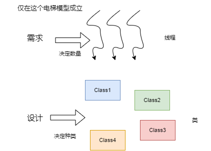

## 一、总论

### 1.1 直观理解

Unit2 的问题以电梯作为题目背景出题，刚做题的时候很容易就把这个单元的任务当成了处理多线程，当我全部完成这些作业以后，发现仅仅将 U2 概括为多线程，是一个十分片面的直观理解。

我觉得应该这么理解，U2 要完成的东西有（当然可以不完成）：

- 多线程设计：这比原来的处理多线程要难一些，处理多线程类似于能跑就行了，但是多线程设计偏向于跑的好，除了比较基础的生产者消费者模型，如果能再次基础上应用 Furture 、Balk、Work-Thread 等模式，可以做到一个更好的优化，此外，限制线程的种类，优化资源管理，这些东西都要比“抄一个多线程模型”要难很多。
- 面向对象设计：面向对象是一种管理代码的方式，只有代码量激增的时候，面向对象对代码的管理能力才能超越面向过程。因此这个其实是一个可选项，因为如果采用一些思路的话，代码量很少，只有采用及其牛逼的调度器策略的时候，才有代码量激增的情况。
- 数据结构设计：这是这次新题目的新难题，因为虽然题还是那个题，但是原来只有一栋楼，现在是 15 栋楼或者是 50 个坐标，总之如何处理这些请求的位置，就成了一个难题。我个人做的就极其繁复，会把每一层每一个方向单独作为一个集合，但是其实把所有请求不加分类的放进一个一维的集合中，似乎可维护性和可拓展性都会强很多。
- 运筹：这回的题目最大的特点就是优化是永无止境的，而且是没有方向的，我们只知道一件事：我们不知道怎么优化。电梯调度算法其实是一个研究很深的问题，在运筹学上专门有一章去讲这个，似乎叫“电梯群控理论”。我翻了一些论文，感觉不仅我不知道怎么优化，似乎写论文的人也不知道怎么优化。但是估计他们也有ddl，所以估计应付应付就交了。

虽然要完成的东西这么多，但是 U2 还有一个明显的特点就是其门槛极低，不同于 U1 最后带入表达式的时候，要是不对表达式树有一个深刻的理解，或者对深克隆有一个很深的理解，作业是完成不了的。U2 不同，因为 U2 的基础实现即为简单，我不止一次看到有人不到一个半天就完成了作业，甚至一两个小时就写完了。

跟令人难受的是，U2 的上限是极高的，如果写一个普通调度器策略（比方说RoundRobin调度），那么至少会比自由竞争多大约 300 行代码，期间还要有一个对线程管理一个更加深刻的理解。如果是比较贪心（局部最优）的调度器策略（比如影子电梯调度），那么可能一个调度器部分就需要写 1 天（我个人是两天都没有写完）。换乘也是类似，如果是基准策略，那么大概就是 30 行不到的控制代码，如果想用图论知识做的话，一个简单的无权图 BFS 就需要写很长时间（我个人是 1 天），如果考虑到是加权多重图，采用遍历所有路径去做，那么只会更复杂（我个人是 1 天没写完）。量子电梯运行策略，我尝试理解了 1 天，卒。

最最痛苦的是，尽管电梯继承了影子电梯调度策略，量子电梯运行策略，加权多重路径换乘策略。这个的性能可能还是没有普普通通基准策略加自由竞争要好。也就是说，会出现这种情况，当一个人花费了远超于其他人很多倍的时间，但是其回报不成正比，甚至是负数，这是经常发生的。

在考虑到时间点的问题，在 U2 的后期刚好是冯如杯交稿子，操作系统 lab2，lab3，期中考试，CPP、UNIX结课，航概大作业等一系列 DDL，所以有可能会发生即使有一颗想优化的心，但是没有优化的时间的情况发生。这都是有可能的。

### 1.2 架构解释

我一直觉得这个单元一直有两个问题，一个是对于要干什么的模糊，一个是对是什么的模糊。对于第一个问题，我一直觉得 U2 把多线程搞好就完事了，哪里想到搞多线程只是其中一个很基础的步骤，到了后期，谁都不会在上面花时间。所以我用 1.1 记录了一下大致要干些啥。

对于第二个问题，主要是看往年博客、听老师讲课、与同学讨论的时候遇到的，一个“自由竞争”的理解就可以有 800 个。有人管 look 叫做电梯调度策略，有人管自由竞争叫做电梯调度策略，这显然都不是一类东西。概念的差异其实并不可怕，就好像各个地区的语言不同一样，可怕的是，有可能因为概念不同，在学习的过程中导致概念的丢失，这就是很恐怖的事情了。

这里给出一些概念的释义，概念的名字不重要，重要的是对应的概念应当得到认识：

| 概念           | 解释                                                         | 举例                                       |
| -------------- | ------------------------------------------------------------ | ------------------------------------------ |
| 电梯运行策略   | 指一个电梯面对多个请求时的工作策略                           | als，look，环形不换向，环形模拟            |
| 电梯调度策略   | 指多个存在竞争关系的电梯进行请求分配的策略                   | 自由竞争，调度器（包括很多种）             |
| 电梯换乘策略   | 指的是如何将一个需要换乘的请求处理成多个电梯可以处理的不需换乘的请求的策略 | 静态换乘、动态换乘（均包括很多种）         |
| 多线程设计模式 | 解决的是多线程中容易出现的问题                               | 生产者消费者模型，Fulture 模式，流水线模式 |
| 设计模式       | 解决的是面向对象中容易出现的问题                             | 单例模式，工厂模式                         |

三次作业大概对应需要完成的任务

|              | hw5                                  | hw6                                                          | hw7                          |
| ------------ | ------------------------------------ | ------------------------------------------------------------ | ---------------------------- |
| 线程设计     | 单向的线程交互                       | 自由竞争需要考虑共享候车表的问题                             | 双向的线程交互               |
| 面向对象设计 | 无，有人用到了策略模式，但是我不了解 | 调度器法需要考虑用面向对象来管理代码，自由竞争不需要。电梯种类增加，需要考虑是否继承或者接口或者组合 | 封装请求，图算法需要封装图类 |
| 数据结构设计 | 考虑是平面化结构还是立体结构         | 考虑是平面化结构还是立体结构                                 | 考虑是平面化结构还是立体结构 |
| 运筹         | 垂直电梯运行策略，评测机             | 环形电梯运行策略，电梯调度策略，评测机                       | 电梯换乘策略，评测机         |

### 1.3 做作业思路

我对于 U2 的特性分析在 1.1 已经阐述过了，我觉得真的挺有意思的，因为这种特点是我第一次接触，而且我相信以后接触的会更多。**没有前进方向，摆烂（其实不能叫摆烂，就是佛系）没有代价，机关算尽误性命，其他DDL重如泰山**，这样的事情到底应该怎么办？虽然有些夸张，但是其实很多事情都是这个样子的。

其实我个人觉得尽兴就好了。

---


## 二、线程设计

### 2.1 线程种类的确定

#### 2.1.1 线程与面向对象的联系与区别

这个也是我发生了很大误区的地方，因为我一直有一种感觉是线程就是**特殊的一种类**，它实现了 `runnable` 接口或者继承了 `Thread` 类。线程是一个过程，而不是一个对象。

怎么论证这个观点呢？有一种朴素的认识，`Printer` 是一个类，因为听到这个单词我脑子就能反映出一个像打印机一样的东西，`Elevator` 也是一个类，因为听见这个词我就可以联想到那个方方的可以进人出人满楼层乱窜的东西，哪怕是抽象一点的 `TreeNode`，我也知道这是一个二叉树的节点，它有两个孩子之类的。但是 `Main` 是什么？我反正反映不出来 `Main` 长什么样子，因为 `Main` 发挥的功能就不是一个类该干的事情，而是一个线程该干的事情。

类或者对象干什么的？把数据封装到一起，把用这些数据做参数的函数也封装到一起。然后呢？然后就什么都不干，等着别人调用或者访问。那么谁来做调用者，其实就是 `Main` ，只有一切有了 `Main` ，一切封装好的代码才有了工作的指令。说到底，只用面向对象是没有办法解决任何问题的。我们需要 `Main` 来让一切对象合理的运作起来。

那么为什么 `Main` 就有这么神奇的作用，因为 `Main` 是一个线程，他是一个过程，只有过程可以调用对象。当我们进行多线程的时候，思考线程的安排的时候，不应该思考这个类应不应该动起来，而是应该该思考这里该不该多一个过程。

可以这么说，线程和类完全是两个不相关的东西，正是因为这种不相关性，才使得程序得以运行。线程与类的关系，应该是这样的


而不应该是这样的


我们常写的电梯类，是这样的：

```java
public class Elevator extends Thread
{
    private static final boolean UP = true;
    private final char building;
    private final int id;
    private final int capacity;
    private final HashMap<Integer, LinkedList<PersonRequest>> inside;
    private int insideCnt;
    private final Building outside;
    private boolean direction;
    private PersonRequest targetRequest;
    private int floor;
    
    void run()
    {
        ...
	}
}
```

但是严格地讲，应该是这样的

```java
public class ElevatorThread extends Thread
{
    private final Building outside;
	private Elevator elevator;
    
    void run()
    {
        ...
	}
}

public class Elevator 
{
    private static final boolean UP = true;
    private final char building;
    private final int id;
    private final int capacity;
    private final HashMap<Integer, LinkedList<PersonRequest>> inside;
    private int insideCnt;
    private final Building outside;
    private boolean direction;
    private PersonRequest targetRequest;
    private int floor;
}
```

#### 2.1.2 分析需求

确定我们需要使用的线程的种类及其个数了。我们这样考虑线程的数目，那就是每一个对象一定属于一个或者多个线程，不然就就没人实例化，调用它，它就没有作用。其次，让线程的种类数目尽量减少，这是因为能由一个线程能干完的事情，两个线程也一定能干完，但是这就相当于凭空创造了需求（也不是不行，比如并行计算就经常创造需求，但是电梯没有这回事），只有以不断减少线程为目标，才能明晰我们的需求。换句话说，决定线程数目的是需求，而不是设计者设计的类。即下面这张图：



对于每个线程，我们都需要思考有没有必要开启这个线程，思考的标准就是仅用现有的线程有没有办法完成任务，对于每个类，我们需要确定他的方法会被哪些线程调用，数据会被哪些线程读写。	

比较好确定的，我们一定需要一个主线程，因为程序入口设置在这里了，没有这个线程就没有办法启动其他线程，所以一定需要一个主线程。

那么输入类要不要单独开一个线程进行管理呢？这个其实很灵活，因为其实输入类在 Main 这个线程中被调用也能实现，但是考虑到不在 Main 里面干不是 Main 的事情，我们可以另开一个线程，作为调用输入对象的过程。

电梯所在的线程可不可以是输入线程或者是主线程，我们说是不行的，因为电梯的方法的调用要求是与输入是并行的，如果等所有输入完了再运行电梯，显然是要完蛋的。所以电梯一定要有自己的线程，多个电梯可不可以共用一个线程？是不可以的，这是因为电梯之间也需要是并行的，不然这个电梯睡了，那个电梯还不能动，这显然不合理。

还有其他需要并行的东西吗？没有了，我们看一下剩下的类能不能找到线程，`WaitQueue`，在输入线程和电梯线程上均有调用和读写，`Dispatcher` ，分发器，定位于输入线程，负责将一部分与分发有关的函数封装起来，并且管理 `WaitQueue`，`Scheduler` 调度器，负责将 `WaitQueue` 中请求分给各个电梯，属于多个电梯线程的。

不过多说一句，往届有人一个线程一个请求，我觉得是可行的。

### 2.2 线程安全

#### 2.2.1 临界区的复杂度

线程刚上手可能会觉得很难，但是其实很大一部分难度是线程协作带来的，真正的线程安全问题，用 `synchronized` 语句块可以很好的解决。优化方向有：

- 用 `lock` 解决同步问题
- 减少临界区的大小

第一个我没有做，是因为懒。但是据小道消息，似乎没有太好的表现（包括读写锁）。第二个我就是积极践行者，我的临界区设置的奇小无比，精确到了每个楼层的每个方向。而且这是有对比的，我有两个朋友，他们的临界区都是整个候车表，也就是说有的请求一块锁。这样我们在 hw5 和 hw6 的效果都是很类似的（甚至他们可能因为其他方面，比我还要好一些）。

至于为什么没有效果呢？我觉得是因为计算机运算速度在处理电梯问题上是很快的，所以即使锁住了全部的请求，但是没多一会儿就遍历完了，所以把临界区设置小了是没有效果的。

而且设置小的临界区意味着多维的数据结构，这种复杂的数据结构是不利于调度器策略实现的，严格地说，是不利于任何创新策略的实现的。

平面化的结构本来应该具有检索速度慢之类的缺点，但是测试数据规定请求数目最多就是 70 个，70 个请求遍历和拿哈希似乎差不过。所以基本上复杂的数据结构应该是一个坑点了。

#### 2.2.2 查必删

这个只的是在自由竞争策略下，多个电梯共享一个候车表，那么必然就会有抢夺现象。所谓的查必删，可以看做是操作系统课程中 `Test and set` 的一个异化版本。因为有多个电梯都可以修改候车表，如果一个电梯查询候车表后不立刻把想要搭载的请求立刻删去，而只是记录了一下，那么等到需要删除的时候，可能这个请求已经被别人删掉了。

现在写起来这个问题似乎很简单，我也不知道当时为啥想了好久。

### 2.3 线程协作

线程安全只能保证没啥错误，但是 CPU 还是可能会轮询的。所谓轮询指的就是因为某个线程卡在临界区外或者没有拿到想要的资源，他会不断的去运算，去检验能不能进入临界区或者拿到某一个资源。这其实没啥毛病，就是比较耗 CPU。那么有没有什么解决办法呢？是有的，就是一旦一个线程拿不到资源（或者说运行条件），我们就不让他运行了（之前是他一直在运行来检测条件），直到这个条件成熟了，才让他运行。

所谓的 `wait`，其实描述的就是当一个线程拿不到资源的时候应该做的事情，就是歇会，那么 `notify` 描述的就是当资源被制造出来以后，通知正在 `wait` 的线程可以运行了。就是这样一个事情。

上面描述的过程被称为 **Guard Suspension** 模式，在《图解Java多线程设计模式》中可以找到。往届学长一直称呼其为生产者消费者模式，其实还是有一些问题的。 **Guard Suspension** 模式更偏向于单向的通信，生产者消费者模式更加偏向于双方的协调，实现上比这次作业需要的更加复杂一些。如果只是为了表示一个“输入可以看做生产者，电梯可以看做消费者”这种意思，其实两种说法并无差异。我记在这里的原因只是为了满足一下我的虚荣心，并没有卫道的意思。

学完 OS 发现 OS 的生产者消费者模型的涵盖面更广一些，似乎学长们一直这么说，也无可厚非。

### 2.4 线程终止

这个东西其实是需要很好的理解的，因为大部分的线程基础知识介绍性的博客都没有涉及。这个东西最快的理解途径是看《图解Java多线程设计模式》中的 **Two Phase Termination** 这一章。如果不想看，其实看实验代码也能看懂。大致意思就是说，当输入结束的时候，电梯把乘客运送完了，整个程序就该停了。那么怎么让线程知道自己该停了呢？其实就是结束 `run` 方法。

为了使 `run` 方法结束，我们先思考他为啥没结束，这是因为 `run` 一般长这样

```java
void run()
{
	while(true)
	{
		...
	}
}
```

里面是一个死循环，至于为啥一定要有个死循环（或者循环），是以为如果不是循环的话，说明执行一会就完了，那就没必要开始一个线程了，多少语句啊，还执行不完了（并不严谨）。所谓的线程终止，就是修改 `run` 方法如下

```java
void run()
{
	while(true)
	{
		if (needTerminate())
		{
			return;
		}
		...
	}
}
```

当到达需要终止的条件的时候，就把这个线程终止了。在诸多的终止条件里，有一个是**输入结束了**，这个条件是一个需要传递的条件，也就是说，这个条件需要通过输入线程传递给电梯线程。具体的示例在实验代码中给出。

### 2.5 多线程调试

这个虽然 IDEA 提供了调试方法，我还好好学了学，但是感觉真的没有 `printf` 方便。emmmm，我真的好好学了，但是输出调试它真的太香了。老师讲到可能输出调试会干扰线程运作，但是我觉得还行，我个人没有遇到那种一 `printf` bug 就复现不来的问题。

而且真的 `printf` 可以细致的发现诸如轮询的问题，而且还可以观察 `wait-notify` 机制，虽然多线程调试也可以，但是有啥比屏幕上出现一串 `alouha` 更能说明我轮询的办法呢？

### 2.6 线程时序图


---


## 三、运行策略

### 3.1 策略类与状态机

我们首先思考电梯要干哪些事情，应该是两件事情，一件事情是决定自己该干嘛，第二件事情是落实自己的决策。如果这两件事情都放到一个类去处理，那么就会变得很复杂。而且这两件事情具有很好的解偶联性。有一个很好的比喻，就是把电梯从一个正常人的结构变成一个“瞎子背瘸子”的结构。瞎子一般对应残缺功能的电梯，它负责改变自身状态和输出信息。瘸子对应策略类，负责收集获取外界信息，结合电梯的自身状态信息，做出决策，将这些信息提供给电梯。

我在作业中一直没有实现这种“瞎子背瘸子”的结构，这是因为从一开始我就没有意识到“线程是线程，类是类”这个基本的事实。一直觉得电梯是个线程，如果有一个策略类，那么策略类会不会没有电梯那么活泼啊。确实挺可笑的，但是确实是我当时的想法。但是其实比较正确的态度是电梯类和策略类都是一些代码和一些数据的集合体，他们运行在电梯线程上，我们提出策略类是为了分担解偶联的功能，而不是其他原因。

在说完了电梯的策略类的正确性和可行性以后，我们讨论一下状态机问题。状态机是根据当前状态和输入进行决策确定下一状态的数学模型。我们的电梯的当前状态包括位置坐标和运行状态，输入是请求，所以是可以抽象出一个状态机模型的。这里我依然是没有实现的。这是因为电梯在空闲的时候需要 `wait` ，而 `wait` 不能看做一个电梯的自发动作，而是一个被动的，因为托盘里没有东西而导致的行为。所以状态机会变得不那么纯粹。为了这篇文章的严谨性，我还特意询问了三个写状态机的大佬，感觉虽然他们确实已经做得很好了，用状态机大幅简化了运行的逻辑，但是我依然感觉失去了状态机的纯粹性。如果要保有这种纯粹性，就会让代码变得繁复不堪。

失去状态机的纯粹性虽然在实现上没有啥差别，但是我想要的是状态机的数学结构借助离散数学数学的形式完成一种转化，毕竟跟状态机等价的数学结构又很多，这样是不是可以有一种新奇的体验呢？因为我愚笨的智商，就没有办法在此讨论了。

我个人是用的一个复杂的判断结构，这个决策分支结构其实有很多状态机的影子，可以说为了数学上的纯粹性，我将不纯粹的状态机转化成了纯粹且繁琐的分支条件判断，真是一种任性啊。


哈哈哈哈，画完这一张突然想明白了，我之所以觉得状态机行不通，是因为对于电梯来说，是没有等待行为的，等待是线程的等待，而不是电梯对象的等待，这样一切都说的通了，线程需要判断自己是**等待，工作还是终止**。而电梯则需要判断自己是**移动还是开关门**。只有电梯是状态机。这样就可以完美解释了。

并不是我的数学能力不行导致的状态机架构的不纯粹性，而是强行把等待纳入电梯的状态就是一种数学上错误的东西。想起楠哥在实现的时候，尽管有停止状态，但是停止状态里的函数是空函数，而且停止状态的状态转换也颇为诡异，一切都得到了应验。

上面是线程的工作分支判断图，对于电梯的状态，其实没必要了，因为只有两个状态了，没有必要运用状态机去理清思路了。成功达到了数学的最高境界：不用数学。（\doge）

### 3.2 垂直运行策略

我个人采用的是 look 哈，其实啥都行，但是似乎大家都在采用 look，没有什么选择空间。

这里稍微记录一下 look 是啥。它脱胎于 SCAN 扫描策略，就是这个电梯就往上走到顶楼，图中如果有向上的请求，那么就捎带上，到了顶楼以后就改变方向向下走，如果图中有向下的请求，那么就捎带上，到了最底层就改变方向。如此循环。

look 策略比 SCAN 好一些的地方是，比如说向上的时候中，电梯里已经没有人了，而且更高层也都没有人了，那么电梯就转向就可以了，没必要到了顶楼再转向。就是把扫描的范围变得动态化了。而且还是挺好实现的。

### 3.3 环形运行策略

在说策略之前，我先说一个事实，就是我有一个大冤种好朋友，她做题的时候没有审清题，在第六次作业的时候把电梯的移动速度看成了 0.4，但是其实是 0.2 ，也就是说她的电梯比别人慢一倍，但是强测性能分依然高的离谱。所以感觉似乎运行策略没啥可以卷的。

我在 hw6 和 hw7 分别采用过两种策略。一种是不区分乘客的方向（环形电梯可以区分方向，比如由 `A->C` ，由于 `A->B->C`比 `A->E->D->C` 要短，所以可以按照这种规则把请求分出方向来），然后电梯每次运行的时候，都先判断一次方向，判断的依据是，尝试两种不同的方向，比较哪次可以在更短的路径下运完所有的内部乘客。这种的好处是可以避免强行区分方向，导致该拉的乘客要到换完向以后再拉的低效事情。然后第七次作业我就改成了区分乘客方向，电梯捎带乘客，必须满足乘客的方向与电梯的方向一致，然后人为规定最高层和最底层，将环形展开，然后采用 ALS，最后两者效果相似（想想我的冤种朋友都很好，就知道这个东西卷不起来）。

当然还可以让电梯一直沿一个方向工作，据说也可以 98 分，emmmm，也挺好的。

### 3.4 解释量子电梯

往届学长的智慧遗产，但是我领悟到的时候已经是 U2 结束的时候了。这里再解释一下（还要感谢楠哥带我）。

延续之前所说的，电梯的行为是电梯的行为，线程的行为是线程的行为。所以等待不是电梯的行为。

那么我们看一下比较普通的电梯移动是怎么写的，其实普通的电梯就是错误的电梯

```java
void updatePosition(boolean hasUpdate)
{
    if (!hasUpdate)
    {
        try
        {
            Thread.sleep(400);
        }
        catch (InterruptedException e)
        {
            e.printStackTrace();
        }

        if (direction == UP)
        {
            floor++;
        }
        else
        {
            floor--;
        }

        Printer.println("ARRIVE-" + building +
                        "-" + floor +
                        "-" + id);
    }
}
```

因为电梯是 0.4 秒一层，所以我就先让他睡 0.4s，但是这对吗？不对，这是因为电梯的 0.4s 指的是到达某一层楼与到达下一层楼的时间间隔（或者在某层关门与到达下一层之间的时间间隔），也就是说这个

```
[time1] ARRIVE-floor1
[time2] ARRIVE-floor2
```

移动速度的限制是 `time2 - time1 > 0.4` 。但是如果考虑电梯在floor1等待，那么运行的时候其实是这样的

```
[time1] ARRIVE-floor1
[time3] begin wait
[time4] end wait
[time2] ARRIVE-floor2
```

按照上面的写法，其实满足的约束是 `time2 - time4 > 0.4` 这显然是不正确的（不正确指的是没有正确的表达题目的要求）。我们知道，如果按照我这样处理，会有
$$
time2 = time4 + 0.4 = time1 + waitTime + 0.4 \\
waitTume = time4 - time1
$$
而实际上应该是
$$
time2 = time1 + 0.4
$$
我浪费了`waitTime` 的时间。想要完成正确的做法是在电梯中维护一个属性，用来记录最后一次到达或者关门的时间（因为移动前可能是到达，也可能是关门，要挑最新的记录），然后在移动的时候判断还需要移动多少秒，就是这样

```java
void updatePosition(boolean hasUpdate)
{
    if (!hasUpdate)
    {
        long currentTime = System.currentTimeMillis();
        if (currentTime - this.lastTime < 400)
        {
            try
            {
                Thread.sleep(400 - currentTime + this.lastTime);
            }
            catch (InterruptedException e)
            {
                e.printStackTrace();
            }
        }
        

        if (direction == UP)
        {
            floor++;
        }
        else
        {
            floor--;
        }

        Printer.println("ARRIVE-" + building +
                        "-" + floor +
                        "-" + id);
    }
}
```

我没有实际跑过，上面代码可能有bug，但是还是很漂亮的一个结构，更加的接近题目的要求，而我的那个原版就比较的错误。而且这个实现起来也很好实现。

唯一需要吐槽的是这个名字太装逼了，瞬间吓傻了智商本就不富裕的孩子（当然还有一种可能是我依然没有理解啥是量子电梯）。其实叫做计时电梯或者就叫做一次电梯优化都还挺好的。

---


## 四、调度策略

### 4.1 概念说明

| 概念     | 英文           | 说明                                                         |
| -------- | -------------- | ------------------------------------------------------------ |
| 公共资源 | public source  | 会被多个线程访问的数据结构                                   |
| 私有资源 | private source | 只会被一个线程访问的数据结构                                 |
| 电梯     | elevator       | 为了让它更合理一些，我们认为只有垂直运动的电梯叫做电梯       |
| 摆渡车   | ferry          | 即横向的环形电梯，我给它起名叫做摆渡车，因为它的行为与摆渡车更加类似。 |
| 轨道     | rail           | 指电梯工作位置，一个运行在 A 楼座的电梯，他的轨道就是 A 楼座（怎么这么废话）。一个轨道上存着所有出发于该位置的请求 |
| 等候队列 | outside        | 每个电梯或者摆渡车都拥有一个等候队列，这是它们的私有资源     |
| 调度器   | scheduler      | 一种将请求直接发送到电梯或者摆渡车等待队列                   |

所谓的电梯调度，指的是将每一个从输入读入或者换乘的请求，以某种规则，分配个具体的某个电梯的过程。

### 4.2 自由竞争

#### 4.2.1 基本介绍

这里先给出自由竞争的定义，自由竞争指的是，在同一轨道上的电梯可以竞争投放到这个轨道上的所有请求。也就是说，如果一个轨道上有两个电梯，电梯 A 在1楼，电梯 B 在 8 楼，这时候来了一个 6 楼的请求，那么电梯 A B都会向着 6 楼一栋，最后的结果可能是电梯 B 接到了这个请求，然后电梯 A 大约会在 3 楼。

在 hw5 的基础上改进出自由竞争策略很容易，只需要在电梯接人的时候注意一下同步问题，不要出现一个乘客被两个电梯接走的问题就可以了。此外，还需要在各个地方打一下补丁，比如可能会出现“空开门”的现象，也就是开了门，但是没有乘客进去。这类的问题可以在开关门之前，先用同步语句把乘客抢到手（用一个临时容器储存），然后看抢到的乘客数量，如果大于 0 个，然后才进行开关门操作。除了这些问题，因为“抢到 0 个人”还会有一些其他的补丁，需要根据每个人的具体设计来看。

#### 4.2.2 性能分析

自由竞争是一个很好的算法，是因为他实现了一个类似于自然选择的过程，能够接到乘客的电梯一定是离乘客近的电梯，如果涉及到速度的话，那么经常接客的电梯一定是速度快的电梯。而且实现起来真的很简单，不容易出 bug。

我在 hw6 和 hw7 都是实现了自由竞争和某些调度器分配，但是最后提交的时候都是自由竞争策略。因为从中测来看，自由竞争的性能要远高于某些调度器分配。因为没有完成号称最牛逼的影子电梯，所以被自由竞争比下去的只有均分调度器，状态调度器。千万不要因为这个结论就不敢用于尝试。

### 4.3 调度器分配

#### 4.3.1 基本介绍

这里给出调度器的定义，调度器指的是，每个轨道拥有一个调度器，这个轨道上的请求对于调度器是可见的，由调度器负责直接将请求投放给电梯的等候队列。电梯无法看见位于轨道上的请求队列，它只能处理自己内部的请求和请求队列中的请求。

有一个有意思的比喻，调度器为电梯提供了这样的一种抽象，让每个电梯都认为自己都是轨道的唯一的电梯。

因为要向电梯传递请求，那么按照什么规则分配请求就成了调度器设计的重中之重。优秀的调度器，应当结合所要分配的请求的性质和当前电梯的状态去进行决策。

#### 4.3.2 准备工作

决定做调度器，其实整体的架构就需要发生一个大的改变，这个改变严格讲不是必须的，但是因为调度器的复杂性，导致如果不对其他架构进行修正，那么后期复杂性一定会爆炸到无法落笔的地步（当然也可能跟我个人的缺点有关）。

首先就是所有存放请求的容器的结构一定要简单，电梯内部的容器也是。这是因为调度器决策的时候，有可能需要遍历所有的相关请求去做决策，过于复杂的结构有利于检索，但是不利于遍历。想一想遍历一个图的难度和遍历一个链表的难度。

其次是要在调度器里建立管理电梯的容器，自由竞争的电梯不需要管理，跑就行了

```java
(new Elevator(elevatorRequest, outside, this)).start();
```

但是调度器必须可以获得所以的状态，所以是一个这样的过程

```java
Elevator elevator = new Elevator(elevatorRequest, outside, this);
this.elevators.add(elevator);
elevator.start();
```

最后是可能对评测机的要求会更高一些，因为设计调度器的有一种思路就是调参，通过随便乱调来获得优化，那么调参方向就得靠评测机来反馈。即使不是调参思路，调度器架构一旦形成，其实更换调度策略并不困难，所以很少有人只用一种调度策略。那既然写出了多种调度策略，不测一测怎么知道哪种好呢？

#### 4.3.3 均分策略

这个就是基准策略，这种策略不需要考虑待分配请求的性质，也不需要考虑电梯的运行状态。所以实现起来并不困难，甚至我们这届实验课代码都给了一个超级相似的。

这种性能不太好，我有一个好朋友采用了这种策略，我记得在 hw6 有五个 85 分，而我用自由竞争那次分是 98.7 多来着。

#### 4.3.4 人数策略

这个采用的分配评判标准是按照电梯还有多少个请求待执行，调度器会将请求分配给待执行请求最少的电梯。

这种策略考虑了一定的电梯情况，但是利用的信息太少了，只考虑了人数，其实人数多的电梯不一定不适合。我有一个同学在 hw6 采用这个策略，获得了 95 分左右的分数。

#### 4.3.5 调参策略

电梯的状态包括与该请求的距离，电梯的负荷，速度，容量等一系列指标，请求也有出发地，目的地，方向等指标。用这些指标结合参数可以给每个电梯打分（这里认为分数高的电梯适合），然后调度器将请求分配给分数最高的电梯。因为分数受到参数的影响，所以可以通过调节参数来实现最大可能的优化。

我在 hw6 实现了一个评测指标比较少的调度器，但是因为没啥调参的想法，写完以后才发现自己完全不知道咋调参，然后跑了跑，没有自由竞争快，然后就扔了。因为这个其实本质上也不难写，电梯的位置坐标，或者各种属性，获得的难度也不大。

#### 4.3.6 影子电梯

这是一种完全模拟的方法，调参还是对应了数学计算的方法，而影子电梯说的是，我模拟电梯的运行，来计算每部电梯到运行终止需要花费的时间，然后调度器会把请求发给最早结束工作的电梯。

这个方法应该是白箱调度的极限了（调参策略或许可以形成某种黑箱的极限并超越这个方法），它会让电梯尽量保持工作状态，形成一种局部的最优解。

影子电梯的实现需要电梯的等候队列和内部请求容器，然后进行模拟。模拟的方法就是把所有的运行函数重写一遍，里面所有的 `sleep(400)` 都换成 `time += 400` 之类的，然后得出运行时间。这种方法需要克隆内外部请求容器，或者直接克隆一个电梯。这也是“影子电梯” 的名称由来。

因为我的内外部容器极其复杂，我去克隆的时候不堪重负，最终无疾而终。所以想看比较详细的，还是找大佬的博客吧。

#### 4.3.7 退化版影子电梯

其实没必要进行完全的模拟，我们计算模拟的时间只需要确定电梯在那些楼层会停下，运行的最高楼层是哪里，运行的最低楼层是哪里，就可以计算出花费时间，就是路程时间加上开关门时间。这样就可以避免克隆的复杂性了。

我在 hw6 实现了这种方法，但是因为有一些情况计算并不准确（有准确的计算的可能性，但是那就分类讨论太多了），所以应该没有达到局部最优的效果。用自己的评测机做测试，与自由竞争输多赢少（但是起码不是一面倒了）。而且因为实现这个的时候是迭代开发，所以代码极其臃肿。最后交的时候怂了，改为了交自由竞争的版本。

### 4.4 评测机

一般评测机由三部分组成：

- 数据生成器
- 正确性检验器
- 控制器

这个单元的数据生成器比较容易做，基本上随机就可以覆盖所有的情况。但是正确性检验器比较难做，比较好的方法就是采用模拟的方法，所有作业中出现的类都做一遍，先解析输入信息，然后解析输出信息，然后一项一项的去核实。

我自己是写了 hw6 的测评机，那个测评机依然是有无数bug，最后就是给测评机de出了无数的bug，然后用好的测评机去测试，发现一个bug都没有，这里感谢陈同学的不厌其烦和曾大哥的友情合作。

到了 hw7 以后我被加权多重图的换乘策略搞死，然后就没有空写测评机，最后导致 WA 点。不得不说，无论是优化还是测评机，都是一个奢侈的东西啊。

---


## 五、换乘策略

### 5.1 总论

当涉及到换乘问题的时候，其实考虑的是三个问题：

- 怎么把一个请求拆分成多个请求
- 啥时候进行拆分
- 拆分的请求怎么融入到架构设计里

对于第一点，有基准策略提供的很规律的拆除（基本上就跟把一个请求放到一个拆除模具一样，拆除的很规范），还有用图算法拆出来的。对于第二点，有当请求出现的时候就拆好了，有先拆出一个可以让电梯运送的，等到了地方再次进行拆解。对于第三点，有利用一个任务完成计数器的，再借鉴流水线模式。还有我自己提的一种订单式处理。

### 5.2 基准策略

我最后采用的就是这个策略，怎么说呢，可能大家都差不多，然后大家分都挺高的。

### 5.3 图策略

图就很复杂，因为图有很多种。我一开始实现了一种以速度为边的权重的，然后采用最短路径算法去计算，后来发现换乘太多了。当时我并不知道这件事情，就立刻开始了用电梯状态去修正边的权的方法。然后实现不了。我开始对第一个方法做测试，发现换乘太多了。没有办法，我就换成了无权图，每条边就相当于一层楼或者一栋楼的距离，但是这样的话，就变成了多重图。两个节点间会有多条边，原来的最短路径算法没有办法用了，然后我换成了BFS，然后发现依然是换乘太多了。没有办法，只要是一个电梯可以直达，那么两个节点间的距离就是1，这样终于解决了换乘问题。

当做完图方法后，有一个新的东西就可以尝试了，那么就是动态换乘，图是随着电梯状态变化的（牛逼的图），这样考虑可以每走一步或者每送到一个终点站，就重新规划。但是我实现不了。

最后去做测试，依然是没有基准策略快。最后依然是没有提交。

### 5.4 电梯订单

对于一般的拆分请求，都是将这个请求里面加入一个链表，然后将链表第一个元素投入候车表，等第一步处理完了以后，那么就将链表第二个元素投入候车表，这样循环到链表为空，就说明这个请求处理完了。这样的话，需要一个计数器去记录有多少个请求完成了，同时电梯也担任了一部分投递请求的工作。这样原来的终止信号就改成了请求处理完成，而不是end信号了。

但是考虑到，如果请求是在进入的时候就拆分好了，那么其实我们就已经获得了一到三个简单请求了，只不过是第一个请求现在可以被运送，而后面的请求是没有办法被运送的，只有等前一个请求运送完，第二个简单请求才会被投到候车表里。我们可以做这样的优化，就是在一开始的时候就把所有拆分好的简单请求都投入候车表里，只是对于第一个请求可以被处理，而后面的请求只能被看见，而无法被处理。只有第一个请求处理好了，才会设置第二个请求为可处理状态，以此类推。

这样的好处就是在复杂请求开始的时候，后面请求就可以吸引电梯来处理它了。即使现在不可以处理，但是确可以使电梯停在后面请求的起始坐标上。后面的请求就好像一个订单，虽然订单不是实物，但是电梯已经可以根据订单去调整自己的状态了。等订单变成实物的时候，可以立刻处理。

在完成了这个效果以后，我没有 WA 的点好像只有两个在99分一下，其他都是在99分以上，应该有几个是满的。但是考虑到pyq好像大家都99以上，似乎大家就算不采用这个策略，也挺好的。

---


## 六、自我分析

### 6.1 类设计

我的类设计糟糕透顶，因为采用了复杂的请求容器结构，导致横向电梯和纵向电梯因为内部的数据结构不同，导致最关键的部分没有办法提出抽象基类，也没有办法利用工厂类去组装，就导致我有大量的重复代码没有办法抽象，一有bug就需要改两遍。十分的失败。我针对这个问题进行过了重构，然后意识到了重构的难点在于我的复杂容器结构。但是已经没有时间再次重构了。

只能说引以为戒，当时使用这种结构是因为觉得检索会更快，而且更加符合逻辑。但是我没有认真审题观察到最多 70 个请求，遍历和哈希的速度差不多。属于是没有分清主次矛盾。这是这次作业最失败的地方。就是因为这个复杂的结构，导致了拓展性低下，各种补丁困难，逻辑混乱。这种情况必须反思。

UML图如下：


### 6.2 复杂度分析

因为每次作业严格的讲，都是完全的增量开发，所以就分析最后的作业的复杂度。

方法复杂度

| method                                                   | CogC | ev(G) | iv(G) | v(G) |
| -------------------------------------------------------- | ---- | ----- | ----- | ---- |
| Building.addRequest(MyRequest)                           | 1.0  | 1.0   | 1.0   | 2.0  |
| Building.Building()                                      | 1.0  | 1.0   | 2.0   | 2.0  |
| Building.close()                                         | 0.0  | 1.0   | 1.0   | 1.0  |
| Building.findTarget(int, boolean, boolean)               | 22.0 | 10.0  | 6.0   | 10.0 |
| Building.findTargetFloor(int, boolean, boolean)          | 6.0  | 2.0   | 1.0   | 4.0  |
| Building.findTargetRequest(int, boolean)                 | 2.0  | 2.0   | 2.0   | 2.0  |
| Building.grabRequests(int, boolean, int)                 | 0.0  | 1.0   | 1.0   | 1.0  |
| Building.isEmpty(boolean)                                | 2.0  | 2.0   | 1.0   | 2.0  |
| Building.noMoreRequests()                                | 1.0  | 1.0   | 1.0   | 2.0  |
| Building.transfer(MyRequest, int)                        | 3.0  | 3.0   | 2.0   | 3.0  |
| Controller.check(char, char, int)                        | 4.0  | 3.0   | 3.0   | 4.0  |
| Controller.checkBit(int, char)                           | 0.0  | 1.0   | 1.0   | 1.0  |
| Controller.close()                                       | 2.0  | 1.0   | 3.0   | 3.0  |
| Controller.Controller(HashMap, HashMap)                  | 1.0  | 1.0   | 2.0   | 2.0  |
| Controller.dealElevatorRequest(ElevatorRequest)          | 2.0  | 1.0   | 2.0   | 2.0  |
| Controller.dealPersonRequest(PersonRequest)              | 6.0  | 1.0   | 5.0   | 5.0  |
| Controller.findSuitableFloor(char, char, int, int)       | 6.0  | 1.0   | 3.0   | 4.0  |
| Controller.transfer(MyRequest)                           | 2.0  | 1.0   | 2.0   | 2.0  |
| Elevator.checkIn(ArrayList)                              | 1.0  | 1.0   | 2.0   | 2.0  |
| Elevator.checkOut()                                      | 1.0  | 1.0   | 2.0   | 2.0  |
| Elevator.Elevator(char, int, Building, Controller)       | 1.0  | 1.0   | 2.0   | 2.0  |
| Elevator.Elevator(ElevatorRequest, Building, Controller) | 1.0  | 1.0   | 2.0   | 2.0  |
| Elevator.needTerminate()                                 | 1.0  | 1.0   | 2.0   | 2.0  |
| Elevator.needWait()                                      | 3.0  | 1.0   | 6.0   | 6.0  |
| Elevator.run()                                           | 7.0  | 3.0   | 5.0   | 5.0  |
| Elevator.updateContent()                                 | 12.0 | 1.0   | 7.0   | 9.0  |
| Elevator.updatePosition(boolean)                         | 6.0  | 1.0   | 3.0   | 4.0  |
| Elevator.work()                                          | 6.0  | 3.0   | 5.0   | 5.0  |
| Ferry.backMove()                                         | 1.0  | 1.0   | 1.0   | 6.0  |
| Ferry.checkIn(ArrayList)                                 | 1.0  | 1.0   | 2.0   | 2.0  |
| Ferry.checkOut()                                         | 1.0  | 1.0   | 2.0   | 2.0  |
| Ferry.Ferry(ElevatorRequest, Floor, Controller)          | 1.0  | 1.0   | 2.0   | 2.0  |
| Ferry.Ferry(Floor, Controller)                           | 1.0  | 1.0   | 2.0   | 2.0  |
| Ferry.forwardMove()                                      | 1.0  | 1.0   | 1.0   | 6.0  |
| Ferry.getDistance(char, char)                            | 0.0  | 1.0   | 1.0   | 1.0  |
| Ferry.needTerminate()                                    | 1.0  | 1.0   | 2.0   | 2.0  |
| Ferry.needWait()                                         | 3.0  | 1.0   | 6.0   | 6.0  |
| Ferry.run()                                              | 7.0  | 3.0   | 5.0   | 5.0  |
| Ferry.updateContent()                                    | 12.0 | 1.0   | 7.0   | 9.0  |
| Ferry.updateDirection()                                  | 3.0  | 1.0   | 3.0   | 3.0  |
| Ferry.updatePosition(boolean)                            | 6.0  | 1.0   | 4.0   | 4.0  |
| Ferry.work()                                             | 5.0  | 3.0   | 3.0   | 3.0  |
| Floor.addRequest(MyRequest)                              | 1.0  | 1.0   | 1.0   | 2.0  |
| Floor.checkBit(int, char)                                | 0.0  | 1.0   | 1.0   | 1.0  |
| Floor.close()                                            | 0.0  | 1.0   | 1.0   | 1.0  |
| Floor.findTarget(char, int, boolean)                     | 6.0  | 4.0   | 3.0   | 4.0  |
| Floor.findTargetRequest(char, int)                       | 2.0  | 2.0   | 2.0   | 2.0  |
| Floor.Floor()                                            | 1.0  | 1.0   | 2.0   | 2.0  |
| Floor.grabRequests(char, int, int)                       | 0.0  | 1.0   | 1.0   | 1.0  |
| Floor.initClock()                                        | 0.0  | 1.0   | 1.0   | 1.0  |
| Floor.isEmpty(int, boolean)                              | 3.0  | 1.0   | 3.0   | 3.0  |
| Floor.noMoreRequests(int)                                | 4.0  | 1.0   | 3.0   | 4.0  |
| Floor.transfer(MyRequest, char)                          | 1.0  | 1.0   | 1.0   | 2.0  |
| Listener.getController()                                 | 0.0  | 1.0   | 1.0   | 1.0  |
| Listener.Listener(HashMap, HashMap)                      | 0.0  | 1.0   | 1.0   | 1.0  |
| Listener.run()                                           | 5.0  | 3.0   | 5.0   | 5.0  |
| Main.main(String[])                                      | 3.0  | 1.0   | 4.0   | 4.0  |
| MyRequest.getDirection(boolean)                          | 2.0  | 2.0   | 1.0   | 2.0  |
| MyRequest.getFromBuilding()                              | 0.0  | 1.0   | 1.0   | 1.0  |
| MyRequest.getFromFloor()                                 | 0.0  | 1.0   | 1.0   | 1.0  |
| MyRequest.getId()                                        | 0.0  | 1.0   | 1.0   | 1.0  |
| MyRequest.getToBuilding()                                | 0.0  | 1.0   | 1.0   | 1.0  |
| MyRequest.getToFloor()                                   | 0.0  | 1.0   | 1.0   | 1.0  |
| MyRequest.isReady()                                      | 0.0  | 1.0   | 1.0   | 1.0  |
| MyRequest.MyRequest(int, int, char, char, int, boolean)  | 0.0  | 1.0   | 1.0   | 1.0  |
| MyRequest.MyRequest(PersonRequest, boolean)              | 0.0  | 1.0   | 1.0   | 1.0  |
| MyRequest.setReady(boolean)                              | 0.0  | 1.0   | 1.0   | 1.0  |
| Printer.println(String)                                  | 0.0  | 1.0   | 1.0   | 1.0  |
| WaitQueue.addRequest(MyRequest)                          | 0.0  | 1.0   | 1.0   | 1.0  |
| WaitQueue.checkBit(int, char)                            | 0.0  | 1.0   | 1.0   | 1.0  |
| WaitQueue.getHeadRequest(boolean)                        | 7.0  | 4.0   | 3.0   | 4.0  |
| WaitQueue.grabRequests(int)                              | 6.0  | 4.0   | 3.0   | 4.0  |
| WaitQueue.grabRequests(int, int)                         | 7.0  | 4.0   | 5.0   | 6.0  |
| WaitQueue.size(boolean)                                  | 4.0  | 1.0   | 3.0   | 4.0  |
| WaitQueue.transfer(MyRequest)                            | 3.0  | 3.0   | 3.0   | 3.0  |
| WaitQueue.WaitQueue()                                    | 0.0  | 1.0   | 1.0   | 1.0  |

类复杂度：

| class      | OCavg              | OCmax | WMC  |
| ---------- | ------------------ | ----- | ---- |
| Building   | 2.8                | 10.0  | 28.0 |
| Controller | 2.75               | 5.0   | 22.0 |
| Elevator   | 2.5                | 5.0   | 25.0 |
| Ferry      | 3.0714285714285716 | 7.0   | 43.0 |
| Floor      | 2.0                | 4.0   | 22.0 |
| Listener   | 2.3333333333333335 | 5.0   | 7.0  |
| Main       | 4.0                | 4.0   | 4.0  |
| MyRequest  | 1.1                | 2.0   | 11.0 |
| Printer    | 1.0                | 1.0   | 1.0  |
| WaitQueue  | 2.75               | 4.0   | 22.0 |

感觉数据和感觉挺近的。确实方法普遍复杂度不高，这得益于复杂的数据结构，基本上不需要循环遍历就可以获得符合要求的请求。唯一稍微复杂一点的方法，都是需要把复杂结构的所有元素都遍历。

在类复杂度方面，比较大的就是轨道类，这是因为这是复杂的数据结构，里面有很多的方法，可以说是很失败的设计了。

### 6.3 bug

在 hw5 有一个笔误的bug，强测占便宜了，没有测出来，被互测出来了，hw6 十分完美，hw7 检查条件设置不足，导致有的人不该进电梯反而进了，强测 WA 了 4 个点。

第七次作业是 C 房，所以完成了一刀 5 个人的体验，还挺爽的。对于怎么 hack 别人，确实没有实质性进展，就是下载下来，开始用评测机并行着跑，出错了就扔上去。我看往届有好多名词我也不太懂，我也没看别人代码，主要是时间挺急的，周日冯如杯没啥空看别人代码。

我自己除了那个 bug 外，写的时候 bug 并不多，基本上写完了就能跑（指自由竞争策略），但是调度器写的时候就经常需要重构，但是这种重构是一种无效重构，每次只是改一些细节的部分，对于最大的架构问题，总是舍不得改。感觉就好像喜欢了一个渣男一样，明知道他渣，但是总觉得他能回心转意（为什么是渣男不是渣女，六系啊六系）

### 6.3 心得体会

这篇文章终于是快写完了。这次写的完全没有第一单元那么势如破竹，期间磕磕绊绊的，甚至写的时候还要去跟各种大佬去讨论，然后反应过来自己之前三周写了个什么东西。画图也是，完全没有想要画图的欲望，硬逼着自己画了几张，也是画的牛头不对马嘴。

emmm，我前两次作业分数都还说的过去，第三次作业 WA 点了，最后是 79 分。但是这期间确实没有什么理论性的成果诞生。我对于面向对象的看法基本上第一单元就形成了，这个单元只不过是重新印证了一遍。多线程设计可以说就很草草的就了事了，大概就学了个基础水平，没有很好的体悟。写评测机的本事也没有长进，顶多是用python做了一个自动一点的评测机，用了面向对象的思想，但是理论没有提高，还有对于解决如何de评测机bug这件事情没有实质性进展。在作业方面，尝试倒是不少，就是真正牛逼的影子电梯和量子电梯都没有写出来，动态加权多重图也没有实现，可以说我最想拥有的东西一个都没有实现。而且我的 bug 居然是没有检查上门情况。一个电梯我没有TLE 我居然 WA。混了一次研讨课，其实那次研讨课我最想讲怎么读写博客，但是要求是讲作业，虽然挺尽心的准备了，但是我在台上就想抬手抽我几个嘴巴子。

总结下来，这次的 U2 是一次谁都不可否认的失败。**不过这也是我最愿意接受的一种失败**。我知道人都是要面对失败的，那么导致失败的原因是什么，我觉得这次单元的原因是最好的。我失败在了对面向对象权威的怀疑上，我失败在了其他的责任上，我失败在了不愿意接受安逸的方法上，我失败在了想要控制一切的狂妄上，我失败在了偏激与固执上，我失败在了最初的设想上，我失败在了想得太多做的太少上。

不过或许我这么失败，是因为**我从一开始就在渴望这样的失败，甚至胜过了对于成功的渴望**。那种对于轻轻松松成功的天然反感，或许是我在软件设计中最大的弱点。
