[TOC]

## 一、总论

### 1.1 题目特点

虽然这三周哪次作业题目描述都很多，多到经常看不懂的地步。但是应该怎么概括呢？又是一件需要仔细思考的事情。

我们可以看一看我们的要求，给出一个表达式，然后去括号，最后比较的是表达式的长度。如果来看 19 年的题目，那么是给出一个比较简单表达式，然后求导。两年的侧重点不同，比如 19 年的题目，会有提取公因式的操作（因为当不需要去括号的时候，提取公因式会让表达式变得更短），而 20 年的题目，多了自定义函数，这样给表达式的处理增加了难度。

我不妄加猜测课程组的意图，不过选择这样的题目作为第一单元的内容，肯定是有设计在里面的。在后续的实践中会发现，这个题目呈现一下特征

#### 1.1.1 重结构轻算法

从数据结构的角度谈，表达式本身就是与树结构和栈结构密切相关，当然也不排除现实所有问题都可以找到合适的数据结构。但是表达式明显的无穷无尽的**递归特性**，还有已经有了数据结构基础的前置引导。很难让人不选择树结构作为解题的关键（栈结构可以看做隐式地建立了一棵树，毕竟具有等价性）。而树结构又绑定了一大堆算法，比如说 DFS，BFS，这种遍历几乎是唯一的算法模型。可以说，只要独立的思考出要采用树结构，那么可以说，架构设计**最关键**的部分已经被解决了。不过课程组已经给了联系单元做明示，我个人解题的时候不是去思考要用一个树结构，而是自己想出了一个算法，然后发现原来是树上的算法，然后暗自震惊一下，继续 debug。

从算法的角度看，我将其分为两个部分，一个是**与树相关的**，一个是**与树无关的**。与树相关的算法可以说很精妙，难以理解，除非意识到这是一个与树相关的算法，才能把树的知识迁移过来辅助理解，比如说递归下降法，如果没有意识到这是一个建树的过程，或者说意识到这是一个 DFS 的话，那么甚至理解他是一个递归算法都困难，因为它**并没有自己调用自己**，而是几个函数在一起**转着圈的调用**。而与树无关的算法都极其简单，而且甚至缺少设计空间，比如加法，其实就是根的节点组对应的表达式里的每一项都写到一起，跟没说一样，再比如乘法，就是系数相乘，指数相加，没有一点优化空间，就好像没有办法去优化 1+1=2 一样。而性能优化采用的算法，大体思路也是极其丑陋的，比如合并同类项就是把相同的项相加，然后删掉；做三角的平方和优化，就是把原来的平方项去掉，乘上一个新的项，其他优化都是如此，都是以遍历和简单数组操作为主。哪怕不谈具体的优化，优化总体的设计感也并不好，我见到的，都是一项优化一项优化的作，然后不断的尝试，最后记录下来一个最好的结果。对于**优化的调度**，就是**重复的试错，大量的试错**的思路，比**枚举**还要朴素。可以说做优化的唯一难点就是**“说服自己，采用这个丑陋的算法，而不是冥思苦想，不得结果。”**

当然这么说有失偏颇，比如我看 19 级陈昊哥哥的博客，里面的计时熔断机制，而且对于替换调度的队列结构（这个我到现在都没有实现，应该是有特定的数据结构支持），可以说给人一种极端的暴力美感，是十分优秀的，十分体现算法智慧的。

#### 1.1.2 重架构设计

我给架构的定义就是解决整个问题的总体设计。比如说我的架构设计就是**“输入 -> 建立在 AST 递归解析 -> AST -> 标准项集合 -> 建立在标准项的优化 -> 输出”**。我现在对于架构的追求就是**尽量解偶联**。解偶联的好处在于，工作就那么多，只要把任务分的更多，每个任务就可以分的更小更简单。

不可否认，得出“重架构设计”的结论应该有我个人的主观因素的影响，因为我的特点就是没有实力做出很漂亮的细节。比方说我身边很多人是没有**标准项**这层结构的，很多人可以采用树结构进行运算和字符串输出，无疑是需要更加强大的算法能力，而我是不具有。我只有把输出的任务从树结构上剥离出来，单独做出一个标准项集合来承担这个工作，才比较符合我的性格。

我在后面希望能够达到的目标是**局部的算法水平不超过整体的架构设计水平**，如果算法水平过高，那么就把这部分算法拿出来单独作为一个架构结构进行设计。像那些只用树可以输出字符串的项目，其实在算法实现的过程中，已经在中间实现了某些类似标准项的结构，只是没有单独做出来而已。我称为这种现象就是**局部算法超过了整体的架构设计**，是我不希望见到的。

之所以有这样的想法，是因为当一个算法的等级提高（从局部升级到整体），那么服务它的数据结构和算法就可以更加精细的操作，比如说这个部分就可以进行面向对象的设计，而不是在一个方法里面腾挪。而就我个人实践而言，确实有这种倾向。

当然并不是不允许强悍的算法设计，架构设计也不应该是靠算法的复杂倒逼的。架构设计最重要的就是贴切，贴切于解空间，贴切于到达解的路径。比如说在实现自定义函数的带入的时候，在树上直接操作的算法难度要高于预处理字符串，但是在树上操作，更加符合题目的思路，所以还是应当采用树上的实现。

前面似乎有埋汰预处理字符串的嫌疑，但是其实如果预处理字符串设计的足够巧妙，比如说蕴含了递归的思想，这何尝又不是一种对树结构压力的分担呢，又何尝不是一种优秀的设计呢？

### 1.2 架构设计

#### 1.2.1 整体架构

整体架构分为如下部分

| 组成       | 结构 | 算法     | 功能                         |
| ---------- | ---- | -------- | ---------------------------- |
| 解析       | 树   | 递归下降 | 根据输入字符串建立树         |
| 抽象语法树 | 树   | 递归遍历 | 根据抽象语法树生成标准项集合 |
| 标准项集合 | 集合 | 增删改查 | 包括运算，优化，输出三大功能 |

架构图如下：

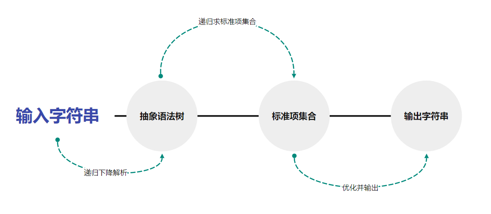

#### 1.2.2 类设计

类设计如下：

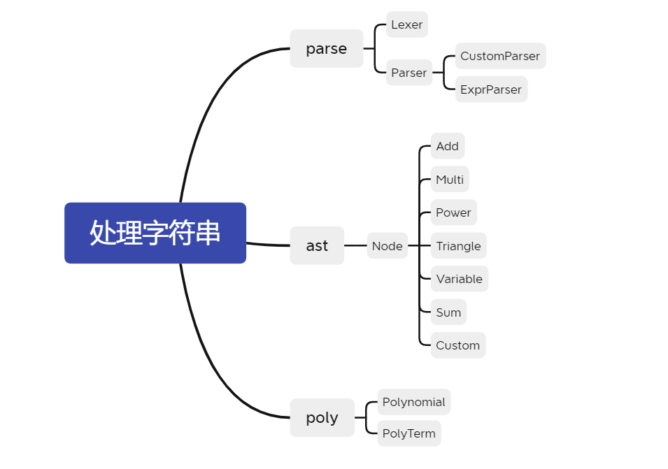

parse 包下有 Lexer，Parser，CustomParser，ExprParser。Lexer 是每个 Parser 必须有的属性。因为解析自定义函数的定义和解析表达式存在一定差异，所以现有 Parser 抽象类，CustomParser，ExprParser 继承了 Parser。

ast 包下所有类都实现了 Node 接口，这是为了 AST 的一致性问题。

poly 包下有 Polynomial，他管理着一个 PolyTerm 的集合。

### 1.3 设计思想

#### 1.3.1 齐物观

都是画眼睛的高光，有人喜欢用橡皮，有人喜欢用电动橡皮，有人喜欢用小刀划，有人喜欢用 12B 去衬，有人喜欢用白颜料去点，有人喜欢直接将眼睛从画面中抹去，有人喜欢将高光画成黑色，有人用摘下雪花作为高光，洁白而且温暖，有人画的不好，却会讲故事。

我只是喜欢那双眼睛，其他皆可齐物。

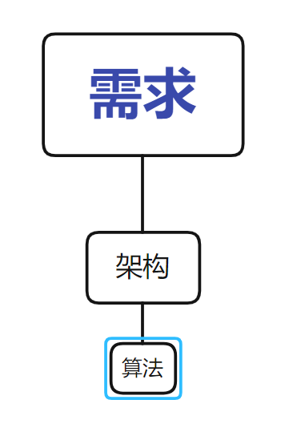

#### 1.3.2 代码分类

仅代表我个人观点，我感觉面向对象对我们的帮助**不在于帮我们解决更难的问题，而是帮助我们解决规模更大的问题**。

就我个人观点，面向对象由一部分是**对代码进行分类**。分类是一种人本位的思想，他默认我们可以**对任何客观事物完成主观上的抽象与分类**。这点上我持观望态度。


上图是竹子的花，因为古典植物学坚持以繁殖器官的解剖结构对植物进行分类，而竹子具有开花难，花期短，花的结构存在普遍差异性的特点，成为了分类学的难题。

---


## 二、标准项集合

### 2.1 倒着讲

虽然算法是**“解析，建树，建集合，输出”**这样一个过程，但是要是从理解的角度，我更愿意倒着讲述。这是因为标准项集合跟现实中的运算更为类似，后面的数据结构也会调用他的方法，所以不然先放到前面来讲。

### 2.2 格式

这里说的是标准项的格式，大概是这个样子的
$$
a \times x^b \times \Pi \sin \times \Pi \cos
$$
也就是说，想要确定一个标准项，就要确定**他的系数、指数、三角函数列表，三角函数又有内容和幂次的属性**。

这里首先要明确，这是一个数学概念，是可以用多种数据结构来实现，不同的数据结构是为了需求的不同而设计的，比方说我的标准项设计，就用到了 HashMap 的结构。但是其实最容易想到的是用 ArrayList 来存。我这么做是服务于乘法。

```java
private BigInteger coefficient;
private BigInteger exponent;
private HashMap<Polynomial, BigInteger> sin;
private HashMap<Polynomial, BigInteger> cos;
```

标准项集合描述的就是一堆标准项，其形式如下
$$
a_1 \times x^{b_1} \times \Pi^1 \sin \times \Pi^1 \cos + a_2 \times x^{b_2} \times \Pi^2 \sin \times \Pi^2 \cos + ...
$$
我个人这里偷懒了，直接采用的是 ArrayList，

```java
private ArrayList<PolyTerm> polyTerms;
```

但是如果细致考量，就会发现 ArrayList 赋予了每个标准项**顺序**的概念，而对于标准项来说，朴素的看，每一项应该是等价的，即满足加法交换律，所以无脑的用 ArrayList 不是一个很好的设计。

对此我想了两个比较好的优化结构，一个是 HashSet，它模糊了顺序的概念，这样比较两个项的时候，就可以不用管顺序了，也就是说，满足了加法交换律。对于 ArrayList 而言
$$
x + x^2 \neq x^2 + x
$$
但是 HashSet 没有这个问题。

此外就是对标准项实现 `Comparable` 接口，这样就可以利用 ArrayList 的排序功能，完成相同标准项集合的比对。

### 2.3 方法

我觉得这里的方法设计消耗脑力最少，而且可以设计出实现各种功能的方法。这些方法还可以进行组合，生成更加复杂的方法。给人的感觉就是在定义数学的运算空间一样。这里仅介绍与运算相关的方法：

| 方法     | 解释                       |
| -------- | -------------------------- |
| add      | 描述两个多项式相加的结果   |
| multi    | 描述两个多项式相乘的结果   |
| isZero   | 判断当前表达式的值是不是 0 |
| negative | 描述一个多项式的负值       |

剩下的方法在优化部分介绍。

---


## 三、拙劣的抽象语法树

### 3.1 树结构

还是先明晰一点，就是**形式化表述**与**树结构**并不那么等价，在形式化表述里，对于树的强调并不多，甚至给人一种“Expression 是 Term 的集合，Term 是 Factor 的集合”的感觉，这种感觉很不利与我发现树。而且有的因子，并不对应一个叶节点，比如 `x**2` 其实他对应的是这样的一种结构

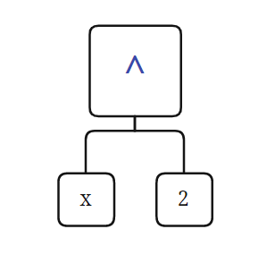

而不是一个节点，像这样

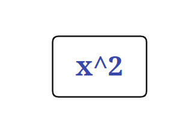

也就是说，这棵树，更像是数据结构里的**表达式树**，里面是没有 Expression，Term，Factor 概念的	

其次，是这棵树的来源问题，这棵树是我从网上看了好多代码以后找出来我比较喜欢的一款，应该是叫做抽象语法树（Abstract syntax tree，AST）。但是我看人家都是解决那种特别复杂的问题的，而且我看见那个还是个二叉树，而我这个应该是**多叉有序树**，所以不确定是不是，就放这里，有兴趣再了解吧。

### 3.2 举例

还是举一个例子，来明确一下这棵树的样子，这是表达式

```java
sin(x**3)**2*x-f(x,x**2,(x+1)**2)+(x**2+1)*sum(i,1,3,i**2)
```

转换成表达式树，就是如下结构

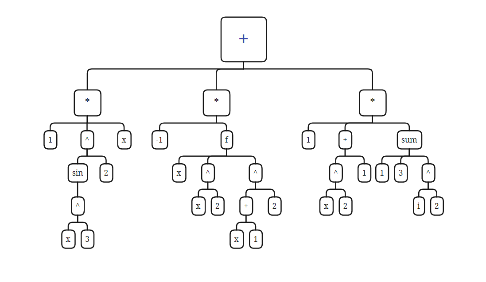

这里面，每一个方框就是一个节点，也就是一个类，这些类均实现了 `Node` 接口，方便管理。（除了幂次，我没有写成图那样，因为那样有点繁琐，标准项不适合幂次运算）。

### 3.3 Node

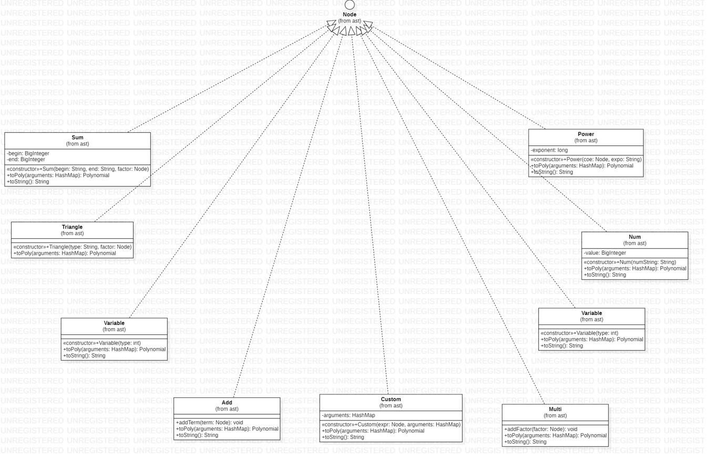

我们构建这棵树的目的就是为让它通过递归，生成我们的标准项集合，所以每个节点其实完成的是一件什么事情呢？是他的所有孩子都已经标准项集合化了，它需要把孩子们的标准项集合经过一定的处理，生成一个标准项集合，并返回给其父节点。那么要经过怎样的处理呢？这其实是由两部分组成，即

- 运算
- 运算法则

运算部分是在标准项集合中实现的，比如加法，乘法。而运算法则是节点的信息，比如说 `Add` 的运算法则就是对所有的孩子进行加法运算。这个是比较直观的，稍微复杂一点的是 `Power` ，他的法则是将底数（他的一个孩子节点）进行乘法运算指数次。代码如下

```java
public Polynomial toPoly(HashMap<Integer, Node> arguments)
{
    ...

    for (long i = 0; i < exponent; i++)
    {
        polynomial = polynomial.multi(factor);
    }
    return polynomial;
}
```

### 3.4 自定义函数

自定义函数看着挺难的，但是其实很简单，只需要意识到，自定义函数也是一种**运算节点**，只不过它的运算法则更为复杂，是以一棵表达式树定义的（就是我们用 CustomPaser 解析出来的树，往下看就知道了）。我们践行这种运算法则的方式就是遍历这棵树，并且在合适的位置将形参换成实参即可。因为不让放代码，所以不能说的太清楚。

---


## 四、解析

### 4.1 形式化表述与递归下降法

我个人最大的一个体会，就是**形式化表述**与**递归下降法**是对应的，甚至在数学上是等价的。但是指导书里的形式化表述还不是最终形式，这里安利一篇博文（找不到了，大概就是这样，具体的忘了，肯定不严谨），他在最开始的时候将形式化表述做了一个转化，我觉得更有 DFS 的感觉了。
$$
Expr -> Term \quad| \quad  Term\quad Expr \\
Term -> Factor\quad| \quad Factor\quad Term\\
Factor -> factor1 \quad| \quad factor2 \quad | \quad factor3
$$

### 4.2 递归调用

因为递归下降很难看出来，因为不是传统的递归，即**自己调用自己**，而是一种循环的调用。我们以第三次作业中 parse 的逻辑来谈，可知如图：

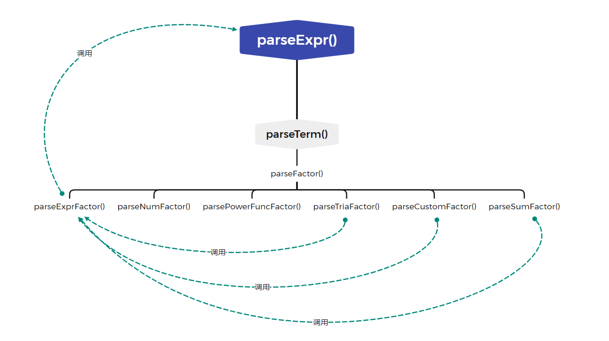

可以看出，所谓的递归调用，就是 `parseExpr() -> parseTerm() -> parseFactor -> parseExpr` 的一个过程。可以发现是一个循环。

### 4.3 掩盖细节

如果观察我的主代码就会发现，在解析部分其实只出现了一个 `ExprParser` 类，如下

```java
public static void main(String[] args)
{
    ExprInput scanner = new ExprInput(ExprInputMode.NormalMode);
    int n = scanner.getCount();

    ExprParser parser = new ExprParser();

    for (int i = 0; i < n; i++)
    {
        parser.addFunction(scanner.readLine());
    }

    parser.setLexer(new Lexer(scanner.readLine()));

    Node tree = parser.parseExpression();

    Polynomial polynomial = tree.toPoly(new HashMap<>());

    System.out.println(polynomial.selectShortest());
}
```

可以看到，没有出现 `Lexer,CustomParser` 类，这是我觉得设计比较好的地方，用户程序员其实没必要掌握 `Lexer,CustomParser`  的知识，其实只要给他呈现一个解析器就好了，`Lexer,CustomParser` 出现在 `ExprParser` 的内部，我觉得是一个很好的封装处理。

### 4.4 类设计

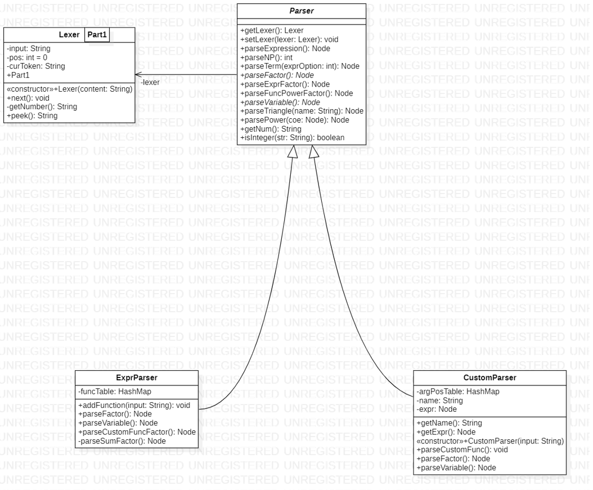

#### 4.3.1 Lexer

译作词法分析器，其实好像没那么玄，就是把一个一个的字符拆成有意义的语义元素，比如将 `sin(x**2)**3` 就顺序拆成 `sin`，`(`，`x`，`**`，`2`，`)`，`**`，`3` 即可。

对于实现的方法

| 方法 | 功能                      |
| ---- | ------------------------- |
| next | Lexer 移动指向下一个元素  |
| peek | 返回 Lexer 当前指向的元素 |

对了，我个人觉得如果把 Lexer 作为 Parse 的一个内部类，封装性会更好。

#### 4.3.2 Parser

Parser 只有一个属性，就是 lexer，可以说如果不是 lexer，parser 的大部分方法其实写成静态更好。这里就涉及到一个关于面向对象的**朴素思考**，即一个类必须封装一些属性，然后再封装一些以这个属性为参数的函数，不然就没有面向对象的意义。

作为一个抽象类，其中其实实现了大部分方法，在这里展示一下递归下降的写法，对于 parseExpr，parseTerm，有

```java
Term parseTerm()
{
	factors.add(parseFactor)
	while(有分隔符)
	{
		factors.add(parseFactor)
	}
	
	return term;
}
```

而对于 parseFactor，是交由子类实现的，但是大体的思路是一致的，都是根据当前语义元素进行判断，选择出具体的 factor 类型，然后调用具体的方法。

```java
Factor parseFactor()
{
	if (语义元素是表达式)
	{
		factor = parseExpressionFactor();
	}
	else if (语义元素是数字)
	{
		factor = parseNumFactor();
	}
	else if (语义元素是幂函数)
	{
		factor = parsePowerFuncFactor();
	}
	else if (...)
	{
		....
	}
	
	return factor;
}
```

#### 4.3.3 CustomParser

 CustomParser 是一个专门解析自定义函数的定义的 Parser，相较于普通的 Parser，他多了三个属性，而这三个属性刚好代表他功能的特殊性。

| 属性                                   | 解释                                                         |
| -------------------------------------- | ------------------------------------------------------------ |
| `HashMap<String, Integer> argPosTable` | 完成一个由形参名到形参位置的映射，比如说 f(y,z,x)，则有 `y -> 1, z -> 2, x -> 3` |
| `String name`                          | 该自定义函数的名字，比如 `f,g,h`                             |
| `Node expr`                            | 该自定义函数的表达式，是一种树结构                           |

当我们用 CustomParser 解析一条定义的时候，他需要告诉我们，这个函数的名字是什么，这个函数的表达式是什么，而且这个表达式已经经过了处理，在变量部分已经变成了形参的位置，而不是形参名（这是因为形参 `y` 可以出现在第一个位置，也可以出现在第二、三个位置，所以没办法确立替换规则）。我们需要在 Variable 节点里包含的信息是“第一个形参，第二个形参……”，而不是“x，y……”。

#### 4.3.4 ExprParser

这是用来解析待化简的表达式的类，可以说是在解析部分最重要的类。经过它的解析以后，我们会生成我们需要的树结构。

这个最大的容易出 bug 就是 lexer 的移动问题，真的超容易出 bug，放一个解析 sum 的给大家感受一下

```java
private Node parseSumFactor()
{
    // 此时指向 sum
    getLexer().next();
    // 此时指向 (
    getLexer().next();
    // 此时指向 i
    getLexer().next();
    // 此时指向 ,
    getLexer().next();
    // 此时指向 begin
    final String begin = getNum();
    // 此时指向 ,
    getLexer().next();
    // 此时指向 end
    final String end = getNum();
    // 此时指向 ,
    getLexer().next();
    Node factor = parseFactor();
    // 此时指向 )
    getLexer().next();
    return new Sum(begin, end, factor);
}
```

然后这个方法就 bug 了，de 了好久。

---


## 五、优化

### 5.1 合并同类项

这里我做了两版，一般是普通的合并同类项，采用的方法就是判断两个标准项的幂次，三角是不是相同，写作下面

```java
return exponent.equals(other.exponent) && sin.equals(other.sin) && cos.equals(other.cos);
```

第二版就更加灵活一些，考虑到这样的情形
$$
\sin(x-1) = -\sin(1-x)
$$
所以放宽了比较的条件，每次进行比较的时候，先比较一次 `x-1` 和 `x-1` ，在比较一次 `x-1` 和 `-x+1` 。这样就可以达到合并更多的同类项的目的。这是用 `negative` 方法实现的。

需要注意的是，不是每次变换，都需要修改系数的值，`sin` 的奇数次才需要修改，`cos` 永远不需要修改
$$
\sin(x-1) = -\sin(1-x)\\
\sin^2(x-1) = \sin^2(1-x)
$$

### 5.2 去零

这里也是写了两版，第一版是直接判断系数为不为 0，如果为 0，那么就认为这个标准项为 0。这里刚学了 lambda 表达式，就献了个丑。（不是这节的重点）

```java
polyTerms.removeIf(e -> e.getCoefficient().equals(BigInteger.ZERO));
```

lambda 表达式分为三个部分，即：

- 参数，一般用 `()` 括起
- 连接符，即 `->`
- 函数体，可以是一个表达式或者一个语句块。如果是一个表达式，表达式的值会被作为返回值返回；如果是语句块，需要用return语句指定返回值。

第二版去零考虑到了这些情况
$$
\sin(0),\sin((x-x))
$$
所以是这样实现的：

```java
public boolean isZero()
{
    // 系数为 0，则整个项为 0
    if (coefficient.equals(BigInteger.ZERO))
    {
        return true;
    }
    else
    {
        for (Polynomial p : sin.keySet())
        {
            // sin 的因子为 0，则整个项为 0
            if (p.isZero())
            {
                return true;
            }
        }

        return false;
    }
}
```

### 5.3 平方和

这个看上去挺难的，但是怎么说呢，其实只要硬着头皮写，是可以写出来的。我个人经验，如果在标准项层面实现不了，那么就把他转换成标准项集合看看能不能实现，效果十分好，这是因为标准项集合拥有的方法更多，**更接近数学定义**。算法流程如下：

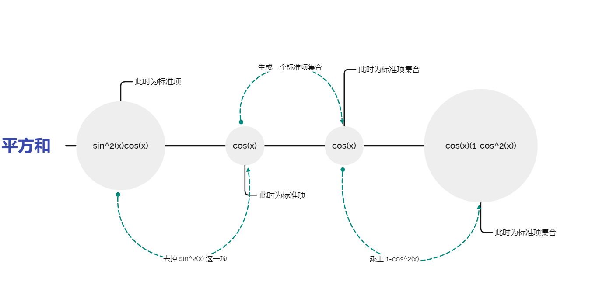

此外，还需要注意的是，从 Map 去掉某一项的操作容易抛出异常（第十个点 RE ），具体原因和解决办法这里有：

https://blog.csdn.net/weixin_40807247/article/details/88413347

### 5.4 诱导公式

不是特别复杂的诱导公式，就是很普通的
$$
\sin(x) = -\sin(x)\\
\cos(x) = \cos(-x)
$$
这个就更简单了，可以在标准项层面就完成，不需要升级到标准相机集合的层面。

### 5.5 优化调度

如果实现了很多个优化，那么就会意识到，不同的优化的执行顺序，是会对优化结果产生影响的，比如（没有遵循形式化表述）
$$
2\sin^2(x)\cos(x)+2\cos^3(x)
$$
如果先执行平方和化简
$$
2\cos(x)
$$
可如果先使用正弦二倍角化简
$$
\sin(2x)\sin(x)+2\cos^3(x)
$$
会发现结果由差异。所以怎么确定先采用哪个形式去化简呢？我反正没有实现这个事情，摆烂了。不过陈昊哥哥说可以用**队列**做，我昨晚又想了想，似乎这个具有后无效性？**可以动态规划吗**？甚至还可以加上时间的限制条件。反正我摆了，就不想了。

### 5.6 输出优化

标准项集合除了实现计算方法之外，最重要的就是实现 `toString` ,对于这里，有如下优化

- 把正项移到前面：1-x 优于 -x+1
- 系数为 1 或者 -1 的时候不输出系数：x 优于 1*x
- 指数为 0 的时候，不输出 x：1 优于 x**0
- 指数为 1 的时候，不输出指数：x 优于 x**1
- 项有负号的时候，不输出 +：-x 优于 +-x

---


## 六、评测机与 bug

### 6.1 组成

评测机由三部分组成：

- 数据生成器：用于生成测试数据
- 自动调用机：可以进行自动化的测试
- 检验机：可以用于检验正确性

### 6.2 数据生成器

#### 6.2.1 原理

到了 6.3 终于可以贴合完整的命题空间了。其实生成数据的过程可以看做是**解析的逆过程**，基本上解析有几个函数，生成就有一个函数，这里放下 UML 图

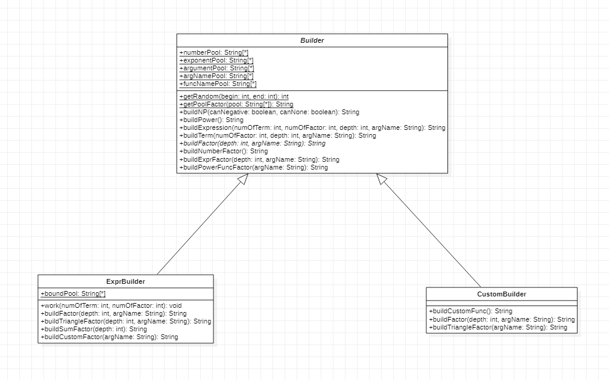

可以发现，基本跟 Parser 上一模一样。同样也是递归的创建。

#### 6.2.2 复杂性控制

可以从两个方向控制：

- 项数和因子数，可以作为参数传入，控制循环的次数
- 递归深度，也可以作为参数传入，当调用某些方法的时候（比如创建表达式因子），就让深度减 1，当深度为 0 的时候，就限制一些构造的方法，比如禁止构造表达式因子

#### 6.2.3 体验

我在第二次作业第一次写数据生成器，体验很不好，虽然领悟到了**递归构造就是最贴切的构造方法**，但是具体实现的时候，依然 bug 连连，最后还得重构，然后为了 debug，又给评测机写了一个评测机。

而且我意识到数据生成器只是评测机的一个组件，其他组件虽然对于不同的项目复用性会更高，但是依然是很体现技术的。而我当时年少轻狂，现在也是。总之吃了很多亏，干了很多费力不讨好的事情。

### 6.3 bug 分析

#### 6.3.1 BigInteger

我这三次作业，强测都是满分，自己被 hack 了一次。出现的 bug 在 sum 的起始和终止都是 `long` 类型，而不是 `BigInteger`。我当时写的时候只考虑到因为长度限制，所以 begin 和 end 之间的差值不会超过 long，所以就图省事没有用 `BigInteger` ，但是没有想到起始和终止都是可以特别大的。

#### 6.3.2 hack 策略

虽然写评测机的时候满心都以为可以用评测机发现别人的 bug，后来发现能 hack 到别人的数据都是手动构造的，尤其是还有一个构造是卡 TLE 的。我分析这是因为我写评测机的功力还不够，没有办法构造出特别刁钻的数据。还是以后多多参与，多多锻炼为好。

---


## 七、补充知识

### 7.1 对象处理流

总之就是深浅克隆问题，简单的定义就不说了。我做的时候一直在思考必要性，因为我第一次作业就没有用到 clone，所以影响我的是，我不知道如果浅克隆的会发生啥问题，反正大家都说有问题，我也不知道有啥问题。可能是因为我树上操作少，没有嫁接操作？总之就是因为没出过这个方面的bug，所以很难理解到底哪里有问题。第二次作业本来也不打算用 clone 的，但是想了想，还是改成有 clone 的交了。但是真的不明白会在哪里出问题，这可能跟我对于算法的需求不高有关。

但是还是担心的学了序列化和反序列化的知识，并用在了 clone 上，序列化和反序列化属于是**对象处理流**里的概念：

- 序列化就是保存数据的时候，保存数据的值和数据类型
- 反序列化就是在恢复数据时，恢复数据的值和数据类型
- 需要让某个对象支持序列化机制，则必须让其类是可序列化的。为了让某个类是可序列化的，该类必须实现如下两个接口之一（他的每个属性也必须实现这两个接口之一）
  - Serializable
  - Externalizable

我们用序列化反序列化实现 clone 的原理就是我们相当于是把对象保存到了一个文件中，然后立刻又从文件中把这个对象读了出来，此时这个新的对象就是一个深度 clone 的副本了。

这是标准写法

```java
public class SerialCloneable implements Cloneable,Serializable  
{  
    public Object clone()  
    {  
        try  
        {  
            //save the object to a byte array  
            ByteArrayOutputStream bout = new ByteArrayOutputStream();  
            ObjectOutputStream out = new ObjectOutputStream(bout);  
            out.writeObject(this);  
            out.close();  

            //read a clone of the object from the byte array  
            ByteArrayInputStream bin = new ByteArrayInputStream(bout.toByteArray());  
            ObjectInputStream in = new ObjectInputStream(bin);  
            Object result = in.readObject();  
            in.close();  

            return result;  
        }
        catch(Exception e)  
        {  
            return null;    
        }  
    }  

}
```

我的写法，以标准项为例：

```java
public PolyTerm clone()
{
    try
    {
        //save the object to a byte array
        ByteArrayOutputStream bout = new ByteArrayOutputStream();
        ObjectOutputStream out = new ObjectOutputStream(bout);
        out.writeObject(this);
        out.close();

        //read a clone of the object from the byte array
        ByteArrayInputStream bin = new ByteArrayInputStream(bout.toByteArray());
        ObjectInputStream in = new ObjectInputStream(bin);
        Object result = in.readObject();
        in.close();

        return (PolyTerm) result;
    }
    catch (Exception e)
    {
        return null;
    }
}
```

### 7.2 不可变类

看了讨论区赵姑娘的文章，感觉颇受启发，可能我的设计更偏向于不可变对象设计。赵姑娘主要讲了怎么实现不可变设计，我想对为啥不可变类可以解决 clone 问题。

这是我们容易出现的场景

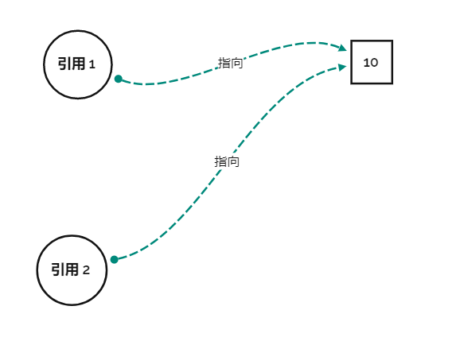

我看见这个场景就天生反感，因为这东西不是我想要的，我想要的是这个东西

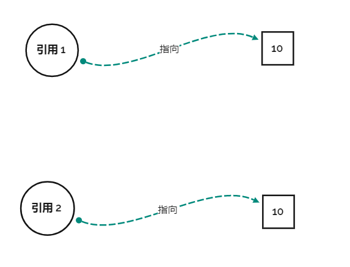

但是其实第一种图其实没啥不好的，只要不修改 10 的值，那么第一种就够了，就好像犯不着为每个人都配一个小便池，小便池能用就行了。我们对于厕所的问题，其实有人上完厕所不冲小便池，对应这里就是修改了 10 的值，只有这个时候我们会说，要是有独立卫浴就好了，这就对应了第二幅图的情况。

当我们使用了不可变对象的时候，就好像规定了人使用完小便池以后必须冲水，不然就枪毙他（保持对象的不可变性）。只要定下这个规矩，人们共享小便池的意愿就会高一些。

这是第一点，也就是说，不可变类减少了人们去 clone 对象的需求。就好像没人在有绝对干净的公厕时还会花钱修建个人卫浴（仅是比喻）。而另一点，如果真的有修改需求怎么办，我们如果用 clone 思想去做，是这样的

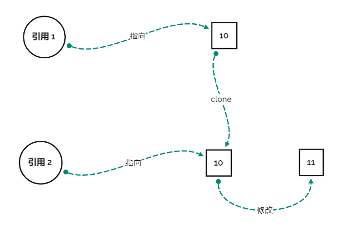

我们先 clone 出一个原对象，然后把值给修改了，就好像先仿造公厕里的小便池造一个小便池安自己家里，然后在给这个小便池镶上钻石来满足自己的品味需求。这时是需要 clone 的，因为如果不克隆，所有的人第二天上厕所的时候，都会发现自己居然会使用是一个镶钻石的小便池。

那么这种**修改**的请求不可变对象是如何处理的呢？如图

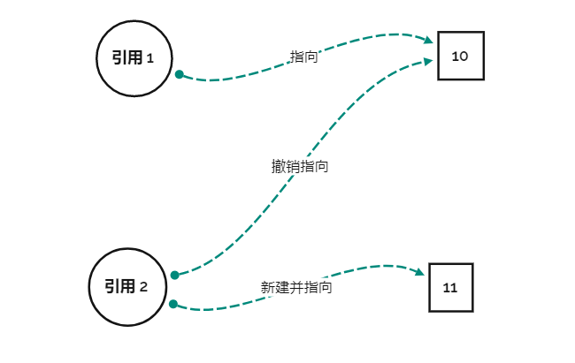

他直接新建了一个对象，然后对其进行了设置。就好像是现在开了一个新的公厕，这个公厕里的小便池是镶钻石的，现在这个高雅的人改去这个公厕了。相当于是将原来的“**克隆并在克隆件上修改**”，改成了“**模仿原对象不需要修改的部分，结合需要修改的部分，重新建立一个新的对象**”。

以上两种处理很好的满足了需求。

----


## 八、量化分析

### 8.1 基础知识

方法的衡量指标：

- CogC（Cognitive complexity）认知复杂度：衡量一个方法的控制流程有多困难去理解。具有高认知复杂度的方法将难以维护。sonar要求复杂度要在15以下。计算的大致思路是统计方法中控制流程语句的个数
- ev(G)（essential cyclomatic complexity）：方法的基本圈复杂度，衡量程序非结构化程度的。
- iv(G) （Design complexity）：设计复杂度
- v(G)（cyclomatic complexity）：方法的圈复杂度，衡量判断模块的复杂度。数值越高说明独立路径越多，测试完备的难度越大。

类的衡量指标：

- OCavg（Average opearation complexity）：平均操作复杂度
- OCmax（Maximum operation complexity）：最大操作复杂度
- WMC（Weighted method complexity）：加权方法复杂度

### 8.2 ast 包

方法分析

| method                              | CogC | ev(G) | iv(G) | v(G) |
| ----------------------------------- | ---- | ----- | ----- | ---- |
| ast.Add.addTerm(Node)               | 0.0  | 1.0   | 1.0   | 1.0  |
| ast.Add.toPoly(HashMap)             | 1.0  | 1.0   | 2.0   | 2.0  |
| ast.Custom.Custom(Node, HashMap)    | 0.0  | 1.0   | 1.0   | 1.0  |
| ast.Custom.toPoly(HashMap)          | 0.0  | 1.0   | 1.0   | 1.0  |
| ast.Multi.addFactor(Node)           | 0.0  | 1.0   | 1.0   | 1.0  |
| ast.Multi.toPoly(HashMap)           | 1.0  | 1.0   | 2.0   | 2.0  |
| ast.Num.Num(String)                 | 0.0  | 1.0   | 1.0   | 1.0  |
| ast.Num.toPoly(HashMap)             | 0.0  | 1.0   | 1.0   | 1.0  |
| ast.Power.Power(Node, String)       | 0.0  | 1.0   | 1.0   | 1.0  |
| ast.Power.toPoly(HashMap)           | 0.0  | 1.0   | 1.0   | 1.0  |
| ast.Sum.Sum(String, String, Node)   | 0.0  | 1.0   | 1.0   | 1.0  |
| ast.Sum.toPoly(HashMap)             | 1.0  | 1.0   | 2.0   | 2.0  |
| ast.Triangle.toPoly(HashMap)        | 8.0  | 1.0   | 5.0   | 5.0  |
| ast.Triangle.Triangle(String, Node) | 3.0  | 1.0   | 3.0   | 3.0  |
| ast.Variable.toPoly(HashMap)        | 2.0  | 1.0   | 2.0   | 2.0  |
| ast.Variable.Variable(int)          | 1.0  | 1.0   | 1.0   | 5.0  |
| ast.VarType.add()                   | 1.0  | 5.0   | 1.0   | 5.0  |

分析：

可以看到所有的方法都很规矩，除了跟 `Triangle` 相关的方法。因为 `Triangle` 包括 `Cos` 和 `Sin` 两种，所以导致各种方法都需要写两个分支，然后相应的复杂度就上去了。之所以这样设计，是因为单独开设两个三角函数类，会出现大量的重复代码。修改起来也十分麻烦。如果再建立一个抽象类来提取公共代码，在利用多态来实现区别，应该是更好的设计思路。

类分析

| class        | OCavg              | OCmax | WMC  |
| ------------ | ------------------ | ----- | ---- |
| ast.Add      | 2.6666666666666665 | 5.0   | 8.0  |
| ast.Custom   | 1.3333333333333333 | 2.0   | 4.0  |
| ast.Multi    | 3.0                | 6.0   | 9.0  |
| ast.Num      | 1.3333333333333333 | 2.0   | 4.0  |
| ast.Power    | 1.6666666666666667 | 3.0   | 5.0  |
| ast.Sum      | 1.3333333333333333 | 2.0   | 4.0  |
| ast.Triangle | 4.0                | 5.0   | 8.0  |
| ast.TriType  |                    |       | 0.0  |
| ast.Variable | 4.333333333333333  | 6.0   | 13.0 |
| ast.VarType  | 6.0                | 6.0   | 6.0  |

分析：

这个复杂度有些高啊，但是如果把这个里面的 `toString` 方法去掉，那么复杂度会大大减少。这里面其实 `toString` 方法没有用，就是我写出来用来调试的。所以其实这个复杂度还在可以接受的范围内。这里的分析也告诉我，不要把多功能集中在一个类上，而应该按照姜姐姐在研讨课上提供的思路**单一职责**。否则复杂度就会升高。

### 8.3 parser 包

方法分析

| method                                    | CogC | ev(G) | iv(G) | v(G) |
| ----------------------------------------- | ---- | ----- | ----- | ---- |
| parser.CustomParser.CustomParser(String)  | 0.0  | 1.0   | 1.0   | 1.0  |
| parser.CustomParser.getExpr()             | 0.0  | 1.0   | 1.0   | 1.0  |
| parser.CustomParser.getName()             | 0.0  | 1.0   | 1.0   | 1.0  |
| parser.CustomParser.parseCustomFunc()     | 1.0  | 1.0   | 2.0   | 2.0  |
| parser.CustomParser.parseFactor()         | 7.0  | 1.0   | 8.0   | 8.0  |
| parser.CustomParser.parseVariable()       | 0.0  | 1.0   | 1.0   | 1.0  |
| parser.ExprParser.addFunction(String)     | 0.0  | 1.0   | 1.0   | 1.0  |
| parser.ExprParser.parseCustomFuncFactor() | 1.0  | 1.0   | 2.0   | 2.0  |
| parser.ExprParser.parseFactor()           | 10.0 | 1.0   | 11.0  | 11.0 |
| parser.ExprParser.parseSumFactor()        | 0.0  | 1.0   | 1.0   | 1.0  |
| parser.ExprParser.parseVariable()         | 3.0  | 1.0   | 2.0   | 3.0  |
| parser.Lexer.getNumber()                  | 2.0  | 1.0   | 3.0   | 3.0  |
| parser.Lexer.Lexer(String)                | 0.0  | 1.0   | 1.0   | 1.0  |
| parser.Lexer.next()                       | 9.0  | 2.0   | 5.0   | 7.0  |
| parser.Lexer.peek()                       | 0.0  | 1.0   | 1.0   | 1.0  |
| parser.Parser.getLexer()                  | 0.0  | 1.0   | 1.0   | 1.0  |
| parser.Parser.getNum()                    | 2.0  | 1.0   | 3.0   | 3.0  |
| parser.Parser.isInteger(String)           | 0.0  | 1.0   | 1.0   | 1.0  |
| parser.Parser.parseExpression()           | 2.0  | 1.0   | 3.0   | 3.0  |
| parser.Parser.parseExprFactor()           | 0.0  | 1.0   | 1.0   | 1.0  |
| parser.Parser.parseFuncPowerFactor()      | 0.0  | 1.0   | 1.0   | 1.0  |
| parser.Parser.parseNP()                   | 2.0  | 1.0   | 3.0   | 3.0  |
| parser.Parser.parsePower(Node)            | 2.0  | 1.0   | 2.0   | 2.0  |
| parser.Parser.parseTerm(int)              | 1.0  | 1.0   | 2.0   | 2.0  |
| parser.Parser.parseTriangle(String)       | 0.0  | 1.0   | 1.0   | 1.0  |
| parser.Parser.setLexer(Lexer)             | 0.0  | 1.0   | 1.0   | 1.0  |

分析：

这里的设计就很好，各种方法的复杂度都很低，这是因为将大量的方法的内部再次进行拆解，拆解成了私有方法，这样大大降低了方法的复杂度。这个设计的技巧在之后的调试中也要用到。

类分析

| class               | OCavg              | OCmax | WMC  |
| ------------------- | ------------------ | ----- | ---- |
| parser.CustomParser | 1.8333333333333333 | 5.0   | 11.0 |
| parser.ExprParser   | 2.8                | 7.0   | 14.0 |
| parser.Lexer        | 2.75               | 7.0   | 11.0 |
| parser.Parser       | 1.5454545454545454 | 3.0   | 17.0 |

分析：

这些类的复杂度都比之前 ast 包的类的复杂度高一些。这应该是是这些类的功能更多的原因。但是用私有方法的方式，可以方便的定义bug。

### 8.4 poly 包

| method                                          | CogC | ev(G) | iv(G) | v(G) |
| ----------------------------------------------- | ---- | ----- | ----- | ---- |
| poly.Polynomial.multi(Polynomial)               | 3.0  | 1.0   | 3.0   | 3.0  |
| poly.Polynomial.negative()                      | 1.0  | 1.0   | 2.0   | 2.0  |
| poly.Polynomial.Polynomial()                    | 0.0  | 1.0   | 1.0   | 1.0  |
| poly.Polynomial.power(long, Polynomial)         | 1.0  | 1.0   | 2.0   | 2.0  |
| poly.Polynomial.removeIfZero()                  | 0.0  | 1.0   | 1.0   | 1.0  |
| poly.Polynomial.selectShortest()                | 4.0  | 1.0   | 4.0   | 5.0  |
| poly.Polynomial.simplify()                      | 0.0  | 1.0   | 1.0   | 1.0  |
| poly.Polynomial.squareTrans(TriType)            | 1.0  | 1.0   | 2.0   | 2.0  |
| poly.Polynomial.toString()                      | 7.0  | 1.0   | 4.0   | 5.0  |
| poly.Polynomial.traverse(Polynomial, TriType)   | 2.0  | 1.0   | 2.0   | 2.0  |
| poly.PolyTerm.clone()                           | 1.0  | 1.0   | 1.0   | 2.0  |
| poly.PolyTerm.equals(Object)                    | 4.0  | 3.0   | 5.0   | 7.0  |
| poly.PolyTerm.getCoefficient()                  | 0.0  | 1.0   | 1.0   | 1.0  |
| poly.PolyTerm.hashCode()                        | 0.0  | 1.0   | 1.0   | 1.0  |
| poly.PolyTerm.isFactor()                        | 6.0  | 4.0   | 7.0   | 10.0 |
| poly.PolyTerm.isSameType(PolyTerm)              | 3.0  | 2.0   | 4.0   | 4.0  |
| poly.PolyTerm.isSameTypeRough(PolyTerm)         | 24.0 | 10.0  | 14.0  | 19.0 |
| poly.PolyTerm.isZero()                          | 7.0  | 4.0   | 3.0   | 4.0  |
| poly.PolyTerm.multi(PolyTerm)                   | 13.0 | 1.0   | 8.0   | 8.0  |
| poly.PolyTerm.PolyTerm(BigInteger, BigInteger)  | 0.0  | 1.0   | 1.0   | 1.0  |
| poly.PolyTerm.setCoefficient(BigInteger)        | 0.0  | 1.0   | 1.0   | 1.0  |
| poly.PolyTerm.setCos(HashMap)                   | 0.0  | 1.0   | 1.0   | 1.0  |
| poly.PolyTerm.setSin(HashMap)                   | 0.0  | 1.0   | 1.0   | 1.0  |
| poly.PolyTerm.squareTrans(TriType)              | 6.0  | 1.0   | 4.0   | 5.0  |
| poly.PolyTerm.toPoly()                          | 0.0  | 1.0   | 1.0   | 1.0  |
| poly.PolyTerm.toString()                        | 17.0 | 2.0   | 8.0   | 8.0  |
| poly.PolyTerm.triangleToString(HashMap, String) | 11.0 | 1.0   | 5.0   | 5.0  |

分析：

这个包里的方法的复杂度都偏高，这是因为这里的方法不是优化，就是输出，为了性能分，大量的引入了各种特判条件，导致了复杂度提高。这里其实也揭示了一个道理，就是优化性能有可能导致正确性的牺牲。或者说**复杂就容易失误**。这样的话，简洁优秀的算法，就是一个很好的设计目标。

类分析

| class           | OCavg              | OCmax | WMC  |
| --------------- | ------------------ | ----- | ---- |
| poly.Polynomial | 2.3333333333333335 | 5.0   | 49.0 |
| poly.PolyTerm   | 3.4705882352941178 | 12.0  | 59.0 |

分析：

感觉是因为方法的调用次数，导致了加权偏高。我曾经考虑过单独做出一个包来分担优化的功能。但是设计能力有限，遗漏了这个设计。

---


## 九、迭代

其实怎么说呢，虽然我觉得我第一次架构就可以应付三次的作业。但是我最为骄傲的就是，每次我都是重构的，虽然这些重构并不是对架构的调整，但是我尽量在重构的过程中将代码写的更加简洁优雅。

在第二次作业中，我把原来的 `Expression`、`Term`、`Factor` 类都去掉，换成了更为抽象的 `Node`。这个重构使架构中的树结构更加明显。

在第三次作业中，我把 `Parser` 作为一个抽象类，这样减少了重复代码量，而且更加贯彻面向对象的思想。

---


## 十、鸣谢

首先最最应该感谢的人就是李寻欢，可以说真的真的对我的帮助很大。我第一单元的所有设计，都是对李寻欢设计思想拙劣的模仿。似乎给我画出了我这种实力的破学生的设计的极限。每每我恍然大悟，就发现李寻欢早已在那里等着我。

不仅是设计方面，李寻欢设计中透露的那种粗粝的美感，那种果决与英气，都是我不具有的，可以说李寻欢在我进入 OO 这门课初，塑造了我对于项目的审美。

其次感谢郭嵩阳，在我深陷困难的时候及时帮忙，感谢至极。

最后感谢我的其他朋友们，他们或多或少在我的实践中为我提供了帮助。感谢之至。
