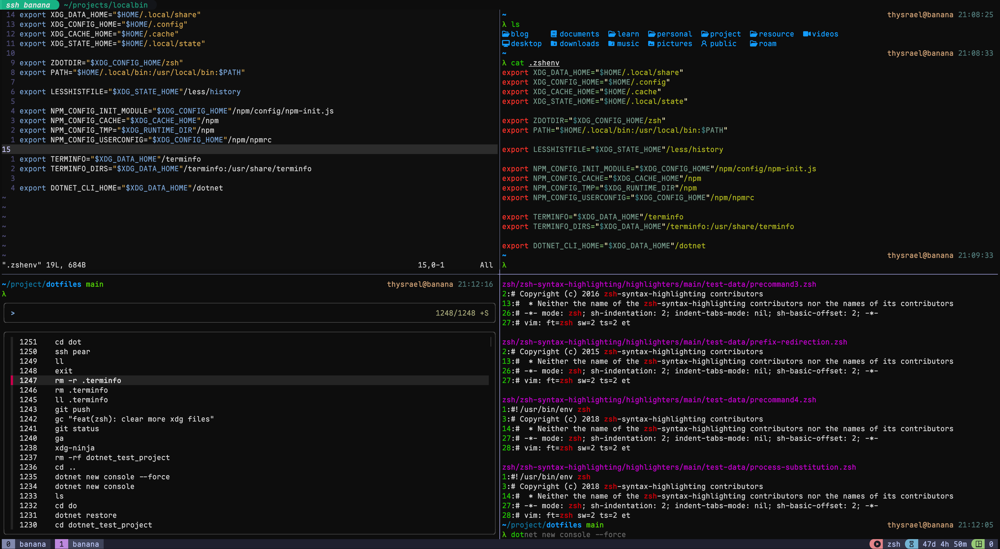
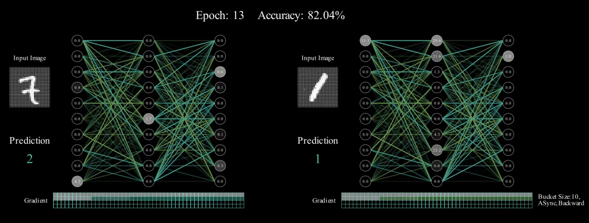

> 这里记录着我的个人项目。
>
> 放在这里面的，都是实打实我觉得有用的，跪求大家 star！
>
> This is a collection of my personal projects—tools that are actually practical. 
>
> **I'm shamelessly asking for stars** if you find them helpful! 🙏

## LaTeX Beamer 主题：北航绿园

> 项目地址：[GreenParkBeamerTheme](https://github.com/Thysrael/GreenParkBeamerTheme)

这真的是我最后一封北航情书……

我个人觉得非常漂亮，而且现代化的。里面用到的素材，也是费尽千辛万苦找到的。

在 overleaf 上也有模板可以使用（但是还是希望你能 star 一下）。

---

## Pandoc 模板：再见 Word

> 项目地址：[PandocWordTemplate](https://github.com/Thysrael/PandocWordTemplate)

虽然 Pandoc 提供了 markdown 等文本文件转成 Word 的默认模板。但是默认模板有诸多缺点（不太适应中文、没有标题序号、没有代码块高亮和没有表头强调等）。而在网上找的模板有些过于炫技甚至浮夸，而有些则难以涵盖我的所有需求。

因此我自己搓了一个模板，具有如下 feature：

- 标题序号
- 中文适配
- 参考文献，交叉引用
- markdown 基础格式的润色

我觉得自用还是不错的。

---

## Dotfiles：极简配置框架与文件

> 项目地址：[Dotfiles](https://github.com/Thysrael/dotfiles)

在实验室的服务器上写代码，如果没有一个好的 shell 环境，总是感觉不是那么舒服。但是考虑到不同服务器网络状况和依赖，这点总是很难实现。

所以我专门写了一个基于 `make` 并且无须 `sudo` 的配置框架（总不能有 server 上连 `make` 都没有吧）来进行配置。

而且我除了配置文件外，还把服务器上常用的应用（二进制文件）打包了，可以使用脚本一键下载。可以说是非常舒服了。

当然除了服务器上面的小工具的配置，我这个仓库里其实还罗列了我的笔记本电脑的配置（Linux and MacOS），作为一个非常喜欢配置的人，我觉得还算不错吧。

---

## LaTeX 试卷模板：再见 Word 2

> 项目地址：[SJTUExamLaTeX](https://github.com/Thysrael/SJTUExamLaTeX)

到底是什么受虐癖才会用 Word 出卷啊？缺乏协作手段，缺乏版本控制能力，格式与内容完全耦合在一起，代码和公式都没有办法轻松敲出来，动不动就出现不一致的情况。

这个模板有诸多功能：

- 自动更新卷头和分数
- 答案条件编译
- 良好中英文支持
- 分数核验

---

## DDP Mainim：3B1B 同款示意动画

> 项目地址：[Pytorch-DDP-Manim](https://github.com/Thysrael/Pytorch-DDP-Manim)

课程大作业，两天时间内极限手搓。可以用于演示 Pytorch 的 DDP 的策略实现。

其实这个东西对大家可能没有什么用，但是难得像 3B1B 偶像致敬。

---

